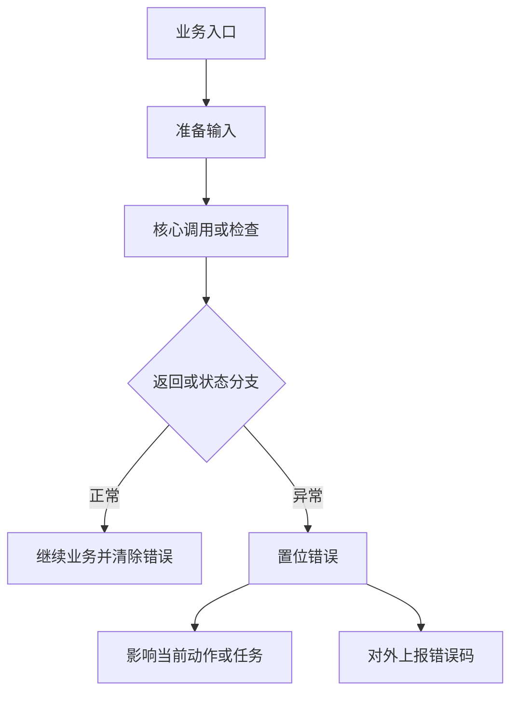

# {{错误码}}：{{错误名称}}

> 文档用途：当 AI Agent 在日志或状态上报中发现 `{{错误码}}` 时，用本文理解错误触发流程，并根据同期证据选择下一步排查、处置和验证方法。

## 1 错误结论

| 字段 | 内容 |
|---|---|
| 错误码 | `{{错误码}}` |
| 错误名 / Key | `{{稳定错误名或Key}}` |
| 错误描述 | {{描述}} |
| 等级 / 所属模块 | {{等级与模块}} |
| 直接触发条件 | {{最小触发条件}} |
| 直接影响 | {{对当前动作、任务和系统的影响}} |
| 恢复条件 | {{自动或人工恢复条件}} |
| 分析基线 | `{{分支或版本}} @ {{commit}}` |
| 适用前提 | {{适用版本、机型、配置或实现路径}} |
| 注册来源 | `{{注册表}}` → `{{sheet或条目}}` → {{行号或记录标识}} |

**核心判断**：{{说明该错误是什么、不是什么，以及当前证据最深确认到哪里。}}

| 状态 | 含义 |
|---|---|
| `已确认` | 注册表、源码、原始日志或复现实验可直接证明 |
| `高可能` | 特征高度吻合，但仍缺最后一层直接证据 |
| `待确认` | 当前只能作为排查方向 |
| `已排除` | 正常判据或反向证据已经排除 |

## 2 错误触发的功能流程

进入该错误链的前置条件：

1. {{前置条件一}}
2. {{前置条件二}}



对应调用链：

```text
{{入口符号}}
  -> {{中间符号}}
  -> {{直接触发符号}}
  -> {{状态置位}}
  -> {{对外错误码}}
```

错误生命周期：

```text
{{开始检查 -> 置位 -> 保持/重复上报 -> 清除 -> 恢复}}
```

关联错误的时序解释：

| 时序或组合 | 优先判断 |
|---|---|
| {{关联错误先出现}} | {{优先分析的底层链路}} |
| {{本错误单独出现}} | {{优先分析的输入或模块}} |

## 3 结合日志选择排查方向

先提取错误前后至少 `{{时间窗}}` 的日志：

```bash
{{只读日志提取命令}}
```

| 顺序 | 检查项 | 正常判据 | 异常判据 | 结论状态与下一步 |
|---:|---|---|---|---|
| 1 | 时间与版本 | {{一致判据}} | {{不一致判据}} | {{重新取证动作}} |
| 2 | 直接触发证据 | {{直接日志存在}} | {{日志缺失}} | {{核对版本/原始上报}} |
| 3 | 发生阶段 | {{阶段明确}} | {{阶段不明}} | {{扩大时间窗或补充上下文}} |
| 4 | 直接输入 | {{输入正常}} | {{输入异常}} | {{沿输入生产者追因}} |
| 5 | 配置与依赖 | {{配置/依赖正常}} | {{配置/依赖异常}} | {{收敛到负责链路}} |
| 6 | 具体失败分支 | {{分支条件未命中}} | {{日志或数据命中分支}} | {{更新结论状态与处置}} |

停止规则：

- {{命中首个非法输入后沿其生产者继续追因。}}
- {{只有错误码、没有同期证据时，不输出确定根因。}}
- {{修复未通过第 5 章验证时，不标记为闭环。}}

现场确认命令：

```bash
{{状态原始上报命令}}
{{输入或依赖检查命令}}
{{版本检查命令}}
```

## 4 可能原因与解决方案

| 优先级 | 原因与唯一特征 | 负责链路 | 临时处置 | 根因修复 | 修复验证 |
|---|---|---|---|---|---|
| P1 | {{原因一及可区分特征}} | {{负责模块/数据链}} | {{安全止损措施}} | {{具体修复}} | {{验证方法}} |
| P2 | {{原因二及可区分特征}} | {{负责模块/数据链}} | {{临时措施}} | {{具体修复}} | {{验证方法}} |

对仍缺源码的底层模块，使用以下方式定位失败分支：

```bash
rg -n "{{错误名|返回值|状态枚举|关键函数}}" {{源码目录}}
```

在命中具体分支前，保持候选原因的证据状态，不要把错误名称改写成根因。

## 5 修复验证与证据索引

问题闭环必须同时满足：

1. {{错误状态按设计清除且不反复触发。}}
2. {{直接触发日志不再出现。}}
3. {{原功能流程恢复。}}
4. {{相同场景连续执行多次不再复现。}}

AI Agent 最少需要收集：

```text
错误发生时间及前后原始日志
错误状态原始消息
直接触发函数的输入摘要
配置、开关和依赖状态
主模块与相关依赖版本
修复后的同场景验证证据
```

Agent 完成分析后必须输出：

```yaml
error_code: "{{错误码}}"
error_name: "{{错误名}}"
analysis_status: 待确认  # 已确认 / 高可能 / 待确认 / 已排除
applicable_version:
  primary_module: ""
  dependencies: {}
trigger_path: ""
trigger_stage: unknown
confirmed_facts: []
most_likely_cause:
  cause: ""
  confidence: low  # high / medium / low
  evidence: []
excluded_causes: []
missing_evidence: []
next_action: []
temporary_action: ""
root_fix: ""
verification:
  result: not_started  # passed / failed / not_started
  evidence: []
```

| 证据 | 位置 |
|---|---|
| 数值码映射 | `{{注册表}}` → `{{sheet/条目}}` |
| 错误定义 | `{{路径}}` → `{{符号}}` → `{{commit}}` |
| 置位与清除 | `{{路径}}` → `{{符号}}` |
| 业务入口与影响 | `{{路径}}` → `{{符号}}` |
| 对外上报 | `{{路径}}` → `{{符号}}` |

## 6 Agent 自动排查 Playbook

> 本章供 diagnosis-orchestrator 的确定性分析器自动执行。每一步输出必须互斥且完备，所有 pattern 必须是可 grep 的真实字符串或正则。

```yaml
playbook:
  meta:
    error_code: "{{错误码}}"
    error_name: "{{错误名}}"
    module: "{{触发模块名，如 nav-manager}}"
    time_window: {{错误前后秒数，如 60}}

  steps:
    # ── 步骤 1：区分触发链 ──
    - id: classify_trigger_chain
      description: "根据日志特征区分触发链"
      checks:
        - type: grep_log
          module: "{{模块}}"
          pattern: "{{触发链A的唯一日志特征，从第3章决策表和第4章原因表提取}}"
          on_match:
            trigger_chain: "{{名称}}"
            conclusion: "命中 {{触发链A名称}}"
            goto: diagnose_{{触发链A}}
        - type: grep_log
          module: "{{模块}}"
          pattern: "{{触发链B的唯一日志特征}}"
          on_match:
            trigger_chain: "{{名称}}"
            conclusion: "命中 {{触发链B名称}}"
            goto: diagnose_{{触发链B}}
        # 兜底：以上均未命中
        - type: on_no_match
          conclusion: "当前时间窗内未找到区分触发链的日志特征"
          action: expand_time_window
          time_window: {{扩大后的秒数，如 120}}

    # ── 步骤 2a：触发链 A 深入排查 ──
    - id: diagnose_{{触发链A}}
      description: "{{触发链A的深入排查，按第3章决策表顺序展开}}"
      checks:
        - type: grep_log
          module: "{{模块}}"
          pattern: "{{第一步检查的唯一日志特征}}"
          priority: P1
          on_match:
            conclusion: "{{第4章原因表的结论}}"
            root_cause: "{{根因}}"
            temp_fix: "{{临时处置}}"
            goto: verify
          on_no_match:
            continue: true
        - type: grep_log
          module: "{{模块}}"
          pattern: "{{第二步检查的唯一日志特征}}"
          priority: P2
          on_match:
            conclusion: "{{结论}}"
            root_cause: "{{根因}}"
            temp_fix: "{{临时处置}}"
            goto: verify
          on_no_match:
            continue: true
        # 兜底：A 链所有检查均未命中
        - type: on_no_match
          conclusion: "触发链A的所有已知特征均未命中，当前证据不足以确定根因"
          status: insufficient_data
          action: "收集更长时间窗的日志或补充上下文"

    # ── 步骤 2b：触发链 B 深入排查 ──
    - id: diagnose_{{触发链B}}
      description: "{{触发链B的深入排查}}"
      checks:
        - type: grep_log
          module: "{{模块}}"
          pattern: "{{唯一日志特征}}"
          priority: P1
          on_match:
            conclusion: "{{结论}}"
            root_cause: "{{根因}}"
            temp_fix: "{{临时处置}}"
            goto: verify
          on_no_match:
            continue: true
        - type: on_no_match
          conclusion: "触发链B的所有已知特征均未命中"
          status: insufficient_data

    # ── 步骤 3：验证修复 ──
    - id: verify
      description: "验证修复是否生效"
      checks:
        - type: verify_fix
          grep_pattern: "{{错误不再出现的判据，如 update map success}}"
          watch_duration_sec: 60
          on_match:
            status: still_present
            action: "错误仍然存在，扩大排查范围或升级人工处理"
          on_no_match:
            status: verified
            conclusion: "错误已清除，同场景连续验证通过"
```
