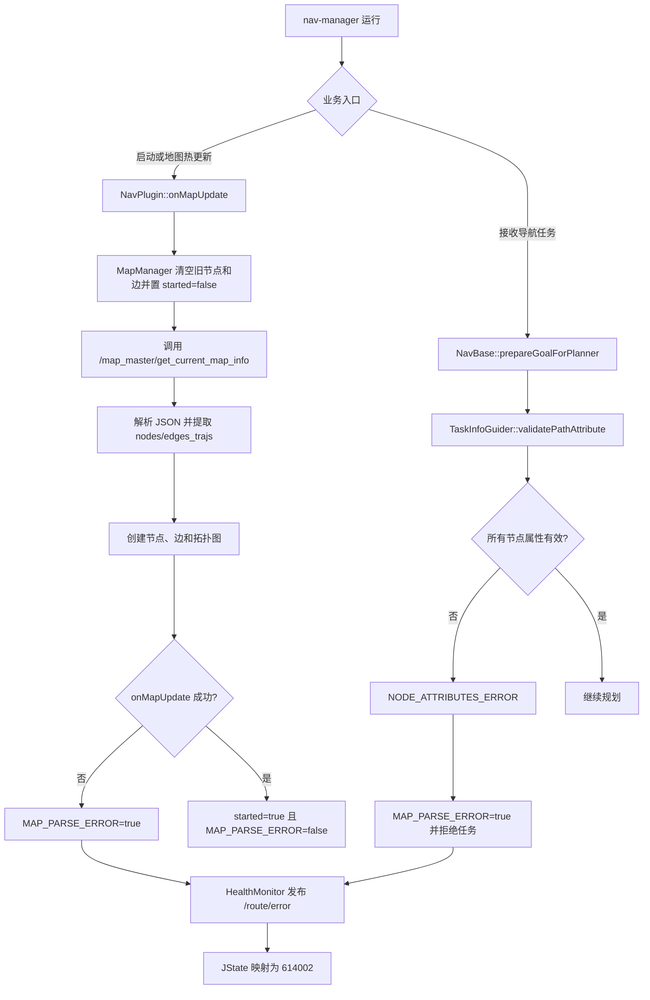

# JState 错误码 614002：地图异常

> 文档用途：当 AI Agent 在现场日志中发现 `614002` 时，用本文区分“地图更新失败”和“任务节点属性非法”两条触发链，并根据同期日志选择下一步排查方向、处置方式和验证方法。

## 1 错误结论

| 字段 | 内容 |
|---|---|
| 错误码 | `614002` |
| JState Key | `/jstate/error/nav-manager/map_parse_error` |
| 错误描述 | 地图异常 |
| 等级 | `level5`，nav-manager 内部为 `ERROR` |
| 直接触发条件 | 地图更新返回失败，或任务路径节点属性校验返回 `NODE_ATTRIBUTES_ERROR` |
| 直接影响 | 地图更新链中地图管理器保持未启动；任务校验链中当前导航任务被拒绝 |
| 内部清除条件 | 后续地图更新成功，或任务重置时统一清除 |
| 错误注册追溯 | `c49ab2f11683565b9c0588dbc33ac3efe8030d35`（2025-03-26，地图热更新相关变更） |
| 本文验证基线 | `RC/1.2603.x @ 744cfcbe352b` |
| 适用前提 | 机器人运行版本使用本文所述的 `MapManager`、`NavPlugin` 和 `TaskInfoGuider` |
| META 来源 | `机型3代状态数据-META大全.xlsx` → `异常状态s3` → 第 437 行 |

**核心判断**：`614002` 不是单一的“地图 JSON 解析失败”。当前源码存在两条独立触发链：

1. nav-manager 获取、解析或构建地图失败。
2. nav-base 收到的任务路径节点属性非法。

AI Agent 必须先从日志判断触发链，再分析根因。看到 `614002` 就直接重新下发地图，可能掩盖调度任务字段问题。

本文使用以下证据状态：

| 状态 | 含义 |
|---|---|
| `已确认` | META、源码或现场原始日志可直接证明 |
| `高可能` | 特征与某一原因高度吻合，但仍缺少生产者侧直接证据 |
| `待确认` | 当前只能作为排查方向 |
| `已排除` | 正常判据或反向证据已经排除该原因 |

## 2 错误触发的功能流程



地图更新链：

```text
NavPlugin::onMapUpdate()
  -> MapManager::onMapUpdate()
  -> MapManager::getNewMapInfo()
  -> /map_master/get_current_map_info
  -> JSON 解析
  -> createMapInfo(nodes, edges_trajs)
  -> 失败时 MAP_PARSE_ERROR = true
```

任务节点校验链：

```text
NavBase::prepareGoalForPlanner()
  -> TaskInfoGuider::parseTaskInfo()
  -> validatePathAttribute()
  -> NODE_ATTRIBUTES_ERROR
  -> MAP_PARSE_ERROR = true
  -> 当前任务 ABORTED
```

任务节点满足以下全部条件才通过校验：

```text
ID >= 0
abs(pose.x) < 10000
abs(pose.y) < 10000
max_vel > 0.05
feasible_region_width > 0.05
```

错误生命周期：

```text
触发 MAP_PARSE_ERROR=true
  -> level5 触发态最多发布 3 次
  -> 后续不再重复发布，但内部状态仍可能为 true
  -> 地图更新成功或任务 reset 时内部清除
  -> ERROR 类型清除态不会通过当前逻辑发布 trigger:false
```

因此，`614002` 后续不再出现不能证明地图或任务数据已经恢复，必须按第 5 章主动验证。

当前基线还有两个需要注意的代码边界：

- `/map_master/get_current_map_info` 返回 `response.success=false` 时，代码记录失败日志但返回 `true`，可能不会触发 `614002`。
- `nodes` 或 `edges_trajs` 为空时，`createMapInfo()` 记录 `map is empty` 但返回 `true`，也可能不会触发 `614002`。

如果现场表现为“地图不可用但没有 614002”，应优先核对这两个分支。

## 3 结合日志选择排查方向

先保留错误前后至少 30 秒的原始日志，再提取关键特征：

```bash
grep -E "map_parse_error|updateMap|\\[MapManager\\]|getNewMapInfo|update map|create graph base fail|map is empty|parse path_node failed|GOAL WITH INCOMPLETE" \
  /opt/jz/log/nav-manager.log | tail -n 300
```

按顺序执行：

| 顺序 | 检查项 | 正常判据 | 异常判据 | 结论状态与下一步 |
|---:|---|---|---|---|
| 1 | 时间与版本 | JState 和日志属于同一进程、同一时间窗，版本适用本文 | 时间、启动 UUID、版本或日志不一致 | 标记`待确认`，重新取得正确证据 |
| 2 | 触发链 | 能找到地图更新日志或 `parse path_node failed` | 两类特征均不存在 | 扩大时间窗并检查旧版本日志格式 |
| 3 | 地图服务调用 | `/map_master/get_current_map_info` 可用且调用成功 | `getNewMapInfo serviceCall fail` | 地图服务通信异常标记为`高可能` |
| 4 | 地图响应 | 响应成功，内容可解析且包含有效节点和边 | `response.success=false`、异常文本或 `map is empty` | 地图数据生产侧异常标记为`高可能`；同时注意可能不触发错误码 |
| 5 | JSON 和建图 | 无解析异常，出现 `update map success` | JSON 异常、`create graph base fail` 或 `update map failed` | 根据首条失败日志进入解析或拓扑构建分支 |
| 6 | 任务节点 | 所有节点满足 ID、坐标、速度和可行域阈值 | `parse path_node failed` | 任务字段异常标记为`已确认`，地图本身暂不判异常 |
| 7 | 地图运行状态 | 更新后地图管理器可查询节点并正常规划 | 服务日志成功但导航仍无地图 | 检查空数据误判成功、版本缺陷及地图内容完整性 |

停止规则：

- 命中 `parse path_node failed` 时，先修复任务节点字段，不要先重载地图。
- 命中首个地图服务、JSON 或建图失败日志时，沿该生产者继续追因。
- 只有错误码而没有同期日志时，只能解释两类触发链，不能确定是哪一类。
- `response.success=false` 或 `map is empty` 后仍显示更新成功时，应记录为代码行为异常，不能宣称地图有效。

现场确认命令：

```bash
# 确认 JState 原始上报
rostopic echo -n 1 /route/error

# 确认地图服务和地图更新服务
rosservice info /map_master/get_current_map_info
rosservice info /move_task_server/waypoint_jsonfile_service

# 检查相关节点
rosnode list | grep -E "map_master|nav_manager"

# 查看任务节点校验失败的完整上下文
grep -B 20 -A 20 "parse path_node failed" /opt/jz/log/nav-manager.log
```

## 4 可能原因与解决方案

| 优先级 | 原因与唯一特征 | 负责链路 | 临时处置 | 根因修复 | 修复验证 |
|---|---|---|---|---|---|
| P1 | 地图服务不可达：`getNewMapInfo serviceCall fail` | map-master、ROS 通信 | 暂停新导航任务，恢复地图服务后重新加载 | 修复服务启动顺序、节点异常或 ROS 通信 | 服务稳定可用且出现 `update map success` |
| P1 | 地图响应不是合法 JSON：出现 JSON 解析异常 | map-master、地图存储 | 保留原始响应，回退到已验证地图 | 修复地图序列化、传输截断或非法字段类型 | 相同数据可解析并完成建图 |
| P1 | 节点/边数据不能构建拓扑：`create graph base fail` | 地图制作、MapManager | 停止使用该地图，切换已验证版本 | 修复缺失节点、非法边引用或字段结构 | 节点、边和拓扑图构建成功 |
| P1 | 任务节点属性非法：`parse path_node failed` 打印具体字段 | 调度、任务转换、地图任务数据 | 拒绝当前任务并修正后重发 | 按校验阈值修复 ID、坐标、`max_vel` 或 `feasible_region_width` 的生产逻辑 | 同一任务通过 `parse succeeded` 并进入规划 |
| P2 | 地图返回失败却被代码当作成功：失败消息后仍出现成功流程 | MapManager 返回值处理 | 不把该次加载结果用于导航，人工确认地图内容 | 修复 `response.success=false` 分支的返回值并增加测试 | 失败响应稳定触发错误，成功响应才置 `started=true` |
| P2 | 空地图被代码当作成功：`map is empty` | MapManager、地图数据生产者 | 禁止在空地图上启动任务 | 修复空数据判定和返回值；地图侧禁止发布空节点/边 | 空数据明确失败，有效数据正常加载 |

没有定位到首条失败证据前，不应通过反复重启 nav-manager 代替根因分析；重启只会清除内存状态，不能修复地图内容或任务字段。

## 5 修复验证与证据索引

闭环需要同时满足：

1. 触发链已经明确为“地图更新”或“任务节点校验”。
2. 首个失败日志对应的生产者已经修复。
3. 地图更新出现 `update map success`，且实际节点、边可用于搜路。
4. 若为任务节点问题，修正后的同一任务出现 `parse succeeded`。
5. 相同地图和任务连续执行多次不再出现 `614002`。

Agent 最少需要收集：

```text
错误时间及前后至少 30 秒的未过滤日志
/route/error 原始消息
nav-manager、map-master 和调度版本
地图服务响应成功状态及原始错误信息
是否出现 JSON/建图失败日志
若命中任务链，完整的 parse path_node failed 日志
修复后地图加载及同任务复测结果
```

Agent 输出格式：

```yaml
error_code: 614002
error_name: map_parse_error
analysis_status: 待确认  # 已确认 / 高可能 / 待确认 / 已排除
applicable_version:
  nav_manager: ""
trigger_path: unknown  # map_update / task_node_validation / unknown
confirmed_facts:
  - ""
most_likely_cause:
  cause: ""
  confidence: low  # high / medium / low
  evidence:
    - ""
excluded_causes:
  - cause: ""
    evidence: ""
missing_evidence:
  - ""
next_action:
  - ""
temporary_action: ""
root_fix: ""
verification:
  result: not_started  # passed / failed / not_started
  evidence:
    - ""
```

输出约束：

- 必须填写 `trigger_path`；无法区分时保持 `unknown`。
- 任务节点属性非法时，不得把地图文件损坏写成已确认原因。
- 地图服务返回失败但代码继续成功流程时，必须记录当前版本的返回值风险。
- 未执行同地图、同任务复测时，验证结果必须为 `not_started`。

代码与数据证据：

| 证据 | 位置 |
|---|---|
| 数值码映射 | `机型3代状态数据-META大全.xlsx` → `异常状态s3` → 第 437 行 |
| ERROR 等级和 JState key | `nav_core/src/health_monitor.cpp:103` |
| 地图更新触发及内部清除 | `manager/src/plugin/nav_plugin.cpp:250` |
| 地图获取、JSON 解析和建图 | `manager/src/map/map_manager.cpp:69`、`:866` |
| 任务节点属性阈值 | `navigation/nav_base/src/task_info_guider.cpp:98` |
| 节点属性错误置位 | `navigation/nav_base/src/nav_base.cpp:277` |
| ERROR 发布规则 | `nav_core/src/health_monitor.cpp:236` |
| META 登记的外部说明 | [地图异常](https://alidocs.dingtalk.com/i/nodes/jb9Y4gmKWr7M4P5xhMwReL5MVGXn6lpz) |
