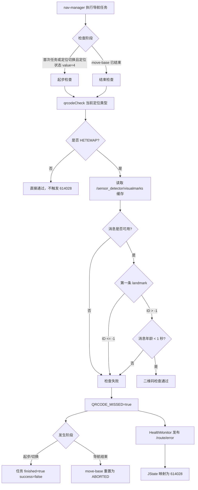

# JState 错误码 614028：二维码识别异常

> 文档用途：当 AI Agent 在现场日志中发现 `614028` 时，用本文判断错误发生在二维码导航起步、定位切换还是导航结束阶段，并沿二维码消息链定位无数据、数据过期或未识别等原因。

## 1 错误结论

| 字段 | 内容 |
|---|---|
| 错误码 | `614028` |
| JState Key | `/jstate/error/nav-manager/qrcode_missed` |
| 错误描述 | 二维码识别异常，请检查相机与码的状态 |
| 等级 | `level5`，nav-manager 内部为 `ERROR` |
| 直接触发条件 | 二维码定位模式下，`AbnormalCheck::qrcodeCheck()` 返回 `false` |
| 直接影响 | 起步/定位切换时拒绝当前任务；导航结束时将 move-base 结果重置为 `ABORTED` 并返回任务失败 |
| 内部清除条件 | 下一任务开始或任务重置时由 `HealthMonitor::exit()` 统一清除 |
| 当前注册行变更记录 | `19c4ba6ad5c9e5a5d2f3cd5b393c9fc2e180df0c`（2025-03-10） |
| 本文验证基线 | `RC/1.2603.x @ 744cfcbe352b` |
| 适用前提 | 机器人运行版本使用 `/sensor_detector/visualmarks` 和本文所述的 `qrcodeCheck()` |
| META 来源 | `机型3代状态数据-META大全.xlsx` → `异常状态s3` → 第 463 行 |

**核心判断**：`614028` 只在当前定位类型为 `HETEMAP`（二维码定位）时触发。源码中的直接失败条件有三类：

1. `/sensor_detector/visualmarks` 没有可用缓存消息。
2. 第一条 landmark 的 ID 小于或等于 `-1`。
3. landmark 消息时间戳距当前 ROS 时间达到或超过 `1` 秒。

因此，错误描述中的“检查相机与码”只是排查方向，不代表相机硬件已经被证明故障。

本文使用以下证据状态：

| 状态 | 含义 |
|---|---|
| `已确认` | META、源码或现场原始日志可直接证明 |
| `高可能` | 特征与某一原因高度吻合，但仍缺少发布者侧直接证据 |
| `待确认` | 当前只能作为排查方向 |
| `已排除` | 正常判据或反向证据已经排除该原因 |

## 2 错误触发的功能流程



起步或定位切换链：

```text
NavPlugin::execute()
  -> first_task_ 或 loc_mode_switch
  -> /nav/localization_status 的 name 非空且 value == 4
  -> AbnormalCheck::qrcodeCheck(loc_type)
  -> false
  -> QRCODE_MISSED = true
  -> "二维码导航起步时二维码缺失"
  -> 当前任务失败
```

导航结束链：

```text
NavPlugin::preprocessing()
  -> move-base result.finished == true
  -> AbnormalCheck::qrcodeCheck(last_loc_type)
  -> false
  -> QRCODE_MISSED = true
  -> move-base reset 为 ABORTED
  -> "二维码导航停止时二维码缺失"
```

错误生命周期：

```text
触发 QRCODE_MISSED=true
  -> level5 触发态最多发布 3 次
  -> 当前代码没有 QRCODE_MISSED=false 的业务置位
  -> 下一任务开始或任务 reset 时统一清除内部状态
  -> ERROR 类型清除态不会通过当前逻辑发布 trigger:false
```

因此，错误停止出现不代表识别已经恢复。必须重新检查实时 landmark 数据并复测相同二维码任务。

关联错误的时序解释：

| 时序 | 优先判断 |
|---|---|
| `614029`（二维码定位初始化超时）先出现，随后出现 `614028` | 优先排查二维码定位初始化链，`614028` 可能是后续表现 |
| `614028` 只在任务起步出现 | 优先检查起步时是否已有新鲜 landmark，以及定位切换时序 |
| `614028` 只在导航结束出现 | 优先检查到站前最后一帧二维码消息、目标码可见性和时间戳 |
| `614028` 每次都出现 | 优先检查 topic 发布、相机/识别模块和定位模式配置 |

代码边界：如果 `LandmarkList` 消息存在但 `landmarks` 数组为空，或第一条 ID 不是合法整数字符串，当前实现的 `.at(0)`/`std::stoi()` 可能抛出异常。这更可能表现为进程异常，而不是一条正常的 `614028`，应作为独立故障处理。

## 3 结合日志选择排查方向

先保留错误前后至少 30 秒的原始日志，再提取关键特征：

```bash
grep -E "qrcode_missed|qrcodeCheck|visualmarks|二维码导航|localization_status|Task begin|movebase is finished" \
  /opt/jz/log/nav-manager.log | tail -n 300
```

按顺序执行：

| 顺序 | 检查项 | 正常判据 | 异常判据 | 结论状态与下一步 |
|---:|---|---|---|---|
| 1 | 时间与版本 | JState、日志和任务属于同一时间窗，版本适用本文 | 时间、任务或版本不一致 | 标记`待确认`并重新取证 |
| 2 | 定位类型 | 触发时为 `HETEMAP` | 非 HETEMAP，且日志显示 `qrcodeCheck loc_type not hetemap` | 本调用链应通过；核对版本、时间窗和错误来源 |
| 3 | 触发阶段 | 能由“起步时缺失”或“停止时缺失”确定阶段 | 阶段不明 | 扩大任务起止时间窗，不得假设任务影响 |
| 4 | topic 发布 | `/sensor_detector/visualmarks` 有发布者且持续更新 | 无发布者、无消息或频率中断 | 消息链异常标记为`高可能`，转查发布节点 |
| 5 | landmark 内容 | 数组非空，第一条 ID 是大于 `-1` 的整数 | 数组空、ID 非法或 `ID <= -1` | 未识别或消息格式异常标记为`高可能` |
| 6 | 消息时效 | `now - header.stamp < 1 s` | 消息年龄达到或超过 `1 s` | 数据过期标记为`已确认`，转查识别频率、阻塞和时间同步 |
| 7 | 相机与识别链 | 图像输入、曝光、目标码和识别节点均正常 | 无图像、码不可见/污损、识别节点错误 | 根据最早的上游异常继续追因 |
| 8 | 复测 | 同一位置和任务持续获得新鲜有效 ID | 数据短暂恢复后再次丢失 | 保持未闭环，分析环境、运动和通信稳定性 |

停止规则：

- topic 无消息时，先修复消息生产链，不继续猜测二维码内容。
- 已确认消息新鲜但 `ID <= -1` 时，排查识别质量和目标码，不先归因于时间同步。
- 已确认 ID 有效但消息超过 1 秒时，排查发布频率、阻塞和 ROS 时间，不先更换二维码。
- 只有错误码而没有 landmark 原始消息时，不能把相机硬件故障标记为已确认。

现场确认命令：

```bash
# 确认 JState 原始上报
rostopic echo -n 1 /route/error

# 确认二维码消息的发布者、频率和内容
rostopic info /sensor_detector/visualmarks
rostopic hz /sensor_detector/visualmarks
rostopic echo -n 1 /sensor_detector/visualmarks

# 确认定位状态
rostopic echo -n 1 /nav/localization_status

# 查看两类任务失败的完整上下文
grep -B 30 -A 30 -E "二维码导航起步时二维码缺失|二维码导航停止时二维码缺失" \
  /opt/jz/log/nav-manager.log
```

## 4 可能原因与解决方案

| 优先级 | 原因与唯一特征 | 负责链路 | 临时处置 | 根因修复 | 修复验证 |
|---|---|---|---|---|---|
| P1 | landmark topic 无消息：无发布者、无缓存或频率为零 | 相机、sensor_detector、ROS 通信 | 安全停止受影响任务，恢复消息链后重试 | 修复节点启动、相机输入、topic 配置或通信中断 | topic 持续发布，`qrcodeCheck()` 可读取消息 |
| P1 | 二维码未识别：第一条 `ID <= -1`，日志可能出现 `visualmarks id is not detected` | 相机、识别算法、现场二维码 | 清洁并重新对准目标码，确认曝光和视野后重试 | 修复码质量、安装位置、光照、相机参数或识别算法 | 同一位置连续输出稳定的有效 ID |
| P1 | 消息过期：ID 有效但消息年龄 `>= 1 s` | sensor_detector、系统负载、ROS 时间 | 恢复发布频率和时间同步后再执行任务 | 修复识别阻塞、线程调度、时间戳来源或系统时间同步 | 消息年龄稳定小于 1 秒 |
| P1 | 起步/切换时序过早：刚进入 HETEMAP 就执行检查，尚无新鲜消息 | 定位切换、nav-manager、识别启动时序 | 等待二维码定位真正就绪后重发任务 | 增加可靠的就绪状态或新鲜数据判定，避免只依赖固定状态值 | 多次定位切换后起步检查稳定通过 |
| P2 | 到站前目标码离开视野或被遮挡：仅停止阶段出现 | 路径、停车位、二维码安装 | 调整车辆到可识别位置后安全重试 | 修正停车位姿、码安装或末段运动设计 | 相同到站轨迹结束时仍持续识别目标码 |
| P2 | LandmarkList 格式异常：数组为空或 ID 非整数字符串 | 消息生产者、接口协议 | 停止消费异常消息并保留原始样本 | 修复消息契约，并在 nav-manager 增加空数组和解析异常保护 | 异常消息不再产生，且不会导致进程异常 |
| P2 | 错误状态未显式恢复：识别恢复但没有 `trigger:false` | HealthMonitor、错误状态管理 | 通过实时 topic 和任务复测判断，不依赖恢复事件 | 为 ERROR 状态设计明确的恢复上报或状态查询机制 | 恢复状态可观测且与实际识别一致 |

不要通过关闭二维码定位检查来规避错误。临时恢复必须以有效、新鲜且 ID 合法的 landmark 数据为前提。

## 5 修复验证与证据索引

闭环需要同时满足：

1. 已明确错误发生在起步/定位切换或导航结束阶段。
2. `/sensor_detector/visualmarks` 持续更新。
3. 第一条 landmark ID 持续大于 `-1`，且消息年龄稳定小于 `1` 秒。
4. 相同二维码、位置和任务连续执行多次不再出现 `614028`。
5. nav-manager 进程无空数组或 ID 解析异常。

Agent 最少需要收集：

```text
错误时间及前后至少 30 秒的未过滤日志
/route/error 原始消息
触发阶段：start_or_switch 或 finish
/sensor_detector/visualmarks 的发布者、频率和原始消息
/nav/localization_status 原始消息
相机、识别模块和 nav-manager 版本
现场二维码可见性、污损、遮挡和光照情况
修复后同位置、同任务复测结果
```

Agent 输出格式：

```yaml
error_code: 614028
error_name: qrcode_missed
analysis_status: 待确认  # 已确认 / 高可能 / 待确认 / 已排除
applicable_version:
  nav_manager: ""
  detector: ""
trigger_stage: unknown  # start_or_switch / finish / unknown
confirmed_facts:
  - ""
most_likely_cause:
  cause: ""
  confidence: low  # high / medium / low
  evidence:
    - ""
excluded_causes:
  - cause: ""
    evidence: ""
missing_evidence:
  - ""
next_action:
  - ""
temporary_action: ""
root_fix: ""
verification:
  result: not_started  # passed / failed / not_started
  evidence:
    - ""
```

输出约束：

- 必须填写 `trigger_stage`；无法区分时保持 `unknown`。
- 未取得 landmark 原始消息时，不得确认相机、二维码或时间戳中的任一项为根因。
- `614029` 更早出现时，应先分析二维码定位初始化失败。
- ERROR 消失但未完成同场景复测时，验证结果必须为 `not_started`。

代码与数据证据：

| 证据 | 位置 |
|---|---|
| 数值码映射 | `机型3代状态数据-META大全.xlsx` → `异常状态s3` → 第 463 行 |
| ERROR 等级和 JState key | `nav_core/src/health_monitor.cpp:91` |
| 二维码检查的三个失败条件 | `manager/src/code_inserting/abnormal_check.cpp:192` |
| `/sensor_detector/visualmarks` 订阅和缓存 | `nav_core/src/ros_datastore.cpp:125`、`:200` |
| 导航结束触发链 | `manager/src/plugin/nav_plugin.cpp:464`、`:608` |
| 起步/定位切换触发链 | `manager/src/plugin/nav_plugin.cpp:699` |
| 任务重置和内部状态清除 | `manager/src/access_layer.cpp:63` |
| ERROR 发布规则 | `nav_core/src/health_monitor.cpp:236` |
| META 登记的外部说明 | [二维码识别异常](https://alidocs.dingtalk.com/i/nodes/20eMKjyp81RjK3g0CQMYz9PBWxAZB1Gv) |
