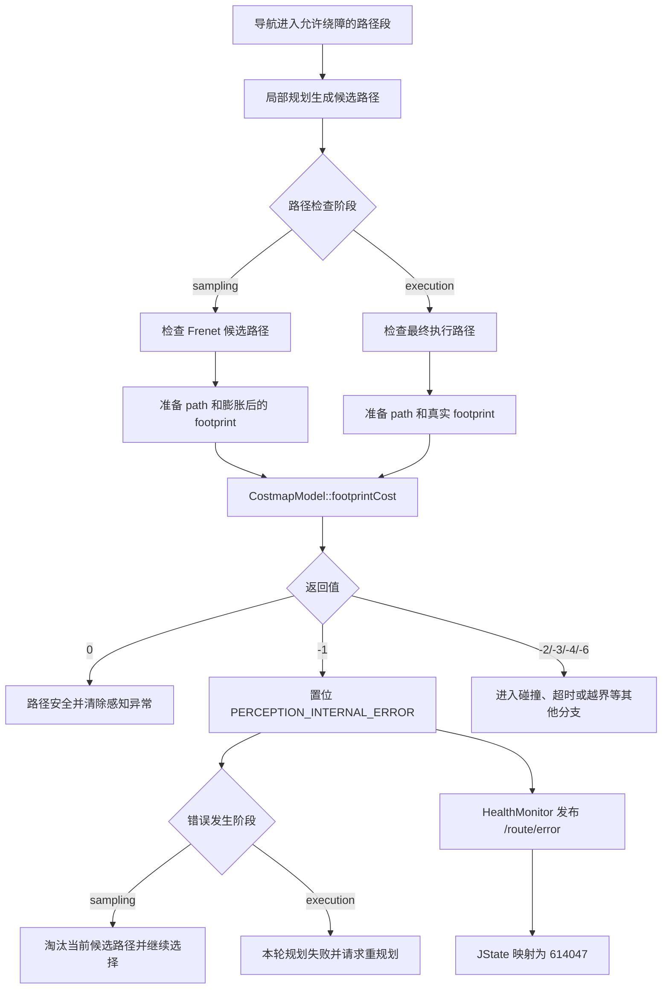

# JState 错误码 614047：障碍物感知模块内部异常

> 文档用途：当 AI Agent 在现场日志中发现 `614047` 时，用本文快速理解错误所在的功能流程，并根据同期日志选择下一步排查方向、处理措施和验证方法。

## 1 错误结论

| 字段 | 内容 |
|---|---|
| 错误码 | `614047` |
| JState Key | `/jstate/error/nav-manager/perception_internal_error` |
| 错误描述 | 障碍物感知模块内部异常 |
| 等级 | `level1`，nav-manager 内部为 `WARN` |
| 直接触发条件 | `jz_costmap_2d::CostmapModel::footprintCost()` 返回 `-1` |
| 直接影响 | 当前候选路径被淘汰，或最终执行路径检查失败并触发重新规划 |
| 自动恢复条件 | 后续路径检查中 `footprintCost()` 不再返回 `-1` |
| 引入记录 | `19c4ba6ad5c9e5a5d2f3cd5b393c9fc2e180df0c`（2025-03-10，添加感知相关报错） |
| 本文验证基线 | `RC/1.2603.x @ 744cfcbe352b` |
| 适用前提 | 机器人运行版本包含该错误映射，且使用本文所述的 `SafetyInspectorImpl` 路径检查链 |
| META 来源 | `机型3代状态数据-META大全.xlsx` → `异常状态s3` → 第 482 行 |

**核心判断**：`614047` 表示 nav-manager 调用 costmap 检查路径时收到了“内部错误”返回值。它不是普通障碍物碰撞，也不同于感知数据超时 `614048` 和检测越界 `614049`。

本仓库只能确认 costmap 返回了 `-1`，没有包含 `CostmapModel` 的实现源码。因此，AI Agent 必须结合机器人实际部署的 costmap 版本、输入数据和同期日志，继续确认 `-1` 来自哪个内部失败分支。

本文使用以下证据状态：

| 状态 | 含义 |
|---|---|
| `已确认` | META、源码或现场原始日志可直接证明 |
| `高可能` | 特征与某一原因高度吻合，但仍缺少底层直接证据 |
| `待确认` | 当前只能作为排查方向 |
| `已排除` | 正常判据或反向证据已经排除该原因 |

## 2 错误触发的功能流程

进入该错误链需要同时满足：

1. 全局参数 `/j3/navigation/feature_toggle/enable_obstacle_avoid` 为 `true`。
2. 当前路径段的 `enable_OA` 为 `true`。
3. nav-manager 已创建 costmap model，并开始检查采样路径或最终执行路径。



对应调用链：

```text
采样路径：
FrenetSampleGeneratorImpl::rolloutCollisionPath()
  -> SafetyInspectorImpl::isCheckPathSafe()
  -> SafetyInspectorImpl::isCheckPathSafeInternal()

最终执行路径：
CentroidPlannerInterface::plan()
  -> SafetyInspectorImpl::isCheckPathSafeForExecution()
  -> SafetyInspectorImpl::isCheckPathSafeInternal()

共同后续：
CostmapModel::footprintCost()
  -> 返回 -1
  -> HealthMonitor::setStatus(PERCEPTION_INTERNAL_ERROR, true)
  -> /route/error
  -> JState 614047
```

错误生命周期：

```text
OA 路径检查开始
  -> footprintCost() 返回 -1
  -> PERCEPTION_INTERNAL_ERROR = true
  -> level1 持续上报
  -> 后续路径检查先清除感知状态
  -> footprintCost() 返回非 -1
  -> 发布 trigger:false 最多 3 次
  -> 停止上报
```

该错误不需要单独调用清除接口，但“错误停止上报”不等于根因已经修复，仍需确认同一场景连续执行不再复现。

关联错误的时序解释：

| 时序 | 优先判断 |
|---|---|
| `614048` 先出现，随后出现 `614047` | 优先排查感知数据超时；`614047` 可能是后续影响 |
| `614049` 先出现，随后出现 `614047` | 优先排查输入范围或地图边界；不要先归因于 costmap 算法 |
| `614047` 单独、持续出现 | 优先检查 path、footprint、costmap 内部状态及版本协议 |
| `614047` 只在 sampling 出现 | 优先比较膨胀 footprint 与原始 footprint |
| `614047` 只在 execution 出现 | 优先检查最终执行路径与真实 footprint |

## 3 结合日志选择排查方向

先提取错误前后至少 30 秒的日志：

```bash
grep -E "perception internal error|internal_error|\\[PathCheck\\]|\\[CPI\\] Execution path|mobility\\[enable_OA|\\[ReconfigPath\\]" \
  /opt/jz/log/nav-manager.log | tail -n 300
```

按顺序执行下表。命中异常判据后，先完成该分支取证，不要无条件继续尝试后面的所有原因。

| 顺序 | 检查项 | 正常判据 | 异常判据 | 结论状态与下一步 |
|---:|---|---|---|---|
| 1 | 时间与版本 | JState、日志属于同一进程和时间窗，运行版本适用本文 | 时间戳、启动 UUID、版本或日志文件不一致 | 当前分析标记为`待确认`；重新取得正确时间窗和版本 |
| 2 | 直接触发日志 | 出现 `costmap perception internal error` | 找不到该日志 | 不能证明本文调用链；核对旧版本日志格式和 JState 原始消息 |
| 3 | 检查阶段 | 能确定为 `sampling` 或 `execution` | 阶段不明 | 扩大日志时间窗；不得假设任务影响 |
| 4 | path 输入 | `size > 0`，坐标和 yaw 均为有限值 | `size:0`、`NaN`、`Inf` 或明显异常坐标 | 路径输入异常标记为`高可能`；回溯局部规划和坐标转换 |
| 5 | footprint 输入 | 点数足以形成多边形，坐标有限，topic 持续更新 | `size:0`、点数不足、数值非法或 topic 中断 | footprint 链路异常标记为`高可能`；转查发布节点和车型配置 |
| 6 | OA 条件 | 全局开关和当前路径段 `oa` 均为 `1` | 任一为 `0`，但仍出现检查日志 | 版本、配置或时间窗不一致标记为`高可能` |
| 7 | 关联错误时序 | 没有更早出现的 timeout/range 错误 | `614048` 或 `614049` 更早出现 | 优先分析最早的底层错误，`614047` 暂标为后续影响 |
| 8 | costmap 内部 | path、footprint、OA 均正常，且部署源码中的某个 `return -1` 分支被现场证据命中 | 只有 `-1` 结果，未找到产生分支 | 找到分支后根因才能标记为`已确认`；否则保持`待确认` |

停止规则：

- 已找到首个非法输入及其生产者时，停止泛化排查，沿该生产者继续追因。
- path、footprint 和 OA 均正常时，排查范围收敛到 costmap 及其数据依赖。
- 仅看到 `614047`、没有同期日志时，只能解释错误含义，不能输出确定根因。
- 修复后未通过第 5 章验证时，不能把结果标记为已闭环。

现场确认命令：

```bash
# 确认 JState 原始上报
rostopic echo -n 1 /route/error

# 确认绕障开关与当前路径段
rosparam get /j3/navigation/feature_toggle/enable_obstacle_avoid
grep -E "mobility\\[enable_OA|\\[ReconfigPath\\].*oa:" \
  /opt/jz/log/nav-manager.log | tail -n 100

# 检查 footprint 是否存在且持续更新
rostopic echo -n 1 /nav_checker/local_costmap/footprint
rostopic hz /nav_checker/local_costmap/footprint

# 查找 costmap、nav_checker 和感知相关接口
rosnode list | grep -E "costmap|nav_checker|perception"
rostopic list | grep -E "costmap|obstacle|perception"
```

## 4 可能原因与解决方案

| 优先级 | 原因与唯一特征 | 负责链路 | 临时处置 | 根因修复 | 修复验证 |
|---|---|---|---|---|---|
| P1 | footprint 未发布或为空：`footprint:size:0`，topic 无有效消息 | nav_checker、车型 footprint 配置 | 阻止继续下发受影响任务，恢复 footprint 发布后重试 | 修复启动顺序、topic、frame 或车型外形配置，确保 nav-manager 初始化后能收到有效多边形 | topic 持续更新且 `[PathCheck]` 中 `footprint:size > 0` |
| P1 | footprint 数值非法：点中存在 `NaN`、`Inf` 或异常大值 | footprint 数据生产者 | 隔离异常配置或数据，不使用错误 footprint 继续导航 | 修复外形计算、单位、坐标系转换或配置解析 | 所有点为有限值，sampling 与 execution 均通过 |
| P1 | costmap 未就绪：输入正常，但 costmap 日志出现初始化、地图或订阅错误 | costmap、nav_checker | 等待依赖就绪；确认状态正常后重新执行任务 | 修复依赖启动、就绪检查、地图加载或订阅恢复机制 | 同一启动流程下不再返回 `-1` |
| P1 | costmap 上游数据异常：先出现订阅中断、解析错误、`614048` 或 `614049` | 感知、地图、TF、costmap | 恢复异常数据源并观察状态，不直接修改 nav-manager | 修复上游时间戳、坐标系、数据内容或通信稳定性 | 上游错误先恢复，随后 `614047` 自动清除 |
| P2 | 路径输入异常：`path:size:0` 或路径点存在非法数值 | 局部规划、坐标转换 | 停止使用本轮规划结果并触发安全重规划 | 修复首个非法路径点的生成或坐标转换逻辑 | 相同输入下产生有效路径且路径检查通过 |
| P2 | 只在 sampling 失败，膨胀 footprint 异常 | nav-manager safety inspector、车型配置 | 在确认安全边界前不通过调小膨胀量绕过检查 | 修正 `sampling_footprint_expansion` 或车型外形；保留业务要求的安全余量 | sampling 和 execution 都通过，且安全余量符合要求 |
| P2 | 返回码协议不一致：部署 costmap 中 `-1` 的定义与 nav-manager 映射不同 | nav-manager 与 costmap 版本管理 | 回退或切换到已验证的配套版本 | 对齐依赖版本和返回码协议，必要时修正映射并增加接口测试 | 部署版本的返回码定义、日志和 JState 映射一致 |

若输入数据表面正常，应在机器人实际使用的 costmap 源码中查找 `-1` 的产生位置：

```bash
rg -n "footprintCost|return -1|InternalError|INTERNAL_ERROR" {costmap源码目录}
```

将每个 `return -1` 分支的前置条件与现场数据逐一对照。没有找到该直接证据前，不应把根因简单归结为“激光雷达故障”或“检测到障碍物”，也不应把“重启后暂时恢复”写成根因修复。

## 5 修复验证与证据索引

修复后同时满足以下条件，才可判定问题闭环：

1. `/route/error` 中出现该 key 的 `trigger:false`，之后不再反复置为 `true`。
2. nav-manager 不再出现 `costmap perception internal error`。
3. sampling 和 execution 路径检查均能通过。
4. footprint、costmap 及其上游数据持续有效。
5. 相同地图和任务连续执行多次不再复现。

AI Agent 最少需要收集：

```text
错误发生时间及前后至少 30 秒的未过滤原始日志
/route/error 原始消息
[PathCheck] 中的阶段、path 和 footprint 摘要
全局 enable_obstacle_avoid 与路径段 oa 值
footprint 单帧数据及频率
costmap/nav_checker 同时间窗日志
nav-manager、costmap 和感知模块版本
```

Agent 完成分析后必须按以下结构输出，禁止省略证据状态和缺失项：

```yaml
error_code: 614047
error_name: perception_internal_error
analysis_status: 待确认  # 已确认 / 高可能 / 待确认 / 已排除
applicable_version:
  nav_manager: ""
  costmap: ""
trigger_stage: unknown  # sampling / execution / unknown
confirmed_facts:
  - "footprintCost 返回 -1"
most_likely_cause:
  cause: ""
  confidence: low  # high / medium / low
  evidence:
    - ""
excluded_causes:
  - cause: ""
    evidence: ""
missing_evidence:
  - ""
next_action:
  - ""
temporary_action: ""
root_fix: ""
verification:
  result: not_started  # passed / failed / not_started
  evidence:
    - ""
```

输出约束：

- `analysis_status: 已确认` 必须引用能命中具体失败分支的直接证据。
- `most_likely_cause` 不能只重复“感知模块内部异常”。
- `temporary_action` 与 `root_fix` 必须分开。
- 缺少 costmap 内部证据时，必须填写 `missing_evidence`，不得虚构根因。
- 验证未执行时必须写 `not_started`，不能根据错误暂时消失推断修复成功。

代码与数据证据：

| 证据 | 位置 |
|---|---|
| 数值码映射 | `机型3代状态数据-META大全.xlsx` → `异常状态s3` → 第 482 行 |
| 感知类错误引入记录 | `19c4ba6ad5c9e5a5d2f3cd5b393c9fc2e180df0c` |
| 异常枚举 | `nav_core/include/nav_core/struct/abnormal_ids.h:19` |
| JState key、描述和 WARN 等级 | `nav_core/src/health_monitor.cpp:71` |
| costmap 返回码及异常映射 | `navigation/nav_controller/src/motion_toolbox/safety_inspector_impl.cpp:31`、`:113` |
| OA 前置条件、输入准备和 `footprintCost()` 调用 | `navigation/nav_controller/src/motion_toolbox/safety_inspector_impl.cpp:251` |
| sampling 入口 | `../jz-pnc/jz_pnc/path_planner/src/frenet_sample_generator.cpp:438` |
| execution 入口 | `navigation/nav_controller/src/plan_ctrl_layer/centroid_planner_interface.cpp:733` |
| JState 上报与恢复规则 | `nav_core/src/health_monitor.cpp:192`、`:236` |
| META 登记的外部说明 | [障碍物感知模块内部异常](https://alidocs.dingtalk.com/i/nodes/QG53mjyd80RMlpD0CQoyDggNV6zbX04v) |

## 6 Agent 自动排查 Playbook

> 本章供 diagnosis-orchestrator 的确定性分析器自动执行。每一步输出必须互斥且完备，所有 pattern 必须是可 grep 的真实字符串或正则。

```yaml
playbook:
  meta:
    error_code: "614047"
    error_name: "perception_internal_error"
    module: "nav-manager"
    time_window: 60

  steps:
    # ── 步骤 1：区分触发链（sampling vs execution）──
    - id: classify_trigger_chain
      description: "根据日志区分内部错误发生在采样阶段还是执行阶段"
      checks:
        - type: grep_log
          module: "nav-manager"
          pattern: "costmap perception internal error"
          on_match:
            trigger_chain: "internal_error_confirmed"
            conclusion: "命中 costmap perception internal error，footprintCost 返回 -1"
            goto: diagnose_internal_error
        - type: on_no_match
          conclusion: "当前时间窗内未找到 internal error 日志"
          action: expand_time_window
          time_window: 120

    # ── 步骤 2：深入排查内因 ──
    - id: diagnose_internal_error
      description: "按第3章决策表顺序排查：阶段 → path 输入 → footprint → OA 条件 → 关联错误 → 频率"
      checks:
        # 检查触发阶段
        - type: grep_log
          module: "nav-manager"
          pattern: "\[PathCheck\]\[sampling\].*internal error"
          priority: P1
          on_match:
            conclusion: "sampling 阶段触发（膨胀 footprint），采样路径检查失败"
            continue: true
          on_no_match:
            continue: true
        - type: grep_log
          module: "nav-manager"
          pattern: "\[PathCheck\]\[execution\].*internal error"
          priority: P1
          on_match:
            conclusion: "execution 阶段触发（真实 footprint），执行路径检查失败"
            continue: true
          on_no_match:
            continue: true
        # 检查 footprint 输入
        - type: grep_log
          module: "nav-manager"
          pattern: "footprint.*size:0"
          priority: P1
          on_match:
            conclusion: "footprint 为空，costmap 无法进行路径安全检测"
            root_cause: "/nav_checker/local_costmap/footprint 无数据或格式异常"
            temp_fix: "恢复 footprint topic 发布后再执行任务"
            goto: verify
          on_no_match:
            continue: true
        # 检查 path 输入
        - type: grep_log
          module: "nav-manager"
          pattern: "path.*size:0"
          priority: P1
          context_lines: 2
          on_match:
            conclusion: "路径输入为空，检查无法进行"
            root_cause: "局部规划生成了空路径或坐标转换异常"
            temp_fix: "触发重规划或回退到上一有效路径"
            goto: verify
          on_no_match:
            continue: true
        # 检查 costmap 未就绪
        - type: grep_log
          module: "nav-manager"
          pattern: "costmap_model not initialized"
          priority: P1
          on_match:
            conclusion: "costmap_model 未初始化，路径检测本身无法执行"
            root_cause: "costmap 初始化失败（订阅、tf或地图加载异常）"
            temp_fix: "等待 costmap 就绪后再启动绕障任务"
            goto: verify
          on_no_match:
            continue: true
        # 检查关联错误——超时
        - type: grep_log
          module: "nav-manager"
          pattern: "costmap perception data timeout"
          priority: P2
          context_lines: 0
          on_match:
            conclusion: "同帧或先出现 data_timeout（614048），internal error 可能是后续影响"
            root_cause: "costmap 数据查询超时，内部错误为后续表现"
            temp_fix: "优先排查 614048（数据超时）"
            goto: verify
          on_no_match:
            continue: true
        # 检查关联错误——越界
        - type: grep_log
          module: "nav-manager"
          pattern: "costmap perception range exceeded"
          priority: P2
          context_lines: 0
          on_match:
            conclusion: "同帧或先出现 range_exceeded（614049），internal error 可能是后续影响"
            root_cause: "costmap 检测越界，内部错误为后续表现"
            temp_fix: "优先排查 614049（范围越界）"
            goto: verify
          on_no_match:
            continue: true
        # 检查 sessions 多帧累计
        - type: grep_log
          module: "nav-manager"
          pattern: "sampling_session_total:[1-9]"
          priority: P2
          on_match:
            conclusion: "sampling 阶段多帧累计 internal error，持续触发"
            root_cause: "footprint 或 path 数据持续异常，或 costmap 内部状态持续错误"
            temp_fix: "收集 path/footprint 摘要数据与 costmap 参数比对"
            goto: verify
          on_no_match:
            continue: true
        # 执行阶段规划失败
        - type: grep_log
          module: "nav-manager"
          pattern: "Execution path collision check failed"
          priority: P2
          on_match:
            conclusion: "执行阶段 internal error 导致规划失败，触发重规划"
            root_cause: "执行路径 costmap 检测返回 -1，本轮规划废弃"
            temp_fix: "检查执行路径和真实 footprint 的有效性"
            goto: verify
          on_no_match:
            continue: true
        # 兜底
        - type: on_no_match
          conclusion: "所有已知检查项均未命中，输入数据表面正常"
          status: insufficient_data
          root_cause: "costmap 内部原因（footprintCost 返回 -1），需 costmap 源码排查"
          evidence_boundary: true
          action: "在部署的 costmap 源码中查找 return -1 分支，与现场数据逐一对照"

    # ── 步骤 3：验证修复 ──
    - id: verify
      description: "验证修复：连续 60 秒不再出现 internal error"
      checks:
        - type: verify_fix
          grep_pattern: "costmap perception internal error"
          watch_duration_sec: 60
          on_match:
            status: still_present
            action: "internal error 仍然存在，需采集 costmap 内部源码排查 return -1 分支"
          on_no_match:
            status: verified
            conclusion: "连续 60 秒未出现 costmap perception internal error，错误已清除"
```
