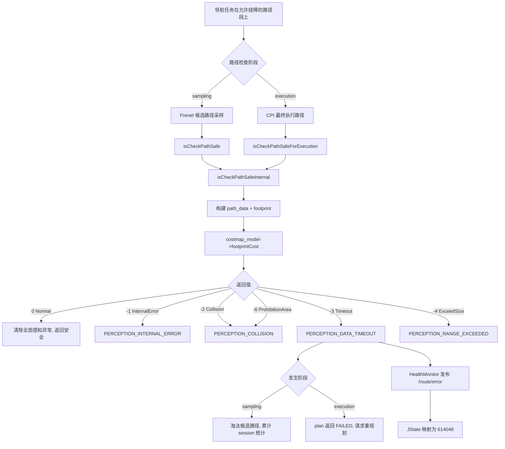

# JState 错误码 614048：障碍物感知原始数据查询超时

> 文档用途：当 AI Agent 在现场日志中发现 `614048` 时，用本文理解 costmap 查询超时的触发流程，并根据同期日志判断是临时网络延迟还是 costmap 数据源持续不可用，以此选择处置方案。

## 1 错误结论

| 字段 | 内容 |
|---|---|
| 错误码 | `614048` |
| JState Key | `/jstate/error/nav-manager/perception_data_timeout` |
| 错误描述 | 障碍物感知原始数据查询超时 |
| 等级 | `level1`，nav-manager 内部为 `WARN` |
| 直接触发条件 | `jz_costmap_2d::CostmapModel::footprintCost()` 返回 `-3`（`CostmapResultId::Timeout`） |
| 直接影响 | 当前待检查路径被判定为不安全：若为采样阶段，淘汰该候选路径；若为执行阶段，本轮规划失败并触发重规划 |
| 自动恢复条件 | 下一次路径检查中 `footprintCost()` 不再返回超时错误 |
| 引入记录 | `19c4ba6ad5c9e5a5d2f3cd5b393c9fc2e180df0c`（2025-03-10，添加感知相关报错） |
| 本文验证基线 | `RC/1.2603.x @ 744cfcbe352b` |
| 适用前提 | 机器人运行版本启用绕障（`ENABLE_OA=true`）且当前路径段 `enable_OA=true` |
| META 来源 | `机型3代状态数据-META大全.xlsx` → `异常状态s3` → 第 483 行 |

**核心判断**：`614048` 表示 nav-manager 调用底层 costmap 做路径安全检测时收到了超时返回值。它不同于 costmap 检测到实际碰撞（`614047` 感知内部错误）或检测范围越界（`614049`）。`footprintCost()` 实现在外部库 `jz_costmap_2d` 中，本仓库只能确认返回值分类和错误置位逻辑，不能确认超时产生的底层分支（如传感器数据未到达、costmap 更新阻塞或节点间通信超时）。

本文使用以下证据状态：

| 状态 | 含义 |
|---|---|
| `已确认` | META、源码或现场原始日志可直接证明 |
| `高可能` | 特征与某一原因高度吻合，但仍缺少生产者侧直接证据 |
| `待确认` | 当前只能作为排查方向 |
| `已排除` | 正常判据或反向证据已经排除该原因 |

## 2 错误触发的功能流程

进入该错误链需要同时满足：

1. 全局参数 `/j3/navigation/feature_toggle/enable_obstacle_avoid` 为 `true`（`oa_enabled_ == true`）。
2. 当前路径段的 `enable_OA` 为 `true`（`path_allows_oa == true`）。
3. `costmap_model` 已成功初始化。
4. footprint 缓存已就绪（topic `/nav_checker/local_costmap/footprint` 有数据）。



对应调用链：

```text
采样路径（isCheckPathSafe）：
  jz_pnc_path_planner/FrenetSampleGenerator (外部库)
    -> SafetyInspectorImpl::isCheckPathSafe()
    -> isCheckPathSafeInternal(path, sampling_expansion_, sampling_expansion_)

执行路径（isCheckPathSafeForExecution）：
  CentroidPlannerInterface::plan()
    -> SafetyInspectorImpl::isCheckPathSafeForExecution(plan_tuple.plan)
    -> isCheckPathSafeInternal(path, execution_expansion_, execution_expansion_)

共同内部 isCheckPathSafeInternal()：
  -> 检查 oa_enabled_ && path_allows_oa（否则 return true 跳过）
  -> 检查 costmap_model（否则 return false）
  -> path → vector<Eigen::Vector3d>
  -> 选择 footprint（sampling 膨胀 0.1m 或 execution 真实 footprint）
  -> costmap_model->footprintCost(path_data, footprint)
  -> 先清除 ALL 感知异常（false）   ← 关键：每次检查都重置
  -> 根据返回值设置对应异常（true）
  -> 打印日志 "[PathCheck][sampling|execution] costmap perception data timeout"
```

错误生命周期：

```text
每次 isCheckPathSafeInternal() 调用：
  第一步：setStatus(PERCEPTION_DATA_TIMEOUT, false)  ← 无条件清除
  第二步：若 footprintCost() == -3：
            setStatus(PERCEPTION_DATA_TIMEOUT, true)
            is_abnormal = true

WARN 级别发布规则（health_monitor.cpp:238-247）：
  当 is_abnormal == true  → 持续发布 trigger:true（每 1 秒）
  当 is_abnormal == false → 发布 trigger:false 最多 3 次后停止

因此：
  - 如果下一帧检查通过（返回 0），错误自动恢复
  - 如果持续返回 -3，则 WARN 持续上报
  - 任务重置时 exit() 统一清除所有非 BLIND_MOVING 状态
```

关联错误的时序解释：

| 时序或组合 | 优先判断 |
|---|---|
| `614048` 与 `614049` 交替出现 | 优先排查 costmap 数据源是否间歇性异常（传感器断连、costmap 更新超时） |
| `614048` 单独持续出现 | 优先排查 costmap 查询数据链路（传感器数据未到达或处理耗时过长） |
| `614047`（内部错误）先出现，随后恢复为 `614048` | costmap 内部状态已恢复，但数据查询仍慢 |
| 仅 `614048` 短暂出现后消失 | 临时网络/CPU 抖动，WARN 级别自动清除 |

## 3 结合日志选择排查方向

先保留错误前后至少 60 秒的原始日志：

```bash
grep -E "perception data timeout|\[PathCheck\]|costmap_model|footprintCost|footprint" \
  /opt/jz/log/nav-manager.log | tail -n 300
```

按顺序执行：

| 顺序 | 检查项 | 正常判据 | 异常判据 | 结论状态与下一步 |
|---:|---|---|---|---|
| 1 | 时间与版本 | JState、日志和任务属于同一时间窗，版本适用本文 | 时间、任务或版本不一致 | 标记`待确认`并重新取证 |
| 2 | costmap_model 状态 | 无 `costmap_model not initialized` 日志 | 出现 `costmap_model not initialized` | 优先修复 costmap 初始化链 |
| 3 | footprint 数据 | footprint 非空，日志显示正常 size | footprint 为空，日志显示 `footprint.*size:0` | footprint 缺失会影响所有路径检测，不单是超时 |
| 4 | 触发阶段 | 能由 `[PathCheck][sampling]` 或 `[PathCheck][execution]` 确定阶段 | 阶段不明 | 扩大时间窗确认上下文 |
| 5 | 超时频率——偶发 | 单次出现，后续帧正常 | 持续多帧 `data timeout` | 持续超时→`高可能`，排查数据链路；偶发→监控恢复 |
| 6 | 超时频率——多帧 | 日志显示 `sampling_session_total:[1-9]` | 无累计统计或仅单次 | 多帧累计→数据链路持续异常 |
| 7 | 关联 costmap 错误 | 同帧无 `range exceeded` 或 `internal error` | 同时出现其他 costmap 错误 | 组合出现时优先排查数据源稳定性 |
| 8 | 执行阶段影响 | 无 `Execution path collision check failed` | 出现 `Execution path collision check failed` | 执行阶段超时导致重规划，影响实际导航 |
| 9 | 复测 | 同一路径段连续多次检查不再超时 | 复测仍偶发 | 检查系统负载、ROS 时间同步和网络 |

停止规则：

- 命中 `costmap_model not initialized` 时，先修复初始化链。
- 首次超时且后续自动恢复时，不标记为确定根因；记录为 `高可能` 并交代恢复模式。
- 只有错误码没有 footprintCost 调用上下文时，只能确认超时已发生。
- 修复后连续 10 帧以上路径检查不再超时，方可闭环。

现场确认命令：

```bash
# 确认 JState 原始上报
rostopic echo -n 1 /route/error

# 确认 footprint topic 和 costmap 状态
rostopic info /nav_checker/local_costmap/footprint
rostopic hz /nav_checker/local_costmap/footprint

# 查看超时前的完整调用上下文
grep -B 20 -A 5 "costmap perception data timeout" /opt/jz/log/nav-manager.log

# 查看同帧其他 costmap 错误
grep "costmap perception" /opt/jz/log/nav-manager.log | tail -n 100
```

## 4 可能原因与解决方案

| 优先级 | 原因与唯一特征 | 负责链路 | 临时处置 | 根因修复 | 修复验证 |
|---|---|---|---|---|---|
| P1 | costmap 数据未到达：日志持续出现 `data timeout` 且同帧无碰撞/越界 | 传感器驱动、ROS topic、costmap 层 | 暂停绕障任务，降低行驶速度 | 修复传感器数据发布链路：驱动启动、topic 配置、网络通信 | 传感器数据持续发布，footprintCost 正常 |
| P1 | costmap 处理阻塞：日志偶尔出现 timeout，出现在高负载场景 | costmap 层、CPU 调度、内存 | 降低任务频率或路径复杂度 | 优化 costmap 计算或增加 CPU 资源 | 相同负载下不再出现 |
| P1 | footprint 数据延迟：timeout 与 `footprint.*size:0` 同时出现 | `/nav_checker/local_costmap/footprint` 发布者 | 等待 footprint 恢复后重试 | 修复 footprint 发布链路的配置或时序 | footprint 持续更新且非空 |
| P2 | costmap_model 初始化时序问题：任务启动时偶发 timeout | nav-manager、costmap 初始化顺序 | 延后首次路径检查 | 增加 costmap 就绪状态等待逻辑 | 启动后不再出现首次超时 |
| P2 | 系统时钟不同步：ROS 时间与系统时间不一致 | 时间同步、NTP、ROS 时钟源 | 检查并校准时间同步 | 修复 NTP 或 ROS use_sim_time 配置 | 时间同步稳定，不再出现时钟导致的超时 |
| P3 | costmap 内部实现耗时路径 | jz_costmap_2d 外部库（证据边界） | 降低路径点数量或缩小检测范围 | 需外部库团队修复 footPrintCost | 修复后不再触发，需配合版本更新 |

不要通过永久关闭 `ENABLE_OA` 来规避超时错误。WARN 级别自动清除时以复测结果为准。

## 5 修复验证与证据索引

闭环需要同时满足：

1. 已明确错误发生在采样阶段还是执行阶段。
2. `costmap perception data timeout` 日志不再出现。
3. `PERCEPTION_DATA_TIMEOUT` JState 不再上报 `trigger:true`。
4. 相同路径段和负载条件下，连续 10 次以上路径检查正常。
5. footprint 数据持续更新且非空，costmap_model 正常。

Agent 最少需要收集：

```text
错误时间及前后至少 60 秒的未过滤日志
/route/error 原始消息
触发阶段：sampling 或 execution
footprint topic 发布者、频率和内容
同帧其他 costmap 错误（collision/internal_error/range_exceeded）
传感器 topic（激光/深度/超声波）发布状态
nav-manager、costmap 和相关传感器驱动版本
修复后同路径段、同负载复测结果
```

Agent 输出格式：

```yaml
error_code: 614048
error_name: perception_data_timeout
analysis_status: 待确认  # 已确认 / 高可能 / 待确认 / 已排除
applicable_version:
  nav_manager: ""
  costmap: ""
trigger_stage: unknown  # sampling / execution / unknown
confirmed_facts:
  - ""
most_likely_cause:
  cause: ""
  confidence: low  # high / medium / low
  evidence:
    - ""
excluded_causes:
  - cause: ""
    evidence: ""
missing_evidence:
  - ""
next_action:
  - ""
temporary_action: ""
root_fix: ""
verification:
  result: not_started  # passed / failed / not_started
  evidence:
    - ""
```

输出约束：

- 连续多帧超时与偶发恢复必须区分，不能把偶发标记为已修复。
- footprint 数据缺失时，不把 costmap 内部实现标记为根因。
- 执行阶段超时导致规划失败时，必须记录相关日志。
- 未执行同场景复测时，验证结果必须为 `not_started`。

代码与数据证据：

| 证据 | 位置 |
|---|---|
| 数值码映射 | `机型3代状态数据-META大全.xlsx` → `异常状态s3` → 第 483 行 |
| WARN 等级和 JState key | `nav_core/src/health_monitor.cpp:73-74` |
| CostmapResultId 枚举（Timeout=-3） | `safety_inspector_impl.cpp:35` |
| 返回值→异常映射表 | `safety_inspector_impl.cpp:113-118` |
| 每次检查清除所有感知状态 | `safety_inspector_impl.cpp:334-338` |
| 错误置位与 session 统计 | `safety_inspector_impl.cpp:341-358` |
| 执行路径检查入口 | `centroid_planner_interface.cpp:746` |
| WARN 级别发布规则 | `health_monitor.cpp:238-247` |
| 外部库调用（证据边界） | `jz_costmap_2d::CostmapModel::footprintCost()` |
| META 外部说明 | [障碍物感知原始数据查询超时](https://alidocs.dingtalk.com/i/nodes/14lgGw3P8vvXgR5xhGw9lbEo85daZ90D) |

## 6 Agent 自动排查 Playbook

> 本章供 diagnosis-orchestrator 的确定性分析器自动执行。每一步输出必须互斥且完备，所有 pattern 必须是可 grep 的真实字符串或正则。

```yaml
playbook:
  meta:
    error_code: "614048"
    error_name: "perception_data_timeout"
    module: "nav-manager"
    time_window: 60

  steps:
    - id: classify_trigger_chain
      description: "确认 costmap 数据超时是否发生"
      checks:
        - type: grep_log
          module: "nav-manager"
          pattern: "costmap perception data timeout"
          on_match:
            trigger_chain: "data_timeout_confirmed"
            conclusion: "命中 costmap perception data timeout，确认超时发生"
            goto: diagnose_data_timeout
        - type: on_no_match
          conclusion: "当前时间窗内未找到 costmap perception data timeout，扩大时间窗重试"
          action: expand_time_window
          time_window: 120

    - id: diagnose_data_timeout
      description: "按第3章决策表顺序排查：costmap_model → footprint → 超时频率 → 关联错误 → 执行影响"
      checks:
        - type: grep_log
          module: "nav-manager"
          pattern: "costmap_model not initialized"
          priority: P1
          on_match:
            conclusion: "costmap_model 未初始化，路径检测本身无法正常工作"
            root_cause: "costmap_model 初始化失败（costmap 订阅或 tf 异常）"
            temp_fix: "检查 costmap 订阅节点和 tf 树，确保 costmap 层正常启动"
            goto: verify
          on_no_match:
            continue: true
        - type: grep_log
          module: "nav-manager"
          pattern: "footprint.*size:0"
          priority: P1
          on_match:
            conclusion: "footprint 为空，可能影响所有 costmap 查询"
            root_cause: "/nav_checker/local_costmap/footprint topic 无数据或格式异常"
            temp_fix: "检查 footprint topic 发布者状态和消息格式"
            goto: verify
          on_no_match:
            continue: true
        - type: grep_log
          module: "nav-manager"
          pattern: "sampling_session_total:[1-9]"
          priority: P2
          on_match:
            conclusion: "sampling 阶段多帧累计 data timeout，数据链路持续异常"
            root_cause: "costmap 数据源或处理链路持续异常（传感器断连、costmap 更新阻塞）"
            temp_fix: "降低行驶速度，检查传感器 topic 发布状态和 costmap 更新频率"
            goto: verify
          on_no_match:
            continue: true
        - type: grep_log
          module: "nav-manager"
          pattern: "costmap perception range exceeded"
          priority: P2
          context_lines: 0
          on_match:
            conclusion: "同帧出现 range_exceeded（614049），costmap 数据源间歇性异常"
            root_cause: "costmap 数据源不稳定（同时触发超时和越界）"
            temp_fix: "检查激光/深度传感器数据发布频率和完整性"
            goto: verify
          on_no_match:
            continue: true
        - type: grep_log
          module: "nav-manager"
          pattern: "Execution path collision check failed"
          priority: P2
          on_match:
            conclusion: "执行阶段 costmap 超时导致规划失败，触发重规划"
            root_cause: "执行路径 costmap 检测超时，本轮规划废弃"
            temp_fix: "检查 costmap 数据链路，临时降低路径复杂度"
            goto: verify
          on_no_match:
            continue: true
        - type: on_no_match
          conclusion: "超时发生但所有已知异常特征均未命中，可能是临时系统抖动"
          status: high_possible
          root_cause: "临时系统负载或网络抖动导致 costmap 查询超时"
          action: "监控后续 10 帧，若不再出现则闭环"

    - id: verify
      description: "验证修复是否生效：连续 60 秒不再出现 data timeout"
      checks:
        - type: verify_fix
          grep_pattern: "costmap perception data timeout"
          watch_duration_sec: 60
          on_match:
            status: still_present
            action: "错误仍然存在，扩大时间窗或升级人工排查 costmap 内部实现"
          on_no_match:
            status: verified
            conclusion: "连续 60 秒未出现 costmap perception data timeout，错误已清除"
```
