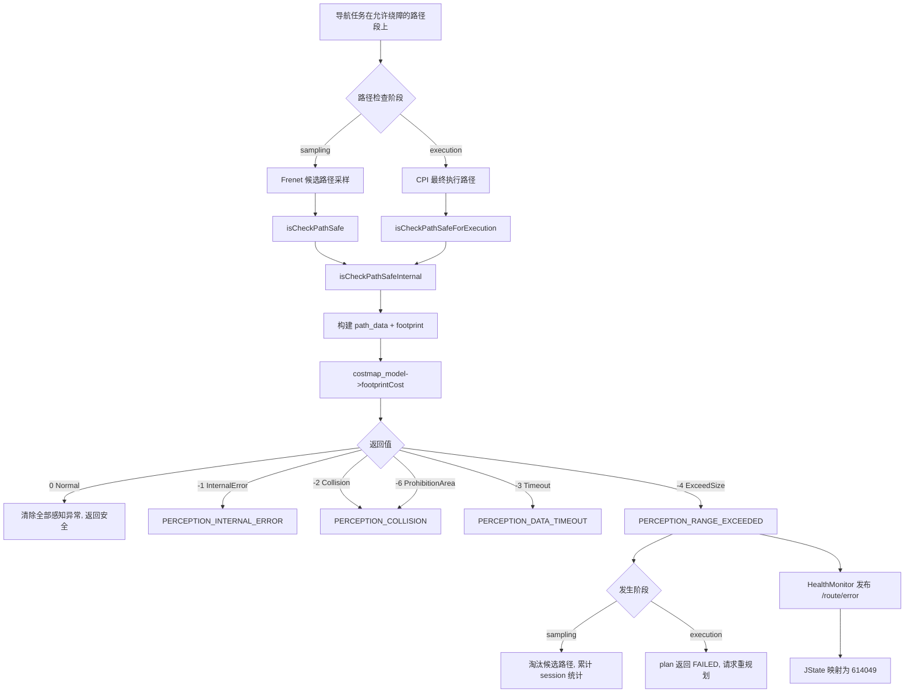

# JState 错误码 614049：障碍物感知检测超出边界

> 文档用途：当 AI Agent 在现场日志中发现 `614049` 时，用本文理解 costmap 检测越界的触发流程，并根据同期日志判断是代价地图范围配置不足还是车辆实际偏离了地图覆盖区域。

## 1 错误结论

| 字段 | 内容 |
|---|---|
| 错误码 | `614049` |
| JState Key | `/jstate/error/nav-manager/perception_range_exceeded` |
| 错误描述 | 障碍物感知检测超出边界 |
| 等级 | `level1`，nav-manager 内部为 `WARN` |
| 直接触发条件 | `jz_costmap_2d::CostmapModel::footprintCost()` 返回 `-4`（`CostmapResultId::ExceedSize`） |
| 直接影响 | 当前待检查路径被判定为不安全：若为采样阶段，淘汰该候选路径；若为执行阶段，本轮规划失败并触发重规划 |
| 自动恢复条件 | 下一次路径检查中 `footprintCost()` 不再返回越界错误 |
| 引入记录 | `19c4ba6ad5c9e5a5d2f3cd5b393c9fc2e180df0c`（2025-03-10，添加感知相关报错） |
| 本文验证基线 | `RC/1.2603.x @ 744cfcbe352b` |
| 适用前提 | 机器人运行版本启用绕障（`ENABLE_OA=true`）且当前路径段 `enable_OA=true` |
| META 来源 | `机型3代状态数据-META大全.xlsx` → `异常状态s3` → 第 484 行 |

**核心判断**：`614049` 表示 nav-manager 调用底层 costmap 做路径安全检测时，待检查的路径点或 footprint 超出了 costmap 的有效范围。它不同于普通碰撞（Collision/-2）、超时（Timeout/-3）或内部错误（InternalError/-1）。常见于路径偏离地图边界、costmap 范围配置偏小或车辆 footprint 膨胀后触及地图边缘。`footprintCost()` 实现在外部库 `jz_costmap_2d` 中，本仓库只能确认返回值分类和错误置位逻辑。

本文使用以下证据状态：

| 状态 | 含义 |
|---|---|
| `已确认` | META、源码或现场原始日志可直接证明 |
| `高可能` | 特征与某一原因高度吻合，但仍缺少生产者侧直接证据 |
| `待确认` | 当前只能作为排查方向 |
| `已排除` | 正常判据或反向证据已经排除该原因 |

## 2 错误触发的功能流程

进入该错误链需要同时满足：

1. 全局参数 `/j3/navigation/feature_toggle/enable_obstacle_avoid` 为 `true`（`oa_enabled_ == true`）。
2. 当前路径段的 `enable_OA` 为 `true`（`path_allows_oa == true`）。
3. `costmap_model` 已成功初始化。
4. footprint 缓存已就绪（topic `/nav_checker/local_costmap/footprint` 有数据）。



对应调用链：

```text
采样路径（isCheckPathSafe）：
  jz_pnc_path_planner/FrenetSampleGenerator (外部库)
    -> SafetyInspectorImpl::isCheckPathSafe()
    -> isCheckPathSafeInternal(path, sampling_expansion_, sampling_expansion_)

执行路径（isCheckPathSafeForExecution）：
  CentroidPlannerInterface::plan()
    -> SafetyInspectorImpl::isCheckPathSafeForExecution(plan_tuple.plan)
    -> isCheckPathSafeInternal(path, execution_expansion_, execution_expansion_)

共同内部 isCheckPathSafeInternal()：
  -> 检查 oa_enabled_ && path_allows_oa（否则 return true 跳过）
  -> 检查 costmap_model（否则 return false）
  -> path → vector<Eigen::Vector3d>
  -> 选择 footprint（sampling 膨胀 0.1m 或 execution 真实 footprint）
  -> costmap_model->footprintCost(path_data, footprint)
  -> 先清除 ALL 感知异常（false）   ← 关键：每次检查都重置
  -> 根据返回值设置对应异常（true）
  -> 打印日志 "[PathCheck][sampling|execution] costmap perception range exceeded"
```

错误生命周期：

```text
每次 isCheckPathSafeInternal() 调用：
  第一步：setStatus(PERCEPTION_RANGE_EXCEEDED, false)  ← 无条件清除
  第二步：若 footprintCost() == -4：
            setStatus(PERCEPTION_RANGE_EXCEEDED, true)
            is_abnormal = true

WARN 级别发布规则（health_monitor.cpp:238-247）：
  当 is_abnormal == true  → 持续发布 trigger:true（每 1 秒）
  当 is_abnormal == false → 发布 trigger:false 最多 3 次后停止

因此：
  - 如果车辆回到 costmap 范围内，下一帧检查通过（返回 0），错误自动恢复
  - 如果车辆持续在 map 边界外，则 WARN 持续上报
  - 任务重置时 exit() 统一清除所有非 BLIND_MOVING 状态
```

关联错误的时序解释：

| 时序或组合 | 优先判断 |
|---|---|
| `614049` 与 `614048`（超时）交替出现 | 优先排查 costmap 数据源是否间歇性异常导致的数据不完整 |
| `614049` 单独持续出现 | 优先排查车辆是否偏离地图覆盖区域或 costmap 范围配置不足 |
| `614049` 在路径末端（终点附近）出现 | 优先排查终点是否在 costmap 边界上，或目标路径超出了地图 |
| `614049` 与 `614047`（内部错误）同时出现 | costmap 内部状态异常，优先修复 costmap 层本身 |

## 3 结合日志选择排查方向

先保留错误前后至少 60 秒的原始日志：

```bash
grep -E "perception range exceeded|\[PathCheck\]|costmap_model|footprint" \
  /opt/jz/log/nav-manager.log | tail -n 300
```

按顺序执行：

| 顺序 | 检查项 | 正常判据 | 异常判据 | 结论状态与下一步 |
|---:|---|---|---|---|
| 1 | 时间与版本 | JState、日志和任务属于同一时间窗，版本适用本文 | 时间、任务或版本不一致 | 标记`待确认`并重新取证 |
| 2 | costmap_model 状态 | 无 `costmap_model not initialized` 日志 | 出现 `costmap_model not initialized` | 优先修复 costmap 初始化链 |
| 3 | footprint 膨胀 | footprint 非空，膨胀参数合理 | footprint 为空或膨胀过大 | 膨胀过大可能使 footprint 超出 costmap 范围，先检查参数 |
| 4 | 触发阶段 | 能由 `[PathCheck][sampling]` 或 `[PathCheck][execution]` 确定阶段 | 阶段不明 | 扩大时间窗确认上下文 |
| 5 | 越界位置 | 日志中的 path 坐标在 costmap 范围内 | path 起点/终点坐标超出 costmap 物理范围 | path 偏离地图→`高可能`，检查路径规划和地图范围匹配 |
| 6 | 越界频率——偶发 | 单次出现，后续帧正常 | 持续多帧 `range exceeded` | 持续越界→`高可能`，逐帧检查路径坐标；偶发→监控位置 |
| 7 | 越界频率——多帧 | 日志显示 `sampling_session_total:[1-9]` | 无累计统计或仅单次 | 多帧累计→采样路径持续出界，检查参考路径或 FSG 参数 |
| 8 | 关联 costmap 错误 | 同帧无 `data timeout` 或 `internal error` | 同时出现其他 costmap 错误 | 组合出现时优先排查数据源稳定性 |
| 9 | 执行阶段影响 | 无 `Execution path collision check failed` | 出现 `Execution path collision check failed` | 执行阶段越界导致重规划，影响实际导航 |
| 10 | 复测 | 同一路径段连续多次检查不再越界 | 复测仍偶发 | 检查地图范围配置、路径规划和定位精度 |

停止规则：

- 命中 `costmap_model not initialized` 时，先修复初始化链。
- 路径坐标持续在 costmap 范围外时，先检查地图范围配置和路径生成逻辑。
- 只有错误码没有 path 坐标日志时，扩大日志采集或补充 path debug 日志。
- 修复后连续 10 帧以上路径检查不再越界，方可闭环。

现场确认命令：

```bash
# 确认 JState 原始上报
rostopic echo -n 1 /route/error

# 确认 footprint topic
rostopic info /nav_checker/local_costmap/footprint
rostopic echo -n 1 /nav_checker/local_costmap/footprint

# 查看越界时的完整 path/footprint 上下文
grep -B 20 -A 5 "costmap perception range exceeded" /opt/jz/log/nav-manager.log

# 提取越界时的 path 起点和终点坐标
grep "costmap perception range exceeded" /opt/jz/log/nav-manager.log -B 3 | \
  grep -oP 'path:size:\d+, st:\([^)]+\), ed:\([^)]+\)'

# 核对 costmap 参数
rosparam get /move_base/local_costmap/width
rosparam get /move_base/local_costmap/height
rosparam get /move_base/local_costmap/resolution
```

## 4 可能原因与解决方案

| 优先级 | 原因与唯一特征 | 负责链路 | 临时处置 | 根因修复 | 修复验证 |
|---|---|---|---|---|---|
| P1 | costmap 范围过小：路径坐标在 costmap 物理范围内但检测仍越界 | costmap 配置、地图制作 | 增大 costmap width/height 参数或缩小路径范围 | 按实际作业区域调整 costmap 尺寸和分辨率配置 | 相同路径不再触发越界 |
| P1 | 车辆偏离地图区域：path 起点/终点坐标超出 costmap 边界 | 定位、路径规划、地图对齐 | 暂停导航，手动将车辆驶回地图范围内 | 修复定位漂移、地图对齐或路径规划不生成出界路径 | 车辆稳定在 costmap 范围内且路径检查正常 |
| P1 | footprint 膨胀过大：`sampling_expansion` 参数过大导致膨胀后 footprint 触及边界 | 安全检测参数配置 | 临时降低 `sampling_footprint_expansion` 值 | 按实际车辆尺寸和场景需求调整膨胀参数 | 膨胀后 footprint 仍在 costmap 范围内 |
| P2 | 采样路径过度探索：Frenet 采样生成过多偏离参考路径的候选 | FSG 参数、参考路径 | 缩小采样宽度或减少候选数量 | 调整 FSG 的 lat_sample 范围或参考路径质量 | 采样路径不再产生越界检测 |
| P2 | 路径段终点在 costmap 边缘：终点或途经点恰好靠近地图边界 | 路径切分、地图范围 | 在路径末端增加 costmap 安全边距 | 确保路径段终点与 costmap 边界保持安全距离 | 多任务运行后不再在终点触发 |
| P3 | costmap 内部实现中地图索引越界 | jz_costmap_2d 外部库（证据边界） | 调整路径避开触发区域 | 需外部库团队修复索引边界检查 | 修复后不再触发，需配合版本更新 |

不要通过永久关闭 `ENABLE_OA` 来规避越界错误。WARN 级别自动清除时以复测结果为准。路径一直出界时应优先解决地图或路径规划问题。

## 5 修复验证与证据索引

闭环需要同时满足：

1. 已明确错误发生在采样阶段还是执行阶段。
2. `costmap perception range exceeded` 日志不再出现。
3. `PERCEPTION_RANGE_EXCEEDED` JState 不再上报 `trigger:true`。
4. 相同路径段和地图配置下，连续 10 次以上路径检查正常。
5. path 坐标均在 costmap 物理范围内。

Agent 最少需要收集：

```text
错误时间及前后至少 60 秒的未过滤日志
/route/error 原始消息
触发阶段：sampling 或 execution
footprint topic 数据及膨胀参数
越界时的 path 起点/终点坐标
costmap width/height/resolution 参数
nav-manager、costmap 和定位模块版本
修复后同路径段复测结果
```

Agent 输出格式：

```yaml
error_code: 614049
error_name: perception_range_exceeded
analysis_status: 待确认  # 已确认 / 高可能 / 待确认 / 已排除
applicable_version:
  nav_manager: ""
  costmap: ""
trigger_stage: unknown  # sampling / execution / unknown
confirmed_facts:
  - ""
most_likely_cause:
  cause: ""
  confidence: low  # high / medium / low
  evidence:
    - ""
excluded_causes:
  - cause: ""
    evidence: ""
missing_evidence:
  - ""
next_action:
  - ""
temporary_action: ""
root_fix: ""
verification:
  result: not_started  # passed / failed / not_started
  evidence:
    - ""
```

输出约束：

- 连续越界与偶发越界必须区分，不能把偶发标记为已修复。
- footprint 膨胀参数异常时，不把路径规划标记为根因。
- 路径坐标在 map 范围外时，优先检查定位和路径生成。
- 未执行同场景复测时，验证结果必须为 `not_started`。

代码与数据证据：

| 证据 | 位置 |
|---|---|
| 数值码映射 | `机型3代状态数据-META大全.xlsx` → `异常状态s3` → 第 484 行 |
| WARN 等级和 JState key | `nav_core/src/health_monitor.cpp:75-76` |
| CostmapResultId 枚举（ExceedSize=-4） | `safety_inspector_impl.cpp:36` |
| 返回值→异常映射表 | `safety_inspector_impl.cpp:113-118` |
| 每次检查清除所有感知状态 | `safety_inspector_impl.cpp:334-338` |
| 错误置位与 session 统计 | `safety_inspector_impl.cpp:341-358` |
| 执行路径检查入口 | `centroid_planner_interface.cpp:746` |
| WARN 级别发布规则 | `health_monitor.cpp:238-247` |
| 外部库调用（证据边界） | `jz_costmap_2d::CostmapModel::footprintCost()` |
| META 外部说明 | [障碍物感知检测超出边界](https://alidocs.dingtalk.com/i/nodes/MNDoBb60VLr4PQpYIxXoxqD28lemrZQ3) |

## 6 Agent 自动排查 Playbook

> 本章供 diagnosis-orchestrator 的确定性分析器自动执行。

```yaml
playbook:
  meta:
    error_code: "614049"
    error_name: "perception_range_exceeded"
    module: "nav-manager"
    time_window: 60

  steps:
    - id: classify_trigger_chain
      description: "确认 costmap 检测越界是否发生"
      checks:
        - type: grep_log
          module: "nav-manager"
          pattern: "costmap perception range exceeded"
          on_match:
            trigger_chain: "range_exceeded_confirmed"
            conclusion: "命中 costmap perception range exceeded，确认越界发生"
            goto: diagnose_range_exceeded
        - type: on_no_match
          conclusion: "当前时间窗内未找到 range exceeded 日志，扩大时间窗重试"
          action: expand_time_window
          time_window: 120

    - id: diagnose_range_exceeded
      description: "按第3章决策表排查：costmap_model → 触发阶段 → 越界频率 → 关联错误 → 执行影响"
      checks:
        - type: grep_log
          module: "nav-manager"
          pattern: "costmap_model not initialized"
          priority: P1
          on_match:
            conclusion: "costmap_model 未初始化，路径检测本身无法正常工作"
            root_cause: "costmap_model 初始化失败"
            temp_fix: "检查 costmap 订阅节点和 tf 树"
            goto: verify
          on_no_match:
            continue: true
        - type: grep_log
          module: "nav-manager"
          pattern: "footprint.*size:0"
          priority: P1
          on_match:
            conclusion: "footprint 为空，可能影响所有 costmap 查询"
            root_cause: "/nav_checker/local_costmap/footprint topic 无数据"
            temp_fix: "检查 footprint topic 发布者"
            goto: verify
          on_no_match:
            continue: true
        - type: grep_log
          module: "nav-manager"
          pattern: "sampling_session_total:[1-9]"
          priority: P2
          on_match:
            conclusion: "sampling 阶段多帧累计 range exceeded，路径持续偏离地图范围"
            root_cause: "参考路径或 FSG 候选路径超出 costmap 边界"
            temp_fix: "检查路径是否在 costmap 范围内，调整采样参数或地图大小"
            goto: verify
          on_no_match:
            continue: true
        - type: grep_log
          module: "nav-manager"
          pattern: "costmap perception data timeout"
          priority: P2
          context_lines: 0
          on_match:
            conclusion: "同帧出现 data_timeout（614048），costmap 数据源间歇性异常"
            root_cause: "costmap 数据源不稳定（同时触发超时和越界）"
            temp_fix: "检查 costmap 数据源稳定性和完整性"
            goto: verify
          on_no_match:
            continue: true
        - type: grep_log
          module: "nav-manager"
          pattern: "Execution path collision check failed"
          priority: P2
          on_match:
            conclusion: "执行阶段 costmap 越界导致规划失败，触发重规划"
            root_cause: "执行路径超出 costmap 范围"
            temp_fix: "检查执行路径坐标与 costmap 边界的距离，临时缩小任务范围"
            goto: verify
          on_no_match:
            continue: true
        - type: on_no_match
          conclusion: "越界发生但所有已知异常特征均未命中"
          status: high_possible
          root_cause: "路径坐标或 footprint 触及 costmap 边界"
          action: "提取 path st/ed 坐标与 costmap 参数对比，排查路径规划或地图范围"

    - id: verify
      description: "验证修复：连续 60 秒不再出现 range exceeded"
      checks:
        - type: verify_fix
          grep_pattern: "costmap perception range exceeded"
          watch_duration_sec: 60
          on_match:
            status: still_present
            action: "错误仍然存在，提取 path 坐标与 costmap 参数对比，升级人工排查"
          on_no_match:
            status: verified
            conclusion: "连续 60 秒未出现 costmap perception range exceeded，错误已清除"
```
