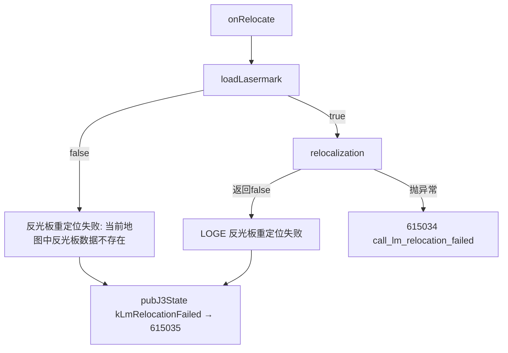

# JState 错误码 615035：反射板重定位失败

> 当 `onRelocate()` 中反光板数据不存在或重定位返回失败时触发。两个触发分支：数据缺失和算法失败。

## 1 错误结论

| 字段 | 内容 |
|---|---|
| 错误码 | `615035` |
| JState Key | `/jstate/error/nav-net/lm_relocation_failed` |
| 错误描述 | 反射板重定位失败 |
| 等级 | `level1`（WARN） |
| 直接触发条件 | 分支A：`loadLasermark()` 返回 false（地图中无反光板数据）；分支B：`relocalization()` 正常返回但 `lm_relocation_ok == false` |
| META 来源 | `机型3代状态数据-META大全.xlsx` → `异常状态s3` |

## 2 触发流程



```text
分支A: !lasermark_exist → loadLasermark() 失败
  -> loadLasermark() @ :776  调用 /map_master 获取 landmarks
  -> 若响应无 "landmarks" 或解析失败 → return false

分支B: !lm_relocation_ok → relocalization() 返回 false
  -> onRelocate() @ :286
```

## 3 排查

| 顺序 | 检查项 | 正常判据 | 异常判据 | 下一步 |
|---:|---|---|---|---|
| 1 | 分支区分 | A: "反光板数据不存在" B: 反光板存在但匹配失败 | 无日志 | 扩大 |
| 2 | map_master | landmarks 数据存在 | 响应中无 | 检查地图数据 |
| 3 | 反射板匹配 | 算法返回成功 | 匹配失败 | 检查反光板安装 |

## 4 原因与方案

| 优先级 | 原因 | 负责链路 | 临时处置 | 根因修复 |
|---|---|---|---|---|
| P1 | 地图无反光板数据 | 地图制作 | 使用有点云匹配的地图 | 补齐反光板数据 |
| P1 | 反光板匹配失败 | 定位算法 | 调整反光板位置 | 修复匹配参数 |

代码证据：JState key `health_info.hpp:77`，触发 `position_recover.cc:259,286`

## 5 Playbook

```yaml
playbook:
  meta: {error_code: "615035", error_name: "lm_relocation_failed", module: "nav-net", time_window: 60}
  steps:
    - id: classify
      checks:
        - type: grep_log; module: nav-net; pattern: "反光板重定位失败"
          on_match: {goto: diagnose}
    - id: diagnose
      checks:
        - type: grep_log; module: nav-net; pattern: "反光板数据不存在"; priority: P1
          on_match: {conclusion: "分支A: 地图无反光板", root_cause: "地图数据缺失", goto: verify}
        - type: grep_log; module: nav-net; pattern: "反光板重定位失败"; priority: P1; context_lines: 5
          on_match: {conclusion: "分支B: 重定位匹配失败", root_cause: "反射板匹配失败", goto: verify}
    - id: verify
      checks:
        - type: verify_fix; grep_pattern: "反光板重定位失败"; watch_duration_sec: 60
```
