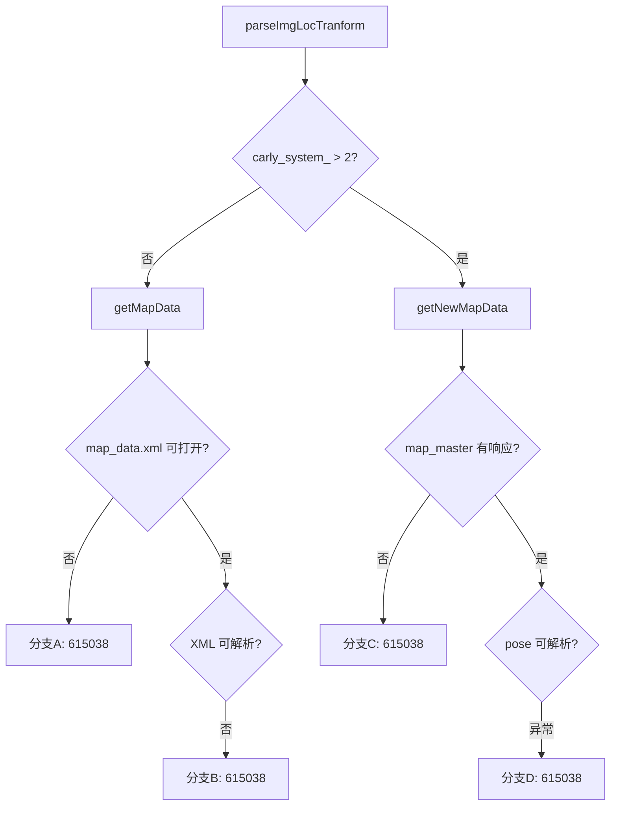

# JState 错误码 615038：地图数据读取错误

> 4 个触发分支，分布在 `getMapData()`（旧版 carly_system<=2）和 `getNewMapData()`（新版>2）。

## 1 错误结论

| 字段 | 内容 |
|---|---|
| 错误码 | `615038` |
| JState Key | `/jstate/error/nav-net/get_map_data_failed` |
| 错误描述 | 地图数据读取错误 |
| 等级 | META 登记 `level0`（NOTICE），代码中 `pubJ3State(level=1)`（不一致） |
| 直接触发条件 | 4个分支见下 |
| META 来源 | `机型3代状态数据-META大全.xlsx` → `异常状态s3` |

## 2 四个触发分支

| 分支 | 源码位置 | 条件 | 日志 |
|---|---|---|---|
| A | `getMapData():605` | `map_data.xml` 文件打开失败（`!file.is_open()`） | `Failed to open map_data.xml` |
| B | `getMapData():615` | XML 解析失败（`doc.LoadFile() != 0`） | `Failed to load map_data.xml` |
| C | `getNewMapData():662` | `/map_master/get_current_map_info` 返回空 | `call /map_master/get_current_map_info failed` |
| D | `getNewMapData():691` | 解析 `map_png_info["pose"]` 异常 | `getNewMapData failed:` + e.what() |



注意：分支 A/B 使用硬编码 key `"error/nav-net/get_map_data_failed"` 且带 `sub_id=15038`；分支 C/D 使用 `kHealthType.kGetMapDataFailed`。

## 3 排查

```bash
grep -E "get_map_data_failed|Failed to open map_data|Failed to load map_data|get_current_map_info failed|getNewMapData failed" \
  /opt/jz/log/nav-net.log | tail -n 200
```

| 顺序 | 检查项 | 正常判据 | 异常判据 | 下一步 |
|---:|---|---|---|---|
| 1 | 分支识别 | 匹配到具体分支日志 | 无日志 | 扩大时间窗 |
| 2 | A/B: xml 文件 | `/vtr/path/map_data.xml` 存在且格式正确 | 文件缺失或格式错误 | 检查地图部署 |
| 3 | C: map_master | `get_current_map_info` 有正常响应 | 响应为空 | 检查 map_master |
| 4 | D: pose 字段 | map_png_info 包含完整 pose | 缺少字段 | 检查地图格式 |

## 4 原因与方案

| 优先级 | 原因 | 负责链路 | 临时处置 | 根因修复 |
|---|---|---|---|---|
| P1 | 地图文件缺失(A) | 地图部署 | 重新部署地图 | 确保 map_data.xml 部署到正确路径 |
| P1 | XML格式错误(B) | 地图生成 | 检查地图文件 | 修复地图生成工具 |
| P1 | map_master 无响应(C) | map_master 服务 | 重启服务 | 修复服务稳定性 |
| P2 | pose 字段缺失(D) | 地图数据 | 使用完整地图 | 修复地图数据 |

代码证据：JState key `health_info.hpp:65`，触发 `position_recover.cc:605,615,662,691`

## 5 Playbook

```yaml
playbook:
  meta: {error_code: "615038", error_name: "get_map_data_failed", module: "nav-net", time_window: 60}
  steps:
    - id: classify
      checks:
        - type: grep_log; module: nav-net; pattern: "get_map_data_failed|Failed to open map_data|Failed to load map_data|get_current_map_info failed|getNewMapData failed"
          on_match: {goto: diagnose}
    - id: diagnose
      checks:
        - type: grep_log; module: nav-net; pattern: "Failed to open map_data"; priority: P1
          on_match: {conclusion: "分支A: XML文件不存在", root_cause: "地图文件缺失", goto: verify}
        - type: grep_log; module: nav-net; pattern: "Failed to load map_data"; priority: P1
          on_match: {conclusion: "分支B: XML解析失败", root_cause: "XML格式错误", goto: verify}
        - type: grep_log; module: nav-net; pattern: "get_current_map_info failed"; priority: P1
          on_match: {conclusion: "分支C: map_master无响应", root_cause: "map_master服务异常", goto: verify}
        - type: grep_log; module: nav-net; pattern: "getNewMapData failed"; priority: P1
          on_match: {conclusion: "分支D: pose解析异常", root_cause: "地图pose字段缺失", goto: verify}
    - id: verify
      checks:
        - type: verify_fix; grep_pattern: "get_map_data_failed|Failed to open map_data|Failed to load map_data"; watch_duration_sec: 60
```
