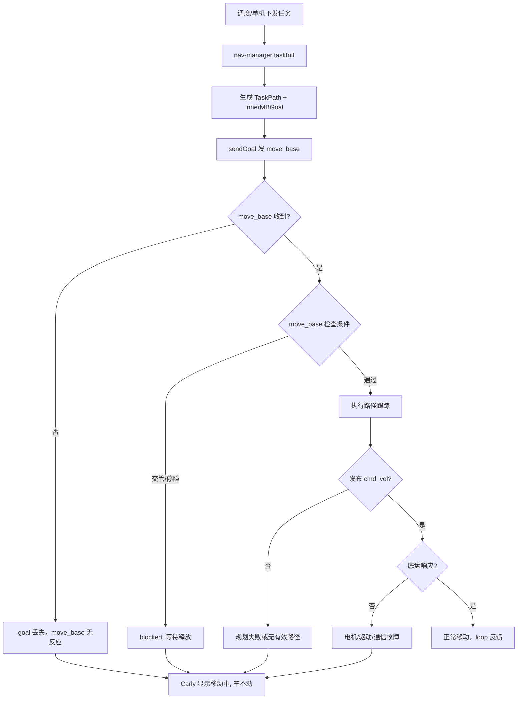

# 现场问题模式：导航不动/卡死

> 文档用途：当 AI Agent 在现场日志中发现「状态显示前进中/后退中但车辆原地不动」时，用本文理解 nav-manager 的 motion dispatch 与 MoveBase 反馈链，并根据同期数据选择排查方向。

## 1 问题结论

| 字段 | 内容 |
|---|---|
| 问题模式 | 导航不动/卡死 |
| 现场现象 | Carly 显示"前进中"或"后退中"，机器人无实际移动；有时伴随"报后退中"无法离开休息点、"准备移动"持续不动 |
| 对应错误码 | 无专用错误码。可能伴随 `615005`（里程计距离过大）、调度下发的 `614006`（other_reason）或 move_base 的规划失败 |
| 涉及模块 | nav-manager（motion dispatch）、move_base（路径执行）、调度系统（交管/停障信号） |
| 数据来源 | Q2-real 报告：197 条导航问题中 19 条，占 9.6% |
| 本文验证基线 | `RC/1.2603.x @ 744cfcbe352b` |

**核心判断**：「导航不动」不是 nav-manager 崩溃，而是 **motion dispatch 链路中某个环节卡住**——可能 goal 没下发、move_base 收到了但被阻塞（交管/停障）、或者 cmd_vel 发布了但底层驱动没响应。

> 「前进中/后退中」是 Carly 根据 move_base 的 task 状态推断的 UI 展示，不代表底盘真的在移动。内部机制：
> 1. nav-manager 通过 `sendGoal()` 下发 move_base goal
> 2. move_base 执行路径跟踪，发布 `cmd_vel`
> 3. move_base 通过 `MoveBaseFeedback` 回报当前进度（`to_goal_dist`, `path_index` 等）
> 4. nav-manager 的 `checkRunning()` 轮询 `getMbFeedback()` 判断是否还在执行
> 5. Carly 读取 move_base 状态显示"前进中"/"后退中"
>
> 任何一个环节中断，Carly 都显示"移动中"但车不动。

本文使用以下证据状态：

| 状态 | 含义 |
|---|---|
| `已确认` | 源码可直接证明的触发条件 |
| `高可能` | 现场日志与代码链路吻合 |
| `待确认` | 缺少关键数据 |
| `已排除` | 反向证据已排除 |

## 2 问题触发的功能流程

进入该问题的前置条件：
1. 调度/单机任务已下发到 nav-manager
2. nav-manager 已完成路径规划（`TaskPath` 生成）
3. `sendGoal()` 已调用 move_base action



对应调用链：

```text
调度/单机任务
  → NavPlugin::taskInit()                               @ nav_plugin.cpp:1635
  → NavPlugin::sendGoal(mb_status, move_base_goal, goal) @ nav_plugin.cpp:1591
  → nav_client_->sendGoal(...)                           → move_base action
  → 循环: NavPlugin::checkRunning()                     @ nav_plugin.cpp:184
  → nav_client_->getMbFeedback(mb_fb)                    → MoveBaseFeedback
  → mb_fb.to_goal_dist / mb_fb.path_index                → 判断进度
```

关键状态流转：

```text
sendGoal 成功:
  is_executing_ = true           @ nav_plugin.cpp:1614
  should_check_ = true           @ nav_plugin.cpp:1615
  KBI->is_executed_.set(true)    @ nav_plugin.cpp:1626

checkRunning 循环 (每次 plugin::execute):
  if (is_executing_) {                                    @ :191
    getMbFeedback(mb_fb)                                  @ :193
    KBI->mb_feedback_.set(mb_fb)                          @ :194
  }

结束条件:
  mb_result.finished == true  → 任务完成
  或异常 → taskStop() → is_executing_ = false            @ :349
```

关联问题的时序解释：

| 时序或组合 | 优先判断 |
|---|---|
| 「不动」+ 调度日志出现"交管/锁死" | 优先排查交管模块——move_base 被调度阻塞 |
| 「不动」+ mb_fb 无更新 | move_base 未收到 goal 或 goal 被覆盖 |
| 「不动」+ 里程计不变化 + `615005` | 定位系统卡死，move_base 无参考位姿 |
| 「不动」+ 报"后退中" + 在休息点 | 优先排查 `move_heading` 配置和路径方向 |
| 「不动」+ 能切单机恢复 | 调度侧的 task 状态异常（preempt/抢占） |

## 3 结合日志选择排查方向

```bash
grep -E "sendGoal|taskInit|mb_feedback|to_goal_dist|is_executing|move_base|cmd_vel|交管|停障" \
  /opt/jz/log/nav-manager.log | tail -n 500
```

按顺序执行：

| 顺序 | 检查项 | 正常判据 | 异常判据 | 结论与下一步 |
|---:|---|---|---|---|
| 1 | 时间对齐 | JState、Carly、调度任务在同一时间窗 | 时间戳不一致 | `待确认`，重新取证 |
| 2 | sendGoal 日志 | 出现 "send goal to point: {id}" | 无 sendGoal 日志 | goal 未下发→`高可能`，检查 taskInit 中是否报错 |
| 3 | move_base 反馈 | `mb_fb.to_goal_dist` 持续减小 | `to_goal_dist` 不变或 mb_fb 无更新 | move_base 未执行→`高可能` |
| 4 | 交管/停障信号 | `traffic_stop=false`, `traffic_wp=false` | `traffic_stop=true` | 交管阻塞→`已确认`，联系调度排查 |
| 5 | 停障信号 | 安全激光/IO停障未触发 | 安全激光触发或 IO 停障 | 停障阻塞→`已确认` |
| 6 | cmd_vel 输出 | `rostopic echo /cmd_vel` 有非零速度 | cmd_vel 全零或无 topic | 控制链路断裂→`高可能`，检查 move_base 和底座通信 |
| 7 | 里程计 | odom 持续更新 | odom 不更新 | 定位/里程计异常→`高可能`，检查 `/vtr/localization` |
| 8 | 复测 | 同任务/同点位能正常执行 | 复测依旧不动 | 扩大排查到调度/路径规划 |

停止规则：
- find sendGoal 日志但无 mb_fb 更新 → 优先检查 move_base 节点和 action server
- mb_fb 更新但 to_goal_dist 不变 → 优先检查 cmd_vel 和底盘
- 交管/停障信号置位 → 根因在调度/安全模块，不归 nav-manager

现场确认命令：

```bash
# 确认 move_base goal
rostopic echo -n 1 /move_base/goal

# 确认 cmd_vel 输出
rostopic echo -n 1 /cmd_vel

# 确认交管/停障
rostopic echo -n 1 /nav/traffic_info

# 确认任务状态
grep -B 20 -A 20 "send goal to point" /opt/jz/log/nav-manager.log | tail -n 100
```

## 4 可能原因与解决方案

| 优先级 | 原因与唯一特征 | 负责链路 | 临时处置 | 根因修复 | 修复验证 |
|---|---|---|---|---|---|
| P1 | move_base 未收到 goal：sendGoal 日志存在但 move_base action 无响应 | nav-manager → move_base action | 重新下发任务 | 修复 action client 超时重试、检查 ROS master 连接 | 同任务重新下发后正常移动 |
| P1 | 交管阻塞：`traffic_stop=true`，mb_fb 正常但车不动 | 调度 → 交管模块 | 手动释放交管或切单机模式 | 修复交管算法死锁、缩减交管区域 | 交管信号清除后正常移动 |
| P1 | 停障触发：安全激光/IO 停障信号持续置位 | 安全模块 | 检查并清除障碍物，复位急停 | 修复停障误触发（粉尘、反光等） | 停障信号清除后正常移动 |
| P2 | goal 被覆盖/抢占：`task_code` 不匹配导致 `is_same=false` 重发 goal 时路径丢失 | nav-manager sendGoal | 停止当前任务重新下发 | 修复 `taskFeedbackAlign` 判断逻辑或 task_code 生成 | 连续下发不再出现 goal 丢失 |
| P2 | move_base 规划失败：路径检查不通过或无有效路径 | move_base / jz-pnc | 调整起点位姿或目标点 | 修复路径规划算法、扩大搜索范围 | 同点位不再规划失败 |
| P2 | 控制链路断裂：cmd_vel 有输出但底盘不响应 | 底座驱动 / CAN 通信 | 重启底座驱动节点 | 修复 CAN 通信、电机驱动器 | cmd_vel 与 odom 同步变化 |

不要通过频繁重启来规避。必须确认阻断点在 motion dispatch 链路的哪个环节。

## 5 修复验证与证据索引

闭环条件：
1. 同一任务连续 3 次执行不再出现"显示移动中但不动"
2. `mb_fb.to_goal_dist` 从下发到结束持续递减
3. `/cmd_vel` 有非零值且 `/odom` 同步变化
4. 交管/停障信号无异常置位

Agent 最少需要收集：

```text
错误前后至少 60 秒的未过滤 nav-manager 日志
move_base goal 和 feedback 原始消息
/cmd_vel 和 /odom 对比数据
交管/停障信号状态
move_base、nav-manager 版本
```

Agent 输出格式：

```yaml
problem_pattern: navigation_stuck
analysis_status: 待确认
block_point: unknown  # sendGoal / move_base / traffic_stop / cmd_vel / chassis
confirmed_facts: []
most_likely_cause:
  cause: ""
  confidence: low
missing_evidence: []
temporary_action: ""
root_fix: ""
verification:
  result: not_started
```

代码与数据证据：

| 证据 | 位置 |
|---|---|
| sendGoal 入口 | `manager/src/plugin/nav_plugin.cpp:1591` |
| is_executing_ 置位 | `nav_plugin.cpp:1614` |
| checkRunning 轮询 | `nav_plugin.cpp:184-207` |
| mb_feedback 获取 | `nav_plugin.cpp:193` |
| taskStop 清理 | `nav_plugin.cpp:349` |
| MoveBaseFeedback 结构 | `manager/include/nav_manager/plugin/nav_plugin.h` |

## 6 Agent 自动排查 Playbook

```yaml
playbook:
  meta:
    problem_pattern: "navigation_stuck"
    description: "状态显示移动中但车不动"
    modules: ["nav-manager", "move_base"]
    time_window: 60

  steps:
    - id: classify_block_point
      description: "确认 motion dispatch 链路的阻断点"
      checks:
        - type: grep_log
          module: "nav-manager"
          pattern: "send goal to point"
          on_match:
            conclusion: "goal 已下发到 move_base"
            goto: check_movebase_feedback
          on_no_match:
            conclusion: "goal 未下发，taskInit 可能失败"
            root_cause: "任务初始化失败"
            goto: check_taskinit_error

    - id: check_taskinit_error
      description: "检查 taskInit 阶段是否报错"
      checks:
        - type: grep_log
          module: "nav-manager"
          pattern: "taskInit.*fail|parse.*error|fillInnerMBGoal.*false"
          priority: P1
          on_match:
            conclusion: "taskInit 失败，goal 未生成"
            goto: verify
          on_no_match:
            conclusion: "taskInit 未报错但 goal 未下发，可能是上一次任务未清理"
            goto: verify

    - id: check_movebase_feedback
      description: "检查 move_base 是否在执行"
      checks:
        - type: grep_log
          module: "nav-manager"
          pattern: "mb_feedback|to_goal_dist"
          priority: P1
          context_lines: 3
          on_match:
            conclusion: "move_base 有反馈"
            goto: check_traffic_stop
          on_no_match:
            conclusion: "move_base 无反馈，goal 可能丢失或 move_base 未收到"
            root_cause: "move_base action 通信异常"
            temp_fix: "重新下发任务"
            goto: verify

    - id: check_traffic_stop
      description: "检查交管/停障是否阻塞"
      checks:
        - type: grep_log
          module: "nav-manager"
          pattern: "traffic_stop.*true|traffic_wp.*true|停障|交管.*阻塞"
          priority: P1
          on_match:
            conclusion: "交管或停障信号阻塞 move_base"
            root_cause: "交管/停障模块阻塞"
            temp_fix: "释放交管或切单机模式"
            goto: verify
          on_no_match:
            goto: check_cmd_vel

    - id: check_cmd_vel
      description: "检查控制指令是否下发到底盘"
      checks:
        - type: ros_topic_check
          topic: "/cmd_vel"
          on_match:
            conclusion: "控制指令链路可能正常，检查底盘/电机响应"
            goto: verify
          on_no_match:
            conclusion: "无控制指令输出，move_base 规划失败"
            root_cause: "move_base 路径跟踪失败"
            temp_fix: "检查障碍物/地图/路径"

    - id: verify
      description: "验证修复：同任务连续执行不再卡死"
      checks:
        - type: verify_fix
          grep_pattern: "send goal to point"
          watch_duration_sec: 60
          on_match:
            status: still_present
          on_no_match:
            status: verified
            conclusion: "同一任务正常移动完成"
