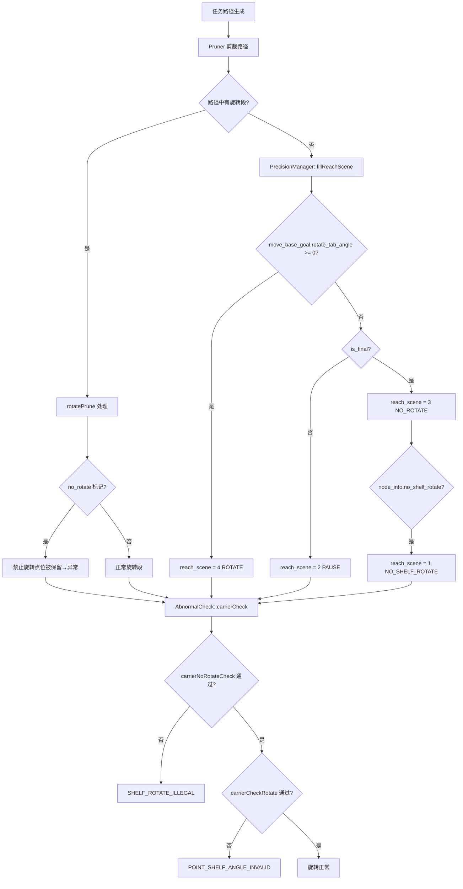

# 现场问题模式：非法/异常旋转

> 文档用途：当机器人出现在禁止旋转点旋转、不受道路属性限制旋转或原地异常旋转时，用本文理解 nav-manager 的旋转检查链（`reach_scene` + `no_shelf_rotate` + `carrierNoRotateCheck`）和 pruner 的路径剪裁逻辑。

## 1 问题结论

| 字段 | 内容 |
|---|---|
| 问题模式 | 非法/异常旋转 |
| 现场现象 | 机器人在禁止旋转点位旋转；到达库位点后异常旋转导致无法申请空间；原地左右旋转无法直行；不受道路属性限制原地旋转 |
| 对应错误码 | `SHELF_ROTATE_ILLEGAL`（货架非法旋转）、`POINT_SHELF_ANGLE_INVALID`（点位货架角度无效）、`PATH_SHELF_ANGLE_INVALID`（路径货架角度无效）|
| 涉及模块 | nav-manager（AbnormalCheck、PrecisionManager、Pruner）|
| 数据来源 | Q2-real 报告：197 条导航问题中 14 条，占 7.1% |
| 本文验证基线 | `RC/1.2603.x @ 744cfcbe352b` |

**核心判断**：nav-manager 通过三层机制控制旋转行为：
1. **Pruner 路径剪裁**（`pruner.cpp`）：根据 `no_rotate` 标记和 `enable_carrier_rotate` 决定路径是否包含旋转段
2. **PrecisionManager reach_scene**（`precision_manager.cpp`）：决定到点后的行为——不旋转（scene 3）、旋转（scene 4）、任意动作禁止旋转（scene 1）
3. **AbnormalCheck 运行时检查**（`abnormal_check.cpp`）：在导航过程中实时检查货架角度是否满足路线/点位要求

任何一层出错都会导致旋转异常。

> `reach_scene` 含义：
> - 1: 任何转盘动作 + 点位禁止旋转
> - 2: 过点（途经点）
> - 3: 终点不旋转（`no_rotate`）
> - 4: 终点旋转

| 状态 | 含义 |
|---|---|
| `已确认` | 源码可证明的触发条件和检查逻辑 |
| `高可能` | 现场日志与代码链路吻合 |
| `待确认` | 缺少关键数据 |
| `已排除` | 反向证据已排除 |

## 2 问题触发的功能流程

进入该问题的前置条件：
1. 任务路径中包含旋转段或有 `no_rotate` 标记的点位
2. `fillReachScene()` 计算了 `reach_scene`
3. `AbnormalCheck::carrierCheck()` 在导航运行时被调用



对应调用链：

```text
路径剪裁:
  Pruner::rotatePrune()                           @ pruner.cpp:601
    → 检查 paths.points[i].node_info.no_rotate    @ :612
    → 判断是否保留旋转段

到点场景计算:
  PrecisionManager::fillReachScene()              @ precision_manager.cpp:109
    → 根据 rotate_tab_angle / is_final / is_follow 赋值 reach_scene
    → cur_mb_goal.reach_scene = 1/2/3/4           @ :123-164

运行时检查（每帧）:
  AbnormalCheck::carrierCheck()                   @ abnormal_check.cpp:15
    → carrierCheckMove()  过点检查                @ :41
    → carrierNoRotateCheck() 禁止旋转检查          @ :66
    → carrierCheckRotate()  旋转角度检查           @ :57
    → setStatus(SHELF_ROTATE_ILLEGAL, true)       @ :70
```

## 3 结合日志选择排查方向

```bash
grep -E "reach_scene|no_rotate|no_shelf_rotate|SHELF_ROTATE|carrierCheck|rotatePrune|rotate_tab_angle|shelf_angle" \
  /opt/jz/log/nav-manager.log | tail -n 500
```

| 顺序 | 检查项 | 正常判据 | 异常判据 | 结论与下一步 |
|---:|---|---|---|---|
| 1 | reach_scene 值 | 日志显示正确的 scene（3=不旋转，4=旋转） | scene 值与预期不符（如禁止旋转点出现 scene=4） | reach_scene 计算错误→`高可能`，检查 rotate_tab_angle 和 no_shelf_rotate 配置 |
| 2 | no_shelf_rotate 标记 | 禁止旋转点位 `no_shelf_rotate=true` | `no_shelf_rotate=false` 但应禁止 | 地图配置错误→`已确认`，修正地图点位属性 |
| 3 | carrierNoRotateCheck | 通过，无 SHELF_ROTATE_ILLEGAL | `SHELF_ROTATE_ILLEGAL` 置位 | 货架角度与禁止旋转冲突→`已确认` |
| 4 | carrierCheckRotate | 通过，无 POINT_SHELF_ANGLE_INVALID | `POINT_SHELF_ANGLE_INVALID` 置位 | 货架角度与目标点位不一致→`已确认` |
| 5 | shelf_angle 值 | `shelf_angle` 与 `cur_cmd_angle` 差值 < 10° 或差 > 350° | 差值在 10°~350° 之间 | 角度配置偏差→`高可能` |
| 6 | rotate_tab_angle | 与任务要求一致 | `rotate_tab_angle >= 0` 导致误进入 ROTATE | 参数传入错误→`高可能` |
| 7 | iobox/转盘版本 | 版本匹配 | 更新 iobox 后出现 | 版本兼容问题→`已确认` |
| 8 | 复测 | 同点位不再出现旋转异常 | 复测仍出现 | 扩大排查到地图/路径规划 |

现场确认命令：

```bash
# 确认当前 reach_scene
grep -B 5 -A 10 "reach_scene" /opt/jz/log/nav-manager.log | tail -n 100

# 确认禁止旋转点位属性
rostopic echo -n 1 /nav/task_info | grep -A 5 "no_shelf_rotate"

# 确认转盘角度
rostopic echo -n 1 /jzhw/rotation

# 查看旋转异常的完整上下文
grep -B 30 -A 10 "SHELF_ROTATE_ILLEGAL\|shelf_angle_illegal\|carrierNoRotate" /opt/jz/log/nav-manager.log
```

## 4 可能原因与解决方案

| 优先级 | 原因与唯一特征 | 负责链路 | 临时处置 | 根因修复 | 修复验证 |
|---|---|---|---|---|---|
| P1 | `no_shelf_rotate` 标记丢失：地图/点位配置缺少禁止旋转标记 | 地图工具/点位编辑 | 手动编辑点位添加 `no_shelf_rotate` | 修正地图点位模板，确保禁止旋转点正确标记 | 同点位 `no_shelf_rotate=true` 且不再触发 SHELF_ROTATE_ILLEGAL |
| P1 | `rotate_tab_angle` 误传入：即使终点不需要旋转，`rotate_tab_angle >= 0` 导致 reach_scene=4 | nav-manager fillReachScene | 调整任务下发参数 | 修复 `fillReachScene` 中对 `rotate_tab_angle >= 0` 的判断条件 | 同任务 reach_scene=3 |
| P1 | 货架角度偏差：实际 shelf_angle 与目标 `cur_cmd_angle` 不在允许范围 | carrier_rotater / 角度校准 | 手动校准货架角度 | 修复角度传感器校准、转盘零点标定 | shelf_angle 与 cmd_yaw 差值 < 10° |
| P2 | iobox 版本兼容：更新 iobox 后 `no_rotate` 属性逻辑变化 | iobox / 版本管理 | 回退 iobox 版本 | 对齐 iobox 与 nav-manager 的 `no_rotate` 语义 | 两版本配合正常 |
| P2 | pruner 误剪裁：`enable_carrier_rotate` 和 `no_rotate` 冲突 | Pruner | 临时调整路径剪裁参数 | 修复 `rotatePrune` 中对 `no_rotate` 的判断优先级 | 同路径不再产生无效旋转段 |
| P2 | `node_info.shelf_node_list` 为空：缺少合法货架角度列表 | 地图点位配置 | 补充点位 shelf_node_list | 修复地图工具自动填充逻辑 | shelf_node_list 非空且包含所有合法角度 |

不要通过关闭旋转检查来规避。必须确认 `reach_scene` → `no_shelf_rotate` → `shelf_angle` 这条链的每一步都正确。

## 5 修复验证与证据索引

闭环条件：
1. `SHELF_ROTATE_ILLEGAL` / `POINT_SHELF_ANGLE_INVALID` 不再置位
2. `reach_scene` 值与禁止旋转点位一致（scene=1 或 3）
3. 同点位连续 3 次任务不再出现异常旋转
4. shelf_angle 与目标角度差值在允许范围内

Agent 最少需要收集：

```text
错误前后的 nav-manager 日志
reach_scene / no_shelf_rotate 配置值
shelf_angle 与 cur_cmd_angle 原始数据
iobox / nav-manager 版本
地图点位属性（no_rotate, no_shelf_rotate, shelf_node_list）
```

Agent 输出格式：

```yaml
problem_pattern: illegal_rotation
analysis_status: 待确认
rotation_type: unknown  # no_rotate_violated / shelf_angle_mismatch / reach_scene_error
confirmed_facts: []
most_likely_cause:
  cause: ""
  confidence: low
missing_evidence: []
temporary_action: ""
root_fix: ""
verification:
  result: not_started
```

代码与数据证据：

| 证据 | 位置 |
|---|---|
| carrierCheck 入口 | `manager/src/code_inserting/abnormal_check.cpp:15` |
| carrierNoRotateCheck | `abnormal_check.cpp:134` |
| carrierCheckRotate | `abnormal_check.cpp:78` |
| fillReachScene | `manager/src/code_inserting/precision_manager.cpp:109` |
| rotatePrune | `manager/src/code_inserting/pruner.cpp:601` |
| no_rotate 判断 | `pruner.cpp:612` |
| SHELF_ROTATE_ILLEGAL 枚举 | `nav_core/include/nav_core/struct/abnormal_ids.h` |

## 6 Agent 自动排查 Playbook

```yaml
playbook:
  meta:
    problem_pattern: "illegal_rotation"
    description: "机器人异常旋转/禁止旋转点旋转"
    modules: ["nav-manager"]
    time_window: 60

  steps:
    - id: classify_rotation_type
      description: "根据日志区分旋转异常类型"
      checks:
        - type: grep_log
          module: "nav-manager"
          pattern: "SHELF_ROTATE_ILLEGAL"
          on_match:
            rotation_type: "no_rotate_violated"
            conclusion: "禁止旋转点发生货架旋转"
            goto: diagnose_no_rotate
        - type: grep_log
          module: "nav-manager"
          pattern: "POINT_SHELF_ANGLE_INVALID"
          on_match:
            rotation_type: "shelf_angle_mismatch"
            conclusion: "到点旋转时货架角度不匹配"
            goto: diagnose_angle
        - type: on_no_match
          rotation_type: "other"
          goto: diagnose_general

    - id: diagnose_no_rotate
      checks:
        - type: grep_log
          module: "nav-manager"
          pattern: "no_shelf_rotate"
          priority: P1
          context_lines: 3
          on_match:
            conclusion: "no_shelf_rotate 标记存在"
            continue: true
          on_no_match:
            conclusion: "no_shelf_rotate 未标记"
            root_cause: "地图点位缺少禁止旋转标记"
            temp_fix: "编辑点位添加 no_shelf_rotate"
            goto: verify
        - type: grep_log
          module: "nav-manager"
          pattern: "reach_scene.*1"
          priority: P1
          on_match:
            conclusion: "reach_scene=1 正确"
            continue: true
          on_no_match:
            conclusion: "reach_scene 未正确设置为 1"
            root_cause: "fillReachScene 逻辑异常"
            goto: verify
        - type: grep_log
          module: "nav-manager"
          pattern: "carrierNoRotateCheck"
          priority: P2
          context_lines: 5
          on_match:
            conclusion: "carrierNoRotateCheck 执行但失败"
            root_cause: "当前货架角度与禁止旋转要求冲突"
            temp_fix: "调整任务下发时的货架角度参数"
            goto: verify

    - id: diagnose_angle
      checks:
        - type: grep_log
          module: "nav-manager"
          pattern: "shelf_angle|cur_cmd_angle|node_yaw"
          priority: P1
          context_lines: 2
          on_match:
            conclusion: "角度数据存在，可对比差值"
            goto: verify
          on_no_match:
            conclusion: "无角度日志，shelf_angle 不可用"
            goto: verify

    - id: diagnose_general
      checks:
        - type: grep_log
          module: "nav-manager"
          pattern: "reach_scene"
          priority: P1
          context_lines: 2
          on_match:
            conclusion: "reach_scene 值存在"
            continue: true
        - type: grep_log
          module: "nav-manager"
          pattern: "rotate_tab_angle"
          priority: P1
          on_match:
            conclusion: "rotate_tab_angle 可能误触发旋转"
            root_cause: "rotate_tab_angle >= 0 导致 reach_scene=4"
            goto: verify

    - id: verify
      checks:
        - type: verify_fix
          grep_pattern: "SHELF_ROTATE_ILLEGAL\|POINT_SHELF_ANGLE_INVALID\|shelf_angle_illegal"
          watch_duration_sec: 60
          on_match:
            status: still_present
          on_no_match:
            status: verified
            conclusion: "连续 60 秒无旋转异常"
