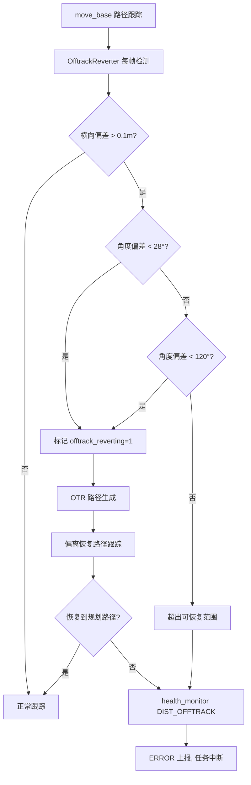

# 现场问题模式：路线偏移/偏离

> 文档用途：当机器人行驶轨迹偏离规划路线（但定位未丢）时，用本文理解 nav-manager 的 DistOfftrack/AngleOfftrack 检测机制和 OfftrackReverter 偏离恢复流程。

## 1 问题结论

| 字段 | 内容 |
|---|---|
| 问题模式 | 路线偏移/偏离 |
| 现场现象 | 行驶中偏离规划路线；走曲线时直线穿过报错；导航走歪/走偏；报错"导航过程异常偏离线路超过阈值" |
| 对应错误码 | `dist_offtrack`（距离偏离）、`angle_offtrack`（角度偏离）。非 JState 错误码，由 health_monitor 注册（`AbnId::DIST_OFFTRACK`、`AbnId::ANGLE_OFFTRACK`），level=ERROR |
| 涉及模块 | nav-base（OfftrackReverter）、nav-manager（health_monitor）、jz-pnc（路径跟踪）|
| 数据来源 | Q2-real 报告：197 条导航问题中 7 条，占 3.6% |
| 本文验证基线 | `RC/1.2603.x @ 744cfcbe352b` |

**核心判断**：「路线偏移」有二层防御：
1. **OfftrackReverter 实时检测**（`offtrack_reverter.cpp`）：每帧计算机器人位置与规划路径的横向/角度偏差，超过阈值触发 OTR（Off-Track Recovery）路径重新规划
2. **health_monitor 严重告警**：当 offtrack 无法自恢复时，`setStatus(DIST_OFFTRACK/ANGLE_OFFTRACK, true)` 发布 ERROR

> OfftrackReverter 关键参数（`offtrack_reverter.cpp:52-56`）：
> - `min_line_OTR_th_ = 0.1m` —— 最小横向偏移阈值
> - `min_angle_OTR_th_ = 28°` —— 最小角度偏移阈值
> - `max_angle_OTR_th_ = 120°` —— 最大可恢复角度（超过视为完全反向）
> - `max_OTR_vel_ = 0.2 m/s` —— 偏离恢复最高速度

| 状态 | 含义 |
|---|---|
| `已确认` | 源码可证明的检测阈值和恢复逻辑 |
| `高可能` | 现场日志与代码链路吻合 |
| `待确认` | 缺少关键数据 |
| `已排除` | 反向证据已排除 |

## 2 问题触发的功能流程

进入该问题的前置条件：
1. move_base 正在执行路径跟踪
2. `enable_OTR_ = true`（默认开启）
3. 机器人实际位姿与规划路径的横向偏差 > `min_line_OTR_th_` 或角度偏差 > `min_angle_OTR_th_`



对应调用链：

```text
路径跟踪循环:
  OfftrackReverter::checkOfftrack()
    → 计算 base_origin（机器人当前位置在规划路径上的投影）
    → 计算横向/角度 deviation
    → generateOTRPath()              @ offtrack_reverter.cpp
    → OTRPathGenerator 生成恢复路径
    → sendOTRGoal() 下发偏离恢复任务
    → 恢复成功 → 继续原路径
    → 恢复失败 → setStatus(DIST_OFFTRACK, true)   @ health_monitor.cpp:85
```

错误生命周期：

```text
正常跟踪 → offtrack_reverting=1 → OTR 路径 → 恢复成功 → 正常
                                         → 恢复失败 → DIST_OFFTRACK=true → ERROR 3次 → 静默
                                   → 下一任务 reset → HealthMonitor::exit() 清除
```

## 3 结合日志选择排查方向

```bash
grep -E "offtrack|OTR|dist_offtrack|angle_offtrack|偏离|偏移|deviation|reverting" \
  /opt/jz/log/nav-manager.log /opt/jz/log/nav-base.log | tail -n 500
```

| 顺序 | 检查项 | 正常判据 | 异常判据 | 结论与下一步 |
|---:|---|---|---|---|
| 1 | OTR 触发 | 出现 `offtrack_reverting=1` 然后恢复 | OTR 触发后无法恢复 | dist_offtrack→`高可能`，进入原因排查 |
| 2 | 横向偏差 | 偏差偶尔 > 0.1m 后自然恢复 | 偏差持续增大或跳跃 | 底盘/定位问题→`高可能` |
| 3 | 角度偏差 | < 28° 小角度偏离 | > 28° 大角度偏离甚至 > 120° | 路径跟踪算法异常→`高可能` |
| 4 | 定位状态 | 定位正常，点云匹配稳定 | 定位跳动或零点漂移 | 定位异常导致路径基准漂移→`已确认` |
| 5 | 里程计 | odom 连续无跳变 | odom 跳变或打滑 | 打滑导致实际位姿与里程计不一致→`高可能` |
| 6 | cmd_vel 震荡 | 速度指令平滑 | 速度指令大幅震荡 | jz-pnc 控制振荡→`已确认` |
| 7 | 地图/路径 | 曲线路径在路径编辑器中正确 | 曲线段实际是折线 | 地图路径配置错误→`已确认` |
| 8 | 复测 | 同路段不再偏离 | 复测仍偏离 | 硬件（轮组/驱动）问题→进一步排查 |

现场确认命令：

```bash
# 确认 offtrack 状态
grep "offtrack_reverting\|OTR" /opt/jz/log/nav-base.log | tail -n 100

# 确认偏离报错
grep "dist_offtrack\|angle_offtrack" /opt/jz/log/nav-manager.log | tail -n 50

# 确认定位和 odom
rostopic hz /vtr/localization
rostopic hz /odom
```

## 4 可能原因与解决方案

| 优先级 | 原因与唯一特征 | 负责链路 | 临时处置 | 根因修复 | 修复验证 |
|---|---|---|---|---|---|
| P1 | 定位跳动/漂移：OTR 触发但偏差源于定位输出异常 | 定位系统 /vtr/localization | 暂停自动任务，触发定位重初始化 | 修复定位算法、增加特征点、校准传感器 | 同路段定位稳定，横向偏差 < 0.05m |
| P1 | 打滑：里程计与真实位姿不一致，OTR 判断的基础位姿有误 | odom / 轮组 | 降速运行 | 修复轮组/地面适配、改善爬坡/转弯速度配置 | 同路段 odom 与激光匹配一致 |
| P2 | jz-pnc 振荡：cmd_vel 速度指令大幅震荡导致轨迹抖动 | jz-pnc 控制算法 | 调整控制器参数 | 修复路径跟踪算法的稳定性 | cmd_vel 平滑，无大幅震荡 |
| P2 | 地图曲线偏移：地图曲线实际生成为折线，路径跟踪沿直线穿过 | 地图/路径配置 | 重新生成曲线路径 | 修复地图工具中曲线→路径的转换精度 | 同曲线路径不再偏离 |
| P2 | OTR 阈值过严：`min_line_OTR_th_=0.1m` 在某些场景偏小 | OfftrackReverter 参数 | 临时放大阈值（需改代码） | 评估后调整阈值常量 | 同场景不再误触发 OTR |
| P3 | move_base 路径跟踪参数异常：lookahead/tracking 参数导致跟踪精度不足 | move_base 配置 | 调整 lookahead_distance 等参数 | 参数调优 | 跟踪精度满足业务要求 |

## 5 修复验证与证据索引

闭环条件：
1. `dist_offtrack` / `angle_offtrack` 不再置位
2. 同路段连续 3 次运行横向偏差 < 0.1m
3. 定位稳定无跳动
4. cmd_vel 输出平滑

Agent 最少需要收集：

```text
ofrtrack 触发前后的 nav-base 和 nav-manager 日志
定位/odom 数据对比
cmd_vel 时间序列
地图路径段属性
```

Agent 输出格式：

```yaml
problem_pattern: path_deviation
analysis_status: 待确认
deviation_type: unknown  # loc_drift / wheel_slip / pnc_osc / map_error
confirmed_facts: []
most_likely_cause:
  cause: ""
  confidence: low
missing_evidence: []
verification:
  result: not_started
```

代码与数据证据：

| 证据 | 位置 |
|---|---|
| OfftrackReverter 初始化（阈值） | `navigation/nav_base/src/offtrack_reverter.cpp:52-57` |
| DIST_OFFTRACK 注册 | `nav_core/src/health_monitor.cpp:85` |
| ANGLE_OFFTRACK 注册 | `nav_core/src/health_monitor.cpp:84` |
| OTR 路径生成 | `nav_local_planner/offtrack_path_generator.h` |
| nav_plugin 中 offtrack 处理 | `manager/src/plugin/nav_plugin.cpp:944` |
| abnormal_check 中 offtrack 检查 | `manager/src/code_inserting/abnormal_check.cpp:33` |

## 6 Agent 自动排查 Playbook

```yaml
playbook:
  meta:
    problem_pattern: "path_deviation"
    description: "导航路线偏移/偏离路径"
    modules: ["nav-base", "nav-manager", "jz-pnc"]
    time_window: 60

  steps:
    - id: classify_deviation
      description: "确认是否触发 offtrack 检测"
      checks:
        - type: grep_log
          module: "nav-base"
          pattern: "offtrack_reverting"
          on_match:
            conclusion: "偏离检测已触发，进入 OTR 恢复"
            goto: diagnose_recovery
        - type: grep_log
          module: "nav-manager"
          pattern: "dist_offtrack|angle_offtrack"
          on_match:
            conclusion: "偏离严重，已触发 ERROR"
            goto: diagnose_severe
        - type: on_no_match
          conclusion: "未触发偏离告警，但用户报告偏移"
          goto: diagnose_mild

    - id: diagnose_recovery
      description: "偏离恢复链排查"
      checks:
        - type: grep_log
          module: "nav-base"
          pattern: "OTR.*success|恢复成功"
          priority: P1
          on_match:
            conclusion: "OTR 恢复成功"
            goto: verify
          on_no_match:
            conclusion: "OTR 恢复失败或未完成"
            goto: diagnose_severe

    - id: diagnose_severe
      description: "严重偏离排查"
      checks:
        - type: grep_log
          module: "nav-manager"
          pattern: "localization.*fail|locating.*err|定位.*异常"
          priority: P1
          on_match:
            conclusion: "定位异常可能导致偏离"
            root_cause: "定位系统异常"
            temp_fix: "触发定位重新初始化"
            goto: verify
        - type: grep_log
          module: "nav-base"
          pattern: "cmd_vel.*[-]?[0-9]\\.[0-9]"
          priority: P2
          context_lines: 5
          on_match:
            conclusion: "cmd_vel 输出存在"
            continue: true

    - id: diagnose_mild
      description: "轻微偏移排查"
      checks:
        - type: grep_log
          module: "nav-base"
          pattern: "deviation|误差|偏差"
          priority: P1
          context_lines: 3
          on_match:
            conclusion: "偏差信息存在"
            goto: verify
          on_no_match:
            conclusion: "无偏差日志，可能是视觉偏移"
            goto: verify

    - id: verify
      checks:
        - type: verify_fix
          grep_pattern: "dist_offtrack|angle_offtrack|offtrack_reverting"
          watch_duration_sec: 60
          on_match:
            status: still_present
          on_no_match:
            status: verified
            conclusion: "连续 60 秒无偏离告警"
