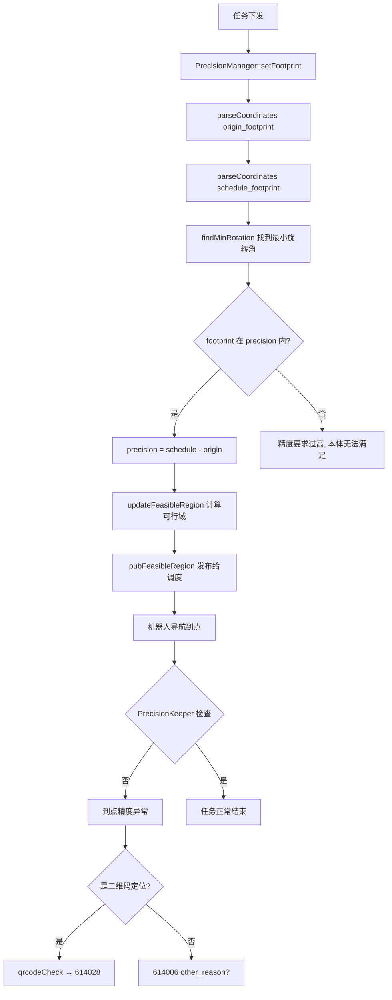

# 现场问题模式：到点精度异常

> 文档用途：当机器人到达目标点但报"导航到点精度异常""到点报错精度异常"时，用本文理解 nav-manager 的 PrecisionManager 到点精度检查机制和 feasible_region 可行域计算逻辑。

## 1 问题结论

| 字段 | 内容 |
|---|---|
| 问题模式 | 到点精度异常 |
| 现场现象 | 机器人到达目标点后报"到点精度异常"；伺服结束退出库位时报精度异常；到点后车辆在点位附近抖动无法结束任务；"获取导航距离超时"导致精度无法确认 |
| 对应错误码 | `614006`（other_reason — 调度要求精度过高）、`614028`（qrcode_missed — 二维码到点检查）|
| 涉及模块 | nav-manager（PrecisionManager、PrecisionKeeper、abnormal_check）|
| 数据来源 | Q2-real 报告：197 条导航问题中 5 条，占 2.5% |
| 本文验证基线 | `RC/1.2603.x @ 744cfcbe352b` |

**核心判断**：到点精度检查有三层：
1. **PrecisionManager 事前计算**（`precision_manager.cpp`）：根据 origin_footprint 和 schedule_footprint 计算 feasible_region（可行域），找到最小旋转角度 `findMinRotation()`，发布给调度
2. **PrecisionKeeper 运行时检查**（`precision_keeper.cpp`）：到点时检查实际位姿是否在 feasible_region 内
3. **AbnormalCheck 终点检查**（`abnormal_check.cpp`）：二维码定位模式下检查 landmark 数据（`qrcodeCheck()`），触发 `614028`

> PrecisionManager 关键常量：
> - `kTolerance` 容差
> - `kYawTolerance` 角度容差
> - feasible_region 包含 `polygon_region`（矩形可行域）和 `circle_region`（旋转可行域）

| 状态 | 含义 |
|---|---|
| `已确认` | 源码可证明的计算逻辑 |
| `高可能` | 现场日志与代码吻合 |
| `待确认` | 缺少关键数据 |
| `已排除` | 反向证据已排除 |

## 2 问题触发的功能流程

进入该问题的前置条件：
1. 任务到达最终目标点（`is_final=true` 或 `reach_scene=3/4`）
2. origin_footprint 和 schedule_footprint 已通过 `parseCoordinates` 解析
3. feasible_region 已计算并发布



对应调用链：

```text
精度计算（任务初始化时）:
  PrecisionManager::setFootprint(origin, schedule, precision) @ precision_manager.cpp:86
    → parseCoordinates(origin_footprint)                      @ :39
    → parseCoordinates(schedule_footprint)                    @ :39
    → findMinRotation(precision_schedule, origin_footprint)   @ :70
    → precision.x = schedule.x - origin.x                     @ :104
    → precision.y = schedule.y - origin.y                     @ :105

可行域计算（路径生成后）:
  PrecisionManager::updateFeasibleRegion(paths, reset)        @ :416
    → calcExtraPoint (路径纵向扩展)                           @ :327
    → calcPolygon (多边形区域)                                @ :250
    → calcCircumcircle (旋转区域)                             @ :180
    → pubFeasibleRegion(json)                                 @ :422

到点场景:
  PrecisionManager::fillReachScene()                          @ :109
    → reach_scene = 3 (不旋转) 或 4 (旋转)
    → cur_mb_goal.reach_scene 赋值
```

## 3 结合日志选择排查方向

```bash
grep -E "precision|feasible_region|reach_scene|footprint|origin_footprint|schedule_footprint|findMinRotation|到点精度" \
  /opt/jz/log/nav-manager.log | tail -n 500
```

| 顺序 | 检查项 | 正常判据 | 异常判据 | 结论与下一步 |
|---:|---|---|---|---|
| 1 | footprint 解析 | `origin_footprint` 和 `schedule_footprint` 都成功解析 | `parse footprint failed` | footprint 配置异常→`已确认`，检查 `/move_base/local_costmap/footprint` 参数 |
| 2 | precision 计算 | `precision max: {x} {y}` 日志存在，值合理 | precision.x/y 为 0 或异常大 | 精度计算异常→`高可能`，检查 footprint 数值 |
| 3 | findMinRotation | 找到合法旋转角度 | `best_angle==-1`（无解） | 可行域过小→`已确认`，检查调度 footprint 是否过大 |
| 4 | feasible_region 发布 | `FeasibleRegion json` 非空且 enabled=true | 空或 enabled=false | 可行域未正确发布→`高可能` |
| 5 | reach_scene | 终点 scene=3 或 4 | scene 为其他值 | 到点场景计算错误→`高可能` |
| 6 | 二维码检查 | `qrcodeCheck` 通过（二维码模式下） | qrcodeCheck 返回 false | 二维码部署问题→`已确认`，参见 614028 文档 |
| 7 | 定位跳动 | 到点时定位稳定 | 到点后定位跳动导致反复不达标 | 定位误差异常→`高可能` |
| 8 | 复测 | 同点位连续 3 次到点正常 | 复测仍报精度异常 | 扩大排查到 footprint 参数/地图 |

现场确认命令：

```bash
# 确认 footprint 配置
rosparam get /move_base/local_costmap/footprint

# 确认可行域
rostopic echo -n 1 /nav/feasible_region

# 确认精度日志
grep -B 5 -A 15 "precision max\|findMinRotation\|FeasibleRegion" /opt/jz/log/nav-manager.log | tail -n 100

# 确认到点场景
grep "reach_scene" /opt/jz/log/nav-manager.log | tail -n 20
```

## 4 可能原因与解决方案

| 优先级 | 原因与唯一特征 | 负责链路 | 临时处置 | 根因修复 | 修复验证 |
|---|---|---|---|---|---|
| P1 | schedule_footprint 过大：`findMinRotation` 无解，precision 无法匹配 | 调度 → footprint 配置 | 临时扩大 origin_footprint 或缩小 schedule_footprint | 修正调度系统中的 footprint 配置，使其与机器人实际轮廓一致 | `precision max` 值在合理范围 |
| P1 | origin_footprint 解析失败：`parseCoordinates` 返回 false | ROS param `/move_base/local_costmap/footprint` | 检查并修复 footprint 参数格式 | 确保 footprint 参数格式为 JSON 数组 | footprint 解析成功 |
| P1 | 定位跳动导致到点不达标：机器人已到达但定位漂移 | 定位系统 | 等待定位稳定后重新确认 | 修复定位在到点阶段的精度 | 到点时定位稳定 |
| P2 | 二维码模式下 landmark 不合格：qrcodeCheck 返回 false | 二维码部署/相机 | 清洁相机和目标码 | 修复码质量/安装位置/光照 | 参见 614028 验证流程 |
| P2 | feasible_region 未发布：`enabled=false` 或空 JSON | PrecisionManager | 手动触发 feasible_region 重算 | 修复 `updateFeasibleRegion` 的触发时机 | feasible_region 持续发布 |
| P2 | 路径扩展异常：`calcExtraPoint` 计算错误导致可行域畸变 | PrecisionManager | 缩小膨胀参数 | 修复 `calcExtraPoint` / `calcTrajPolygon` | 可行域与地图路径一致 |

不要通过关闭精度检查来规避。必须确认 footprint → precision → feasible_region 链完整。

## 5 修复验证与证据索引

闭环条件：
1. `precision max` 值在合理范围内
2. `FeasibleRegion json` 非空且 enabled=true
3. 同点位连续 3 次到点正常
4. 二维码模式下 qrcodeCheck 通过

Agent 输出格式：

```yaml
problem_pattern: arrival_precision
analysis_status: 待确认
precision_issue: unknown  # footprint / feasible_region / loc_drift / qrcode
confirmed_facts: []
most_likely_cause:
  cause: ""
  confidence: low
verification:
  result: not_started
```

代码与数据证据：

| 证据 | 位置 |
|---|---|
| setFootprint | `manager/src/code_inserting/precision_manager.cpp:86` |
| parseCoordinates | `precision_manager.cpp:39` |
| findMinRotation | `precision_manager.cpp:70` |
| isTouchingBoundary | `precision_manager.cpp:27` |
| updateFeasibleRegion | `precision_manager.cpp:416` |
| fillReachScene | `precision_manager.cpp:109` |
| qrcodeCheck（二维码模式下） | `manager/src/code_inserting/abnormal_check.cpp:192` |
| feasible_region 发布 | `precision_manager.cpp:422` |

## 6 Agent 自动排查 Playbook

```yaml
playbook:
  meta:
    problem_pattern: "arrival_precision"
    description: "到点精度异常/到点报错"
    modules: ["nav-manager"]
    time_window: 60

  steps:
    - id: classify_precision_issue
      description: "区分精度异常类型"
      checks:
        - type: grep_log
          module: "nav-manager"
          pattern: "parse.*footprint.*failed"
          on_match:
            conclusion: "footprint 解析失败"
            root_cause: "footprint 参数格式异常"
            temp_fix: "修正 /move_base/local_costmap/footprint 参数"
            goto: verify
        - type: grep_log
          module: "nav-manager"
          pattern: "findMinRotation"
          context_lines: 2
          on_match:
            conclusion: "findMinRotation 执行"
            goto: diagnose_precision
        - type: grep_log
          module: "nav-manager"
          pattern: "qrcodeCheck.*false|二维码.*精度"
          on_match:
            conclusion: "二维码到点检查失败"
            root_cause: "二维码部署问题"
            temp_fix: "检查相机与码状态"
            goto: verify
        - type: on_no_match
          conclusion: "未找到精度异常特征"
          goto: diagnose_precision

    - id: diagnose_precision
      description: "精度计算链排查"
      checks:
        - type: grep_log
          module: "nav-manager"
          pattern: "precision max"
          priority: P1
          context_lines: 2
          on_match:
            conclusion: "precision 值存在"
            continue: true
          on_no_match:
            conclusion: "precision 未计算"
            root_cause: "footprint 配置缺失"
            goto: verify
        - type: grep_log
          module: "nav-manager"
          pattern: "FeasibleRegion.*enabled"
          priority: P1
          on_match:
            conclusion: "可行域已发布"
            continue: true
          on_no_match:
            conclusion: "可行域未发布"
            root_cause: "updateFeasibleRegion 未执行"
            goto: verify
        - type: grep_log
          module: "nav-manager"
          pattern: "best_angle.*-1"
          priority: P2
          on_match:
            conclusion: "findMinRotation 无解"
            root_cause: "schedule_footprint 过大"
            temp_fix: "缩小调度 footprint"

    - id: verify
      checks:
        - type: verify_fix
          grep_pattern: "到点精度异常|precision.*fail|qrcode.*fail"
          watch_duration_sec: 60
          on_match:
            status: still_present
          on_no_match:
            status: verified
            conclusion: "到点正常"
