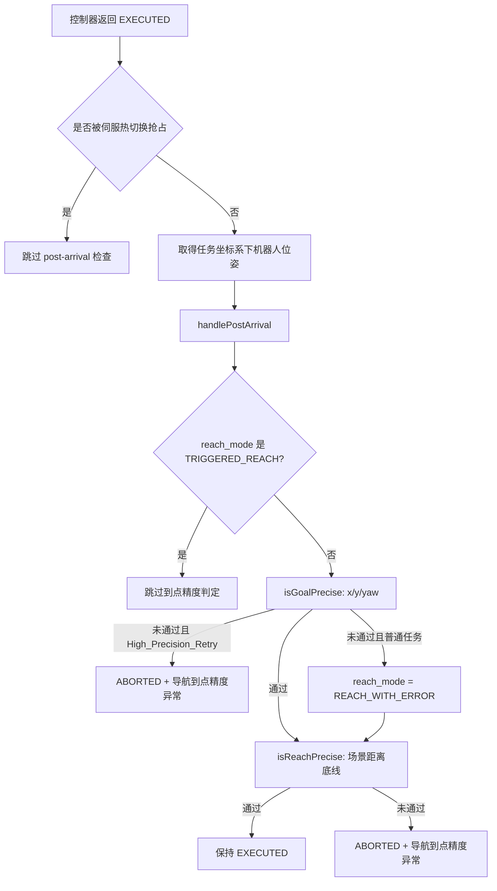

# 高频问题排查：导航到点精度异常（2412 代码版）

> 状态：第一版代码审计稿
> 分析基线：`nav-manager` 的 `RC/1.2412.x` 分支，提交 `a0b4f8433e44e5ae8089f2947cced7982613a4fa`
> 文档入口：现场或上层任务返回“导航到点精度异常”
> 证据范围：仅基于代码与版本历史，不代表真实现场原因频率

## 1. 先说结论

在 2412 基线中，“导航到点精度异常”是 `nav_base` 完成导航之后执行二次精度检查时产生的**任务结果消息**，直接生成位置为：

```text
navigation/nav_base/src/task_master.cpp
└─ TaskMaster::handlePostArrival()
   ├─ isGoalPrecise()   检查任务携带的 x/y/yaw 精度
   └─ isReachPrecise()  检查 FINAL/UNSPINNABLE_FINAL 的距离底线
```

它不是 `PrecisionManager` 直接生成的错误，也不能仅凭这条消息认定是定位、二维码、footprint 或现场环境问题。

代码中有两条直接报错路径：

1. `High_Precision_Retry` 任务的 x/y/yaw 检查不通过；
2. 普通最终到点的距离超过场景底线：`FINAL > reach_tolerance_`，或 `UNSPINNABLE_FINAL > 0.1 m`。

此外还有一种“精度未满足但不直接失败”的路径：普通任务的任务精度检查失败时，结果被标为 `REACH_WITH_ERROR`；如果随后仍满足场景距离底线，任务可以保持成功，但上层收到 `reach_state=abnormal`。

## 2. 结果产生流程



代码入口：

- `navigation/nav_base/src/nav_base.cpp:90-99`：仅对 `EXECUTED` 且未被伺服热切换抢占的结果执行 `handlePostArrival()`；
- `navigation/nav_base/src/task_master.cpp:158-201`：计算最终误差并产生异常消息；
- `manager/src/utils/nav_base_client.cpp:17-51`：将结果转为 manager 使用的 `MoveBaseResult`，其中 `REACH_WITH_ERROR` 被编码为 `{"reach_state":"abnormal"}`；
- `manager/src/plugin/nav_plugin.cpp:1034-1106`：将失败结果和消息继续上报。

## 3. 两条直接报错路径

### 3.1 路径 A：高精度重试仍不满足任务精度

代码确认：

```text
task_type == "High_Precision_Retry"
→ TaskPath.reach_error_retry = true
→ TaskAttribute.reach_error_retry = true
→ isGoalPrecise(task_table, check_error) == false
→ status = ABORTED
→ message = "导航到点精度异常"
```

任务精度检查规则：

- `precision.x > 0` 时：`abs(error.x) <= precision.x`；
- `precision.y > 0` 时：`abs(error.y) <= precision.y`；
- `precision.yaw > 0` 时：高精度重试允许 `abs(error.yaw) <= precision.yaw * 3`；
- 任一启用维度不满足，整体检查失败。

相关代码：

- `manager/src/dispatch/dispatch_preempt_processor.cpp:168-173`；
- `manager/src/plugin/nav_plugin.cpp:1867`；
- `navigation/nav_base/src/task_master.cpp:137-155,186-191`。

优先检查证据：

```bash
grep -E "High_Precision_Retry|precision_x|precision_y|precision_yaw|raw_goal_precision|achieved_precision|IMPRECISE GOAL REACH" <日志文件>
```

### 3.2 路径 B：最终到点距离超过场景底线

`isReachPrecise()` 使用位置误差向量长度，不检查 yaw：

| `reach_scene` | 判定条件 | 不满足时结果 |
| --- | --- | --- |
| `FINAL` | `error_distance <= reach_tolerance_` | `ABORTED + 导航到点精度异常` |
| `UNSPINNABLE_FINAL` | `error_distance <= 0.1 m` | 同上 |
| 其他场景 | 直接通过 | 不由这条路径报错 |

`reach_tolerance_` 默认值是 `0.035 m`，可由 `move_base.reach_tolerance` 配置覆盖。

相关代码：

- `navigation/nav_base/src/task_master.cpp:23-30,45-62`；
- `navigation/nav_base/src/task_master.cpp:123-135,196-200`。

优先检查证据：

```bash
grep -E "TaskMaster.*init success|reach_tolerance|reach_scene|required_precision|raw_goal_precision|achieved_precision|IMPRECISE GOAL REACH" <日志文件>
```

## 4. 不直接报错但会上报异常到点的路径

普通任务中，`isGoalPrecise()` 不满足时不会立刻中止，而是：

```text
reach_mode = REACH_WITH_ERROR
→ NavBaseClient 输出 reach_state=abnormal
→ DispatchPreemptProcessor 接收 abnormal 标记
```

如果后续 `isReachPrecise()` 通过，任务状态仍可能是成功。因此排查时必须区分：

- **任务失败且消息为“导航到点精度异常”**；
- **任务成功但 `reach_state=abnormal`**。

两者触发条件和上层处理不同，不能混成同一种问题。

## 5. 精度输入来自哪里

### 5.1 任务携带的 `precision`

当调度任务携带非空 `footprint` 时，`PrecisionManager::fillReachScene()` 会：

1. 读取本车 `/move_base/local_costmap/footprint`；
2. 解析调度下发的目标 footprint；
3. 计算两者 x/y 外包络差；
4. 计算旋转精度；
5. 写入 `goal.task_attr.precision`；
6. 对高精度重试先将 yaw 阈值除以 3，随后 `isGoalPrecise()` 再乘以 3。

相关代码：

- `manager/src/config_manager.cpp:46-50`；
- `manager/src/code_inserting/precision_manager.cpp:30-110,113-130`。

代码审计提醒：2412 的 `parseCoordinates()` 在正常返回路径上始终返回 `true`，并使用 `std::stod()` 解析字符串。因此现有旧文档中“通过 `false` 判断 footprint 格式错误”的排查描述并不完整；异常格式也可能表现为解析异常或节点异常，需要结合实际异常处理链继续确认。

### 5.2 场景精度 `PrecisionKeeper`

`PrecisionKeeper` 先加载默认值，再尝试从配置的 `precision` 节点覆盖：

| 参数 | 代码默认值 | 用途 |
| --- | ---: | --- |
| `pass_x_precision` | 0.02 m | 暂停点/途经点纵向精度 |
| `pass_y_precision` | 0.2 m | 暂停点横向精度 |
| `pass_yaw_precision` | 0.1 rad | 暂停点角度精度 |
| `final_x_precision` | 0.01 m | 最终点纵向精度 |
| `final_y_precision` | 0.1 m | 最终点横向精度 |
| `no_rotate_y_precision` | 0.2 m | 禁止旋转场景横向精度 |
| `no_rotate_yaw_precision` | 3.15 rad | 禁止旋转场景角度精度 |
| `rotate_yaw_precision` | 0.016 rad | 旋转场景角度精度 |
| `rotate_only_dist_precision` | 9999 m | 纯旋转场景位置精度 |

实际生效值还会与任务的 `active_precision` 取更小值；`tag_map` 和 `fm_map` 的非旋转任务还会进一步收紧。

注意：这些是代码默认值，不等于所有车型、现场和派生版本的实际值。必须先查看启动日志中的：

```text
[PrecisionKeeper] init success, precision ...
[Task] reach_scene:...,required_precision:(...)
```

## 6. `reach_scene` 为什么关键

`PrecisionManager::fillReachScene()` 根据任务是否旋转、是否最终点、车型和点位 `approaching_type` 等条件选择：

- `ROTATE`；
- `FINAL`；
- `UNSPINNABLE_FINAL`；
- `PAUSE`；
- `UNSPINNABLE_PAUSE`。

其中会影响本错误直接判定的主要是 `FINAL` 和 `UNSPINNABLE_FINAL`。如果现场误用了场景类型，最终距离底线和角度要求都会变化。

相关代码：`manager/src/code_inserting/precision_manager.cpp:113-185`。

## 7. 排查顺序

### 第一步：确认是哪一种结果

检查：

- 任务最终是成功还是失败；
- 文本是否精确为“导航到点精度异常”；
- `reach_state` 是 `normal` 还是 `abnormal`；
- 任务是否为 `High_Precision_Retry`；
- `reach_mode` 是否为 `TRIGGERED_REACH`。

### 第二步：核对实际误差与判定目标

查找：

```text
[TaskThread] ReachID:..., achieved_precision:(x,y,yaw)
[TaskThread] check precision using origin goal(...)
[TaskThread] ReachID:..., raw_goal_precision:(x,y,yaw)
```

2412 基线中 `nav_plugin.cpp` 明确将 `goal.task_attr.has_origin_goal` 设为 `false`，因此默认使用 `path_nodes.back()` 作为判定目标。若现场派生版本使用了原始目标或补偿后目标，需要单独核对版本差异。

### 第三步：核对场景和阈值

查找：

```text
[Task] reach_scene:...,required_precision:(x,y,yaw)
[TaskMaster] init success, precision_adapt:...,reach_tolerance:...
precision_x / precision_y / precision_yaw
```

确认：

- `reach_scene` 是否符合任务；
- `reach_tolerance` 是否被配置覆盖；
- 任务 precision 是否由 footprint 计算；
- 高精度重试标记是否正确传递；
- 当前车型和定位坐标系是否触发额外精度收紧。

### 第四步：再判断误差为什么产生

代码只能确认“哪条精度判定没有通过”。至于误差来源，还需要按证据继续分流：

| 候选方向 | 最少需要的证据 | 当前结论级别 |
| --- | --- | --- |
| 定位跳动/漂移 | 到点时间窗定位输出与跳变记录 | 代码候选 |
| 控制未收敛 | 目标位姿、控制误差、速度和结束状态 | 代码候选 |
| 目标点或补偿错误 | 原始目标、下发目标、最终判定目标 | 代码候选 |
| footprint/精度要求异常 | 本车 footprint、调度 footprint、生效 precision | 代码候选 |
| 场景分类错误 | `reach_scene`、点位属性、任务类型 | 代码候选 |
| 版本缺陷 | 现场提交/标签与相关修复提交 | 待验证 |

没有这些证据时，只能确认“精度判定失败”，不能直接确认根因。

## 8. 跳过精度检查的情况

以下路径不会执行或不会中止于该检查：

- 控制器结果不是 `EXECUTED`；
- 伺服热切换已经抢占；
- `reach_mode == TRIGGERED_REACH`，例如 `end_stop` 等触发的提前到点；
- 非最终场景通过 `isReachPrecise()`；
- 普通任务仅任务 precision 不满足，但场景距离底线仍满足：标记 `REACH_WITH_ERROR`，不一定失败。

这部分是排除误判的重要依据。

## 9. 应用工程师最少取证清单

```text
1. nav-manager/nav-base 完整版本或 Git 标签
2. 任务类型，是否 High_Precision_Retry
3. 任务最终 status、message、reach_mode、reach_state
4. ReachID、task_code、frame_id、reach_scene
5. achieved_precision 和 raw_goal_precision 日志
6. required_precision、reach_tolerance 和 PrecisionKeeper 初始化日志
7. 本车 footprint 与调度下发 footprint
8. 最终目标位姿和到点时机器人位姿
9. 错误前后定位、速度及控制结束状态
```

## 10. 当前不能下的结论

- 看到“到点精度异常”不能直接判定为定位问题；
- 不能直接判定为二维码问题，二维码异常有独立检查路径；
- 不能认为 `PrecisionManager` 是错误消息的直接产生模块；
- 不能用代码默认参数替代现场实际参数；
- 不能把 `REACH_WITH_ERROR` 与 `ABORTED` 混为一谈；
- 不能把代码可达原因当成真实现场原因频率。

## 11. 代码证据索引

| 主题 | 2412 文件与行号 |
| --- | --- |
| post-arrival 调用 | `navigation/nav_base/src/nav_base.cpp:89-99` |
| 任务精度检查 | `navigation/nav_base/src/task_master.cpp:137-155` |
| 异常消息产生 | `navigation/nav_base/src/task_master.cpp:158-201` |
| 场景距离底线 | `navigation/nav_base/src/task_master.cpp:123-135` |
| 提前到点跳过 | `navigation/nav_base/src/task_master.cpp:183-184` |
| PrecisionKeeper 默认值与覆盖 | `nav_core/src/precision_keeper.cpp:37-83` |
| 场景精度选择 | `nav_core/src/precision_keeper.cpp:85-132` |
| `reach_scene` 生成 | `manager/src/code_inserting/precision_manager.cpp:113-185` |
| footprint 转任务精度 | `manager/src/code_inserting/precision_manager.cpp:30-130` |
| 高精度重试入口 | `manager/src/dispatch/dispatch_preempt_processor.cpp:168-173` |
| 重试标记下发 | `manager/src/plugin/nav_plugin.cpp:1867` |
| 结果转换 | `manager/src/utils/nav_base_client.cpp:17-51` |
| manager 结果上报 | `manager/src/plugin/nav_plugin.cpp:1034-1106` |

## 12. 第一版未完成项

- 核对 2412 所有车型配置中 `precision` 节点的实际覆盖值；
- 逐个检查 `1.2412.*` 现场派生标签与维护分支的精度相关差异；
- 追踪 `REACH_WITH_ERROR` 在调度侧的完整处理语义；
- 确认 `has_origin_goal`、补偿后目标与相关历史修复在各 2412 标签中的状态；
- 将本专题与已有错误码文档建立精确双向链接；
- 完成全仓代码覆盖复核后，再替换旧版 `04-arrival-precision.md`。
