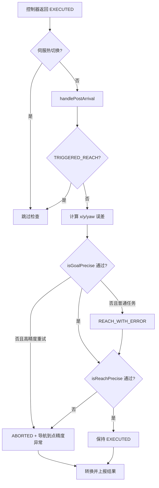

# 高频问题：导航到点精度异常（2412）

> 文档用途：当 AI Agent 在任务结果或同期日志中发现“导航到点精度异常”或 `REACH_WITH_ERROR` 时，用本文区分高精度重试失败、最终距离超限和普通异常到点，并继续采集上游证据。

## 1 问题结论

| 字段 | 内容 |
|---|---|
| 问题模式 | `arrival_precision_abnormal` |
| 用户可见提示 | `导航到点精度异常` |
| JState 错误码 | 2412 基线未发现独立数值码；这是 nav-base 任务结果消息 |
| 直接产生模块 | `navigation/nav_base` → `TaskMaster::handlePostArrival()` |
| 直接触发条件 | 高精度重试的 x/y/yaw 任务精度失败；或最终场景位置误差超过距离底线 |
| 相关异常结果 | 普通任务精度失败可返回 `REACH_WITH_ERROR`，任务不一定失败 |
| 直接影响 | 严格路径返回 `ABORTED`；普通异常到点可保持 `EXECUTED` 并上报 `reach_state=abnormal` |
| 恢复条件 | 没有独立持久错误位；新任务重新计算，必须用同目标、同场景复测确认恢复 |
| 验证基线 | `RC/1.2412.x @ a0b4f8433e44e5ae8089f2947cced7982613a4fa` |
| 不适用条件 | 现场派生版本改变了精度目标、阈值、重试或结果语义；错误发生在控制器完成之前 |

**核心判断**：该提示只能证明任务完成后的精度检查没有通过，不能单独证明定位、二维码、控制器、目标点或 footprint 是根因。

三类结果：

1. `High_Precision_Retry` 某个启用维度超限：`ABORTED`；
2. `FINAL` 或 `UNSPINNABLE_FINAL` 的位置距离超限：`ABORTED`；
3. 普通任务精度未满足但距离底线满足：可保持成功，返回 `REACH_WITH_ERROR`。

证据状态：

| 状态 | 含义 |
|---|---|
| `已确认` | 同版本代码与同期结果/日志共同命中具体分支 |
| `高可能` | 直接输入异常，但缺少上游生产者证据 |
| `待确认` | 只有提示或不完整日志 |
| `已排除` | 反向证据排除该分支 |
| `insufficient_data` | 版本、结果、实际误差或生效阈值缺失 |

## 2 问题触发的功能流程

前置条件：控制器返回 `EXECUTED`、未被伺服热切换抢占、取得最终机器人位姿，且不是 `TRIGGERED_REACH`。



调用链：

```text
NavBase::postExecProcess()
  -> getTaskPose()
  -> TaskMaster::handlePostArrival()
     -> isGoalPrecise()
     -> isReachPrecise()
  -> NavBaseClient::getMbResult()
  -> NavPlugin::fillMoveTaskResult() / abnormalCheck()
```

直接判据：

- 高精度重试：启用的 `abs(error.x/y) <= precision.x/y`；yaw 使用 `abs(error.yaw) <= precision.yaw * 3`；
- `FINAL`：位置误差长度不超过 `reach_tolerance`，代码默认 `0.035 m`，可由配置覆盖；
- `UNSPINNABLE_FINAL`：位置误差长度不超过 `0.1 m`；
- 普通 `isGoalPrecise()` 失败先标记 `REACH_WITH_ERROR`，若距离底线通过则不转为失败。

`PrecisionManager::fillReachScene()` 生成 `reach_scene`，并可根据本车与调度 footprint 生成任务 precision。`PrecisionKeeper` 再按场景选择精度。默认值必须以现场启动日志和配置复核，不能直接当作现场值。

跳过路径：非 `EXECUTED`、伺服热切换、`TRIGGERED_REACH`。本问题没有 HealthMonitor 式持久错误位，新任务会重新计算。

## 3 结合日志选择排查方向

保留问题前后至少 30 秒的 nav-manager/nav-base 未过滤日志及原始任务结果：

```bash
grep -E "High_Precision_Retry|TaskMaster.*init success|reach_tolerance|reach_scene|required_precision|precision_x|precision_y|precision_yaw|achieved_precision|raw_goal_precision|REACH_WITH_ERROR|reach_state|IMPRECISE GOAL REACH|导航到点精度异常" \
  /opt/jz/log/nav-manager.log /opt/jz/log/nav-base.log
```

| 顺序 | 检查项 | 正常判据 | 异常判据 | 结论状态与下一步 |
|---:|---|---|---|---|
| 1 | 时间、任务和版本 | 日志、结果属于同一 `task_code` 和时间窗，版本适用 | 无法对齐 | 输出 `insufficient_data`，补版本、时间和 task_code |
| 2 | 结果类型 | 可提取 `status/message/reach_mode/reach_state` | 只有用户描述 | 标记`待确认`，补原始任务结果 |
| 3 | 跳过条件 | 非 `TRIGGERED_REACH`，post-arrival 日志存在 | `TRIGGERED_REACH` 或伺服热切换 | 本路径应跳过；核对来源或派生版本 |
| 4 | 任务类型 | 可确认普通任务或 `High_Precision_Retry` | 类型缺失 | 补调度任务原文 |
| 5 | 实际误差 | 有同一任务的 `achieved_precision`/`raw_goal_precision` | 误差缺失 | 不得判断超限维度 |
| 6 | 生效阈值 | 有 `required_precision`、`reach_tolerance` 和初始化精度 | 阈值或场景缺失 | 不得确认参数错误 |
| 7 | 直接分支 | 某维度或场景距离明确超限 | 误差均在阈值内却报错 | 核对目标、版本和任务对齐 |
| 8 | 上游来源 | 定位、控制、目标或 footprint 有同期证据 | 只有代码候选 | 直接触发可确认，根因保持`待确认` |
| 9 | 复测 | 同版本、目标、场景成功且误差达标 | 未复测或仍超限 | `verification=not_started/failed` |

停止规则：

- 缺版本、时间、`task_code` 或原始结果时，停止根因判断；
- 确认 `TRIGGERED_REACH` 时，不再套用本文直接失败分支；
- 缺实际误差或生效阈值时，不得确认定位、控制、目标或参数根因；
- 只分析与目标 `task_code`、ReachID 对齐的记录；
- 直接分支确认后，仍需独立证据才能确认上游根因。

## 4 可能原因与解决方案

| 优先级 | 原因与唯一特征 | 负责链路 | 临时处置 | 根因修复 | 修复验证 |
|---|---|---|---|---|---|
| P1 | 高精度重试某维度明确超过同任务 precision | 调度重试→manager→nav-base | 保留证据，停止无证据重复重试 | 修正精度要求、目标或导致该维度误差的上游链 | 同目标重试各维度达标且成功 |
| P1 | `FINAL` 位置距离大于生效 `reach_tolerance` | nav-base | 安全停车并完整取证，不直接放宽阈值 | 按同期证据修复目标、定位或控制问题 | 同场景距离稳定达标 |
| P1 | `UNSPINNABLE_FINAL` 距离大于 0.1 m | 场景/点位→nav-base | 核对 `approaching_type` 和任务场景 | 修正场景属性或上游误差 | 场景正确且距离不超过 0.1 m |
| P1 | 任务 precision 与 footprint 输入不一致 | 调度 footprint→PrecisionManager | 保留两份 footprint，不在线盲改 | 修正数据源、格式、车型配置或实现 | 计算结果与正确输入一致 |
| P2 | `reach_scene` 与任务意图不符 | 调度/地图→PrecisionManager | 核对任务和点位属性 | 修正 `is_final`、旋转或 `approaching_type` 映射 | 同任务场景正确 |
| P2 | 判定目标与原始/补偿目标不一致 | manager 目标生成→nav-base | 保留各目标位姿和版本 | 修复目标传递、补偿或合并遗漏 | 按正确目标计算误差 |
| P2 | 到点窗口定位位姿跳变 | 定位→nav-base | 安全停止并保留定位数据 | 修复定位、时间同步或坐标变换 | 到点窗口定位稳定 |
| P2 | 控制器结束时误差仍未收敛 | nav-controller/nav-base | 保留结束前后误差和速度 | 修复结束条件或控制参数 | 结束时误差进入要求范围 |

前三类直接触发可由本代码确认；其余原因必须有同期输入证据。禁止关闭精度检查或无边界放宽阈值，Agent 不执行参数写入。

## 5 修复验证与证据索引

闭环条件：

1. 已分类为高精度重试、最终距离超限或普通异常到点；
2. 实际误差、阈值、场景、目标和 `task_code` 对齐；
3. 直接触发条件消失，而不是仅隐藏提示；
4. 同版本、目标、场景至少一次成功复测；
5. 参数变更记录原值、新值、边界和回退方式；
6. 无上游证据时，不把候选根因标为已确认。

Agent 最少证据：

```text
前后至少 30 秒的 nav-manager/nav-base 原始日志
完整版本、标签或提交
task_code、ReachID、frame_id、任务类型
status、message、reach_mode、reach_state
achieved_precision、必要时 raw_goal_precision
reach_scene、required_precision、reach_tolerance
PrecisionKeeper 初始化精度
参与计算的本车/调度 footprint
最终目标和到点机器人位姿
同场景复测结果
```

Agent 输出：

```yaml
problem_pattern: arrival_precision_abnormal
analysis_status: insufficient_data  # 已确认/高可能/待确认/已排除/insufficient_data
applicable_version:
  nav_manager: ""
  nav_base: ""
trigger_path: unknown  # high_precision_retry/final_distance/abnormal_reach/skipped/unknown
task_context:
  task_code: ""
  reach_id: ""
  task_type: ""
  frame_id: ""
  reach_scene: ""
result:
  status: ""
  message: ""
  reach_mode: ""
  reach_state: ""
measured_error: {x: null, y: null, yaw: null, distance: null}
effective_threshold: {x: null, y: null, yaw: null, reach_tolerance: null}
confirmed_facts: []
most_likely_cause: {cause: "", confidence: low, evidence: []}
excluded_causes: []
missing_evidence: []
next_action: []
temporary_action: ""
root_fix: ""
verification: {result: not_started, evidence: []}
```

输出约束：普通 `REACH_WITH_ERROR` 不描述为失败；缺误差和阈值时不确认上游根因；`TRIGGERED_REACH` 标记 `skipped`；未复测时验证必须为 `not_started`。

| 证据 | 2412 位置 |
|---|---|
| post-arrival 入口 | `navigation/nav_base/src/nav_base.cpp:89-99` |
| 任务精度判断 | `navigation/nav_base/src/task_master.cpp:137-155` |
| 结果分支和提示 | `navigation/nav_base/src/task_master.cpp:158-201` |
| 场景距离底线 | `navigation/nav_base/src/task_master.cpp:123-135` |
| PrecisionKeeper | `nav_core/src/precision_keeper.cpp:37-132` |
| 场景与任务 precision | `manager/src/code_inserting/precision_manager.cpp:30-185` |
| 高精度重试入口 | `manager/src/dispatch/dispatch_preempt_processor.cpp:168-173` |
| 结果转换与上报 | `manager/src/utils/nav_base_client.cpp:17-51`；`manager/src/plugin/nav_plugin.cpp:1034-1106` |

## 6 Agent 自动排查 Playbook

```yaml
playbook:
  meta:
    problem_pattern: "arrival_precision_abnormal"
    baseline: "RC/1.2412.x@a0b4f8433e44e5ae8089f2947cced7982613a4fa"
    modules: ["nav-manager", "nav-base"]
    time_window_sec: 30
    read_only: true
  steps:
    - id: classify_result
      description: "区分失败与普通异常到点"
      checks:
        - type: grep_log
          module: "nav-base"
          pattern: "导航到点精度异常|IMPRECISE GOAL REACH"
          on_match: {conclusion: "命中失败路径", priority: P1, goto: classify_retry}
          on_no_match: {conclusion: "继续检查异常到点", goto: classify_abnormal_reach}

    - id: classify_abnormal_reach
      description: "检查 REACH_WITH_ERROR"
      checks:
        - type: grep_log
          module: "nav-manager"
          pattern: "REACH_WITH_ERROR|reach_state[^a-zA-Z]*abnormal"
          on_match: {conclusion: "普通异常到点，不得描述为任务失败", priority: P1, goto: collect_evidence}
          on_no_match: {conclusion: "无直接结果证据", goto: fallback}

    - id: classify_retry
      description: "区分高精度重试和最终距离超限"
      checks:
        - type: grep_log
          module: "nav-manager"
          pattern: "High_Precision_Retry"
          on_match: {conclusion: "检查重试任务 x/y/yaw", priority: P1, goto: diagnose_retry}
          on_no_match: {conclusion: "检查最终场景距离", goto: diagnose_final_distance}

    - id: collect_evidence
      description: "收集误差、场景和阈值"
      checks:
        - type: grep_log
          module: "nav-base"
          pattern: "achieved_precision|raw_goal_precision|reach_scene|required_precision|reach_tolerance"
          on_match: {conclusion: "找到直接输入", priority: P1, goto: diagnose_upstream}
          on_no_match: {conclusion: "缺误差或阈值", goto: fallback}

    - id: diagnose_retry
      description: "检查高精度重试维度"
      checks:
        - type: grep_log
          module: "nav-base"
          pattern: "achieved_precision|raw_goal_precision|required_precision|IMPRECISE GOAL REACH"
          on_match: {conclusion: "提取 x/y/yaw 并逐维比较", priority: P1, goto: diagnose_upstream}
          on_no_match: {conclusion: "无法确认超限维度", goto: fallback}

    - id: diagnose_final_distance
      description: "检查最终场景位置距离"
      checks:
        - type: grep_log
          module: "nav-base"
          pattern: "achieved_precision|raw_goal_precision|reach_scene|required_precision|reach_tolerance"
          on_match: {conclusion: "计算距离并按 FINAL/UNSPINNABLE_FINAL 比较", priority: P1, goto: diagnose_upstream}
          on_no_match: {conclusion: "缺场景、误差或阈值", goto: fallback}

    - id: diagnose_upstream
      description: "检查目标、场景与 footprint 输入"
      checks:
        - type: grep_log
          module: "nav-manager"
          pattern: "goal footprint|origin:|precision_x|precision_y|precision_yaw|reach_scene|raw_goal_precision"
          on_match: {conclusion: "仅在输入与超限分支对齐时提升根因置信度", priority: P2, goto: verify}
          on_no_match: {conclusion: "直接触发可确认，上游根因证据不足", goto: verify}

    - id: verify
      description: "监控复测是否再次出现"
      checks:
        - type: verify_fix
          grep_pattern: "导航到点精度异常|IMPRECISE GOAL REACH|reach_state[^a-zA-Z]*abnormal"
          watch_duration_sec: 60
          on_match: {conclusion: "复测仍失败", priority: P1, goto: fallback}
          on_no_match: {conclusion: "未再命中；仍需同 task_code 的成功结果", goto: verify_success}

    - id: verify_success
      description: "确认同场景成功结果"
      checks:
        - type: grep_log
          module: "nav-base"
          pattern: "Goal reached\\.|achieved_precision"
          on_match: {conclusion: "对齐 task_code 和阈值后可标记通过", priority: P1}
          on_no_match: {conclusion: "无成功复测证据", goto: fallback}

    - id: fallback
      description: "证据不足兜底"
      checks:
        - type: grep_log
          module: "nav-manager"
          pattern: "task_code|ReachID"
          on_match: {conclusion: "analysis_status=insufficient_data，列出缺失的结果、误差、阈值或复测"}
          on_no_match: {conclusion: "补完整版本和问题前后 30 秒原始日志，analysis_status=insufficient_data"}
```
