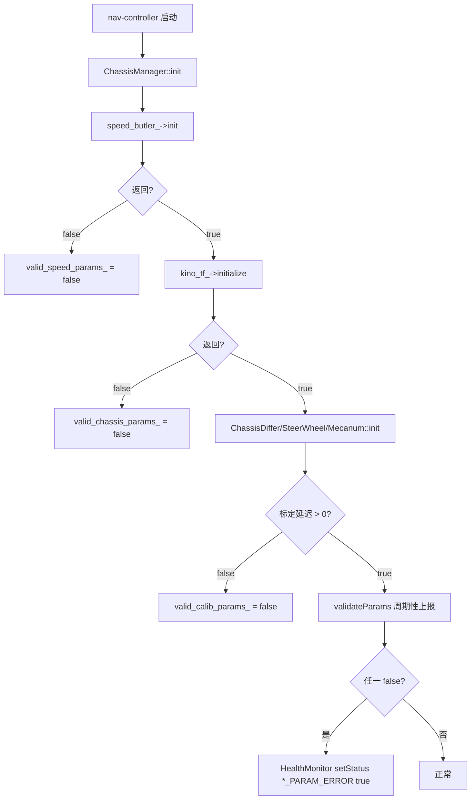
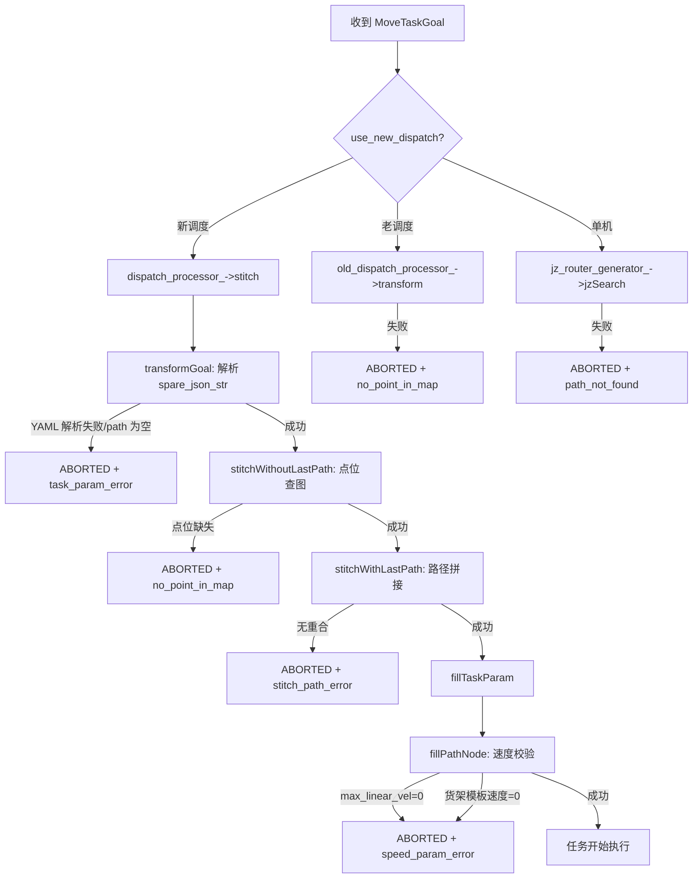

# 高频问题：导航运行参数异常（2412）

> 文档用途：当 AI Agent 在任务结果或同期日志中发现"导航运行参数异常"、HealthMonitor 上报 `*_param_error` 或任务下发失败时，用本文区分配置类、任务字段类和地图类参数异常，并继续采集上游证据。

## 1 问题结论

| 字段 | 内容 |
|---|---|
| 问题模式 | `nav_param_error` |
| 用户可见提示 | `导航运行参数异常`；HealthMonitor 上报 `chassis_param_error` / `speed_param_error` / `calib_param_error` / `task_param_error` / `no_point_in_map` / `stitch_path_error` / `path_not_found` / `other_reason` |
| JState 错误码 | 无独立数值码；由 HealthMonitor 枚举 `AbnormalIds` 标记 |
| 直接产生模块 | `nav-manager` 多个入口；`nav-controller` ChassisManager |
| 直接触发条件 | 底盘参数无效、速度设置为 0、标定延迟非法、调度任务字段异常、地图点位缺失、路径拼接无重合、自搜索无有效路径 |
| 相关异常结果 | 任务下发失败，任务不开始执行；HealthMonitor 持续上报对应异常位 |
| 直接影响 | 任务被阻塞，无法进入执行阶段；若参数在运行中动态失效，当前任务不直接中断但后续任务将失败 |
| 恢复条件 | 修正对应配置/参数/地图后重新下发任务；无持久错误位，新任务重新校验 |
| 验证基线 | `nav-manager` `RC/1.2412.x` @ manager + nav_core + nav_controller |
| 不适用条件 | 现场派生版本改变了校验条件、参数定义、HealthMonitor 注册逻辑或错误消息格式 |

**核心判断**：该提示只能证明任务初始化阶段参数校验未通过，不能直接认定某个具体模块出错。必须按 HealthMonitor 具体 `*_param_error` 子类区分根因入口。

八类子错误：

1. `chassis_param_error`：`kino_tf_->initialize()` 返回 false；
2. `speed_param_error`：`max_linear_vel` ≤ 0 或货架模板速度为 0；
3. `calib_param_error`：标定延迟参数 ≤ 0（各底盘子类），或差速轮标定系数无效；
4. `task_param_error`：`spare_json_str` 为空或 `transformGoal()` YAML 解析失败；
5. `no_point_in_map`：调度下发的点位 loc 在地图中查不到；
6. `stitch_path_error`：新调度路径与上一段无重合点；
7. `path_not_found`：自搜索 `jzSearch` 无法找到有效路径；
8. `other_reason`：任务初始化失败的兜底错误。

证据状态：

| 状态 | 含义 |
|---|---|
| `已确认` | 同版本代码与同期结果/日志共同命中具体分支 |
| `高可能` | 直接输入异常，但缺少上游生产者证据 |
| `待确认` | 只有提示或不完整日志 |
| `已排除` | 反向证据排除该分支 |
| `insufficient_data` | 版本、结果、配置或关键参数缺失 |

## 2 问题触发的功能流程

### 2.1 底盘/速度/标定参数校验（常驻）

前置条件：nav-controller 启动，ChassisManager 初始化。



调用链：

```text
ChassisManager::init()
  → speed_butler_->init()
  → kino_tf_->initialize()
  → (ChassisDiffer|ChassisSteerWheel|ChassisMecanum)::init()
     → valid_calib_params_ 赋值
→ ChassisManager::validateParams()  [周期性, 在 setFeedback 前后]
   → monitor_->setStatus(CALIB_PARARM_ERROR, !valid_calib_params_)
   → monitor_->setStatus(SPEED_PARARM_ERROR, !valid_speed_params_)
   → monitor_->setStatus(CHASSIS_PARAM_ERROR, !valid_chassis_params_)
```

### 2.2 任务下发时的参数和路径校验（按任务触发）

前置条件：收到 `MoveTaskGoal`，进入 `NavPlugin::executeTask`。



直接判据：

- `chassis_param_error`：`KinoTF::initialize()` → false，即运动学正逆解模块初始化失败；
- `speed_param_error`：`max_linear_vel < kZeroTolerance`（ROS param `/chassis/mobility/max_linear_vel`）或货架模板速度配置为 0；
- `calib_param_error`：差速轮 `track_width_coef`/`wheel_radius_coef` 无效（`isCalibCoefValid` 返回 false），或各底盘 `delay <= 0`；
- `task_param_error`：`goal->target_goal.spare_json_str` 为空，或 YAML `path` 节点缺字段/格式错误导致异常；
- `no_point_in_map`：`transformPoint` 查不到 `transform_goal.paths[i].loc` 对应的地图坐标，或老调度 `transform` 失败；
- `stitch_path_error`：`stitchWithLastPath` 在新旧路径间找不到重合点（`start_index < 0` 且无法投影）；
- `path_not_found`：`jzSearch` 规划失败，`dispatch_param.message` 填充错误描述；
- `other_reason`：`NavPlugin::executeTask` 返回 false 且未被上述具体错误覆盖。

`HealthMonitor::init()` 注册所有异常类型，`nodeStateCallBack` 周期性上报 `health_node_pub_`。`AbnormalIds` 枚举在 `nav_core/include/nav_core/struct/abnormal_ids.h`。

## 3 结合日志选择排查方向

保留问题发生前后至少 60 秒的 nav-manager 未过滤日志，以及 ChassisManager 初始化日志：

```bash
grep -E "chassis_param_error|speed_param_error|calib_param_error|task_param_error|no_point_in_map|stitch_path_error|path_not_found|other_reason|tranform_goal paths size|max_linear_vel.*0|货架模板配置速度为0|kino_tf.*initialize|ChassisManager.*init|调度下发点位ID|新调度抢占路径与上一段路径没有重合|无法搜索出有效路径|spare_json_str|导航任务初始化失败|valid_calib_params|valid_speed_params|valid_chassis_params" \
  /opt/jz/log/nav-manager.log
```

| 顺序 | 检查项 | 正常判据 | 异常判据 | 结论状态与下一步 |
|---:|---|---|---|---|
| 1 | 时间、版本、模块 | 日志属于同一时间窗、版本匹配、可区分 nav-manager 和 nav-controller | 无法对齐 | 输出 `insufficient_data`，补版本、时间 |
| 2 | 错误子类 | HealthMonitor 或任务日志明确匹配子错误名 | 只有"导航运行参数异常"笼统提示 | 标记`待确认`，补 nav-manager 完整日志 |
| 3 | 底盘/速度/标定 | ChassisManager init 成功，validateParams 无告警 | 启动日志中有 `*_param_error` 且 `valid_*` 为 false | 需确认 ChassisManager 初始化日志、ROS param 和标定配置 |
| 4 | 任务参数 | `spare_json_str` 非空，`transformGoal` 成功，paths 大小正常 | `tranform_goal paths size 0` 或 YAML 解析异常 | 检查调度下发的 `spare_json_str` 内容 |
| 5 | 地图点位 | `transformPoint` 全部成功 | `调度下发点位ID: X 在导航地图中不存在` | 检查地图是否与调度对齐、loc 是否正确 |
| 6 | 路径拼接 | `stitchWithLastPath` 正常返回，重合点存在 | `新调度抢占路径与上一段路径没有重合路径` | 检查上一段路径和当前路径的 loc 序列 |
| 7 | 路径搜索 | `jzSearch` 成功 | `无法搜索出有效路径` | 检查地图、起点位姿和目标点位 |
| 8 | 速度校验 | `max_linear_vel > 0`，货架模板速度配置非 0 | `配置速度为0,将会导致无法正常导航` | 检查 ROS param `/chassis/mobility/max_linear_vel` 和货架模板 |
| 9 | 复测 | 修正后同条件下任务成功下发并开始执行 | 仍失败或未复测 | `verification=not_started/failed` |

停止规则：

- 缺版本、时间、模块日志时，停止根因判断；
- HealthMonitor 上报多个 `*_param_error` 时，按底盘→速度→标定的顺序排查（标定依赖底盘 init 成功）；
- 收到 nav-manager 和 nav-controller 混合日志时，仅按 `chassis_*/speed_*/calib_*` 归因到 nav-controller；
- 仅 `task_param_error` 时不得归因到调度系统——`spare_json_str` 可能由多个上游拼接；
- 缺地图、loc 或配置快照时，不得确认地图或参数根因。

## 4 可能原因与解决方案

| 优先级 | 原因与唯一特征 | 负责链路 | 临时处置 | 根因修复 | 修复验证 |
|---|---|---|---|---|---|
| P1 | `max_linear_vel` 配置为 0 或未设置 | ROS param→config_manager→nav_plugin | 核对该参数值并记录，不直接写入 | 修正 `/chassis/mobility/max_linear_vel` 配置 | 新任务 `fillPathNode` 通过 |
| P1 | 货架模板速度配置为 0 | 调度模板→config_manager→nav_plugin | 记录当前模板配置 | 更新货架模板 `max_trans_speed` > 0 | 同模板同任务速度校验通过 |
| P1 | 底盘 KinoTF 初始化失败 | nav-controller→kino_tf | 记录运动学模型参数 | 修正底盘类型配置或运动学参数 | `kino_tf_->initialize()` 返回 true |
| P1 | 标定延迟 ≤ 0（差速/舵轮/麦克纳姆） | ChassisManager 子类 init | 记录当前 delay 和 calib 系数 | 修正标定参数文件/ROS param | `valid_calib_params_` 为 true |
| P1 | spare_json_str 为空或 YAML 字段缺失 | 调度→move_task_goal 构造 | 记录任务原文 | 修复调度下发的 YAML 字段 | `transformGoal` 成功，paths 非空 |
| P1 | 调度下发点位在地图中不存在 | 调度 loc→地图 manager | 记录缺失点位 loc | 同步地图或修正调度点位 | `transformPoint` 全部命中 |
| P1 | 路径拼接无重合点 | 调度抢占→stitch | 记录两段路径 loc 序列 | 确保抢占路径与上一段有有效重合 | `stitchWithLastPath` 成功 |
| P1 | 自搜索无有效路径 | jz_router_generator→jzSearch | 记录起点位姿和目标 | 修正地图或检查起点/目标可达性 | `jzSearch` 返回 true |
| P2 | 差速轮 track_width_coef/wheel_radius_coef 无效 | chassis_differ init | 记录当前系数值 | 修正标定系数 | `isCalibCoefValid` 全部通过 |
| P2 | YAML 中 `path` 节点缺 action/loc/t 字段 | 调度→spare_json_str | 记录缺失字段 | 修复调度 YAML 生成逻辑 | 各字段完整且解析成功 |
| P2 | 任务类型为老调度且 ID 格式不兼容 | 调度→old_dispatch_processor | 记录老调度原始格式 | 升级到新调度或修正兼容层 | `transform` 成功 |

前三类直接触发可由本代码确认；其余原因必须有同期输入证据。禁止在线修改配置或速度限制，Agent 不执行参数写入。

## 5 修复验证与证据索引

闭环条件：

1. 已分类到具体 `*_param_error` 子类；
2. 相关配置/参数快照与代码校验点对齐；
3. 修正后新任务校验通过并进入执行；
4. HealthMonitor 对应异常位清零；
5. 参数变更记录原值、新值、边界和回退方式；
6. 无上游证据时，不把候选根因标为已确认。

Agent 最少证据：

```text
前后至少 60 秒的 nav-manager 完整日志
ChassisManager 初始化日志（若涉及底盘/速度/标定）
完整版本、标签或提交
ROS param: /chassis/mobility/max_linear_vel, car_type, support_omni 等
标定参数文件或 ROS param: linear_delay, angular_delay, track_width_coef, wheel_radius_coef
调度下发 spare_json_str 原文
地图版本和管理状态
任务时间、task_code、ReachID
HealthMonitor 完整状态快照
同条件复测结果
```

Agent 输出：

```yaml
problem_pattern: nav_param_error
analysis_status: insufficient_data  # 已确认/高可能/待确认/已排除/insufficient_data
applicable_version:
  nav_manager: ""
  nav_controller: ""
error_subtype: unknown  # chassis_param/speed_param/calib_param/task_param/no_point_in_map/stitch_path/path_not_found/other_reason/unknown
task_context:
  task_code: ""
  task_time: ""
  dispatch_type: ""  # new_dispatch/old_dispatch/standalone/unknown
  spare_json_str: ""
config_snapshot:
  max_linear_vel: null
  car_type: ""
  shelf_template_speed: null
  linear_delay: null
  angular_delay: null
  valid_chassis_params: null
  valid_speed_params: null
  valid_calib_params: null
error_detail:
  message: ""         # dispatch_param.message 或 HealthMonitor 的 AS message
  health_monitor_code: ""
  code_location: ""   # 代码文件和行范围
confirmed_facts: []
most_likely_cause: {cause: "", confidence: low, evidence: []}
excluded_causes: []
missing_evidence: []
next_action: []
temporary_action: ""
root_fix: ""
verification: {result: not_started, evidence: []}
```

输出约束：`*_param_error` 子类必须精确到 HealthMonitor 枚举名；缺配置快照时不确认根因；仅 `task_param_error` 时不归因到调度系统；未复测时验证必须为 `not_started`。

| 证据 | 2412 位置 |
|---|---|
| HealthMonitor 注册 | `nav_core/src/health_monitor.cpp:97-126` |
| AbnormalIds 枚举 | `nav_core/include/nav_core/struct/abnormal_ids.h` |
| ChassisManager::init + validateParams | `nav_controller/src/chassis_manager/chassis_manager.cpp:58-137` |
| chassis_differ calib 校验 | `nav_controller/src/chassis_manager/chassis_differ.cpp:87-90` |
| chassis_steerwheel calib 校验 | `nav_controller/src/chassis_manager/chassis_steerwheel.cpp:67-69` |
| chassis_mecanum calib 校验 | `nav_controller/src/chassis_manager/chassis_mecanum.cpp:54-56` |
| transformGoal YAML 解析 | `manager/src/dispatch/dispatch_preempt_processor.cpp:294-357` |
| stitchWithLastPath 路径拼接 | `manager/src/dispatch/dispatch_preempt_processor.cpp:97-151` |
| stitchWithoutLastPath + NO_POINT_IN_MAP | `manager/src/dispatch/dispatch_preempt_processor.cpp:153-199` |
| stitch 主流程 + TASK_PARAM_ERROR + STITCH_PATH_ERROR | `manager/src/dispatch/dispatch_preempt_processor.cpp:404-446` |
| fillPathNode + speed_param_error | `manager/src/plugin/nav_plugin.cpp:995-1063` |
| executeTask 任务下发 | `manager/src/plugin/nav_plugin.cpp:1730-1797` |
| fillMoveTaskResult + abnormalCheck | `manager/src/plugin/nav_plugin.cpp:805-873` |
| config_manager max_linear_vel | `manager/src/config_manager.cpp:34,52` |

## 6 Agent 自动排查 Playbook

```yaml
playbook:
  meta:
    problem_pattern: "nav_param_error"
    baseline: "nav-manager RC/1.2412.x"
    modules: ["nav-manager", "nav-controller"]
    time_window_sec: 60
    read_only: true
  steps:
    - id: classify_error_subtype
      description: "区分参数异常的具体子类"
      checks:
        - type: grep_log
          module: "nav-manager"
          pattern: "chassis_param_error|speed_param_error|calib_param_error|task_param_error|no_point_in_map|stitch_path_error|path_not_found|other_reason"
          on_match: {conclusion: "已命中具体子类", priority: P1, goto: route_by_subtype}
          on_no_match: {conclusion: "无 HealthMonitor 明细，检查任务下发失败消息", goto: check_dispatch_message}

    - id: check_dispatch_message
      description: "检查任务下发阶段的错误消息"
      checks:
        - type: grep_log
          module: "nav-manager"
          pattern: "stitch fail|transform fail|新调度任务异常|老调度任务字段异常|无法搜索出有效路径|tranform_goal paths size"
          on_match: {conclusion: "命中任务下发失败路径", priority: P1, goto: route_by_message}
          on_no_match: {conclusion: "无直接错误证据", goto: fallback}

    - id: route_by_subtype
      description: "按子类路由到专向排查"
      checks:
        - type: grep_log
          module: "nav-manager"
          pattern: "chassis_param_error"
          on_match: {conclusion: "检查底盘 KinoTF 初始化", priority: P1, goto: diagnose_chassis}
        - type: grep_log
          module: "nav-manager"
          pattern: "speed_param_error"
          on_match: {conclusion: "检查 max_linear_vel 和货架模板速度", priority: P1, goto: diagnose_speed}
        - type: grep_log
          module: "nav-manager"
          pattern: "calib_param_error"
          on_match: {conclusion: "检查标定延迟和系数", priority: P1, goto: diagnose_calib}
        - type: grep_log
          module: "nav-manager"
          pattern: "task_param_error"
          on_match: {conclusion: "检查 spare_json_str 和 YAML 字段", priority: P1, goto: diagnose_task_param}
        - type: grep_log
          module: "nav-manager"
          pattern: "no_point_in_map"
          on_match: {conclusion: "检查调度点位在地图中是否存在", priority: P1, goto: diagnose_map_point}
        - type: grep_log
          module: "nav-manager"
          pattern: "stitch_path_error"
          on_match: {conclusion: "检查新旧路径重合点", priority: P1, goto: diagnose_stitch}
        - type: grep_log
          module: "nav-manager"
          pattern: "path_not_found"
          on_match: {conclusion: "检查自搜索路径规划", priority: P1, goto: diagnose_path_search}
        - type: grep_log
          module: "nav-manager"
          pattern: "other_reason"
          on_match: {conclusion: "检查 executeTask 返回 false 的具体原因", priority: P1, goto: diagnose_other}

    - id: route_by_message
      description: "按 dispatch 错误消息路由"
      checks:
        - type: grep_log
          module: "nav-manager"
          pattern: "调度任务字段异常"
          on_match: {conclusion: "spare_json_str 空或 YAML 解析失败", priority: P1, goto: diagnose_task_param}
        - type: grep_log
          module: "nav-manager"
          pattern: "调度下发点位ID.*在导航地图中不存在"
          on_match: {conclusion: "地图点位缺失", priority: P1, goto: diagnose_map_point}
        - type: grep_log
          module: "nav-manager"
          pattern: "新调度抢占路径与上一段路径没有重合"
          on_match: {conclusion: "路径拼接失败", priority: P1, goto: diagnose_stitch}
        - type: grep_log
          module: "nav-manager"
          pattern: "无法搜索出有效路径"
          on_match: {conclusion: "路径规划失败", priority: P1, goto: diagnose_path_search}

    - id: diagnose_chassis
      description: "检查 KinoTF 初始化"
      checks:
        - type: grep_log
          module: "nav-controller"
          pattern: "kino_tf.*initialize|KinoTF|ChassisManager.*init"
          on_match: {conclusion: "提取初始化日志，确认失败原因", priority: P1, goto: collect_config}
          on_no_match: {conclusion: "缺 ChassisManager 初始化日志", goto: fallback}

    - id: diagnose_speed
      description: "检查速度参数"
      checks:
        - type: grep_log
          module: "nav-manager"
          pattern: "max_linear_vel|配置速度为0|货架模板配置速度为0"
          on_match: {conclusion: "提取 max_linear_vel 值和货架模板配置", priority: P1, goto: collect_config}
          on_no_match: {conclusion: "检查 ROS param dump", goto: fallback}

    - id: diagnose_calib
      description: "检查标定参数"
      checks:
        - type: grep_log
          module: "nav-controller"
          pattern: "ChassisDiffer|ChassisSteerWheel|ChassisMecanum.*init|valid_calib|linear_delay|angular_delay|track_width_coef|wheel_radius_coef"
          on_match: {conclusion: "提取标定参数初始化和校验结果", priority: P1, goto: collect_config}
          on_no_match: {conclusion: "缺标定参数日志", goto: fallback}

    - id: diagnose_task_param
      description: "检查任务字段异常"
      checks:
        - type: grep_log
          module: "nav-manager"
          pattern: "spare_json_str|transformGoal|tranform_goal paths size|new dispatch goal"
          on_match: {conclusion: "提取 spare_json_str 内容和 parse 结果", priority: P1, goto: verify}
          on_no_match: {conclusion: "缺任务参数字段日志", goto: fallback}

    - id: diagnose_map_point
      description: "检查地图点位"
      checks:
        - type: grep_log
          module: "nav-manager"
          pattern: "调度下发点位ID|transformPoint|can not transform path id|no_point_in_map"
          on_match: {conclusion: "提取缺失点位 loc，核对地图", priority: P1, goto: verify}
          on_no_match: {conclusion: "缺地图点位日志", goto: fallback}

    - id: diagnose_stitch
      description: "检查路径拼接"
      checks:
        - type: grep_log
          module: "nav-manager"
          pattern: "stitchWithLastPath|stitchWithoutLastPath|start_index|没有重合路径"
          on_match: {conclusion: "提取新旧路径 loc 序列", priority: P1, goto: verify}
          on_no_match: {conclusion: "缺路径拼接日志", goto: fallback}

    - id: diagnose_path_search
      description: "检查自搜索路径"
      checks:
        - type: grep_log
          module: "nav-manager"
          pattern: "jzSearch|jz_router|无法搜索出有效路径"
          on_match: {conclusion: "提取起点位姿和目标点位", priority: P1, goto: verify}
          on_no_match: {conclusion: "缺路径搜索日志", goto: fallback}

    - id: diagnose_other
      description: "兜底排查 executeTask"
      checks:
        - type: grep_log
          module: "nav-manager"
          pattern: "executeTask|return false|NavPlugin::execute"
          on_match: {conclusion: "提取 executeTask 返回 false 的上下文", priority: P1, goto: verify}
          on_no_match: {conclusion: "无法定位具体原因", goto: fallback}

    - id: collect_config
      description: "收集配置快照"
      checks:
        - type: grep_log
          module: "nav-manager"
          pattern: "max_linear_vel|car_type|have_tab_rotater|support_omni|valid_chassis|valid_speed|valid_calib|max_trans_speed|linear_delay|angular_delay"
          on_match: {conclusion: "配置快照已收集", priority: P1, goto: verify}
          on_no_match: {conclusion: "配置快照不完整", goto: fallback}

    - id: verify
      description: "复测检查"
      checks:
        - type: verify_fix
          grep_pattern: "chassis_param_error|speed_param_error|calib_param_error|task_param_error|no_point_in_map|stitch_path_error|path_not_found|other_reason|stitch fail|transform fail|新调度任务异常|老调度任务字段异常|无法搜索出有效路径"
          watch_duration_sec: 60
          on_match: {conclusion: "复测仍失败", priority: P1, goto: fallback}
          on_no_match: {conclusion: "未再命中；需同条件成功任务确认", goto: verify_success}

    - id: verify_success
      description: "确认任务成功下发"
      checks:
        - type: grep_log
          module: "nav-manager"
          pattern: "fillTaskParam|fillPathNode.*success|transform_goal.uuid"
          on_match: {conclusion: "对齐条件后可标记通过", priority: P1}
          on_no_match: {conclusion: "无成功复测证据", goto: fallback}

    - id: fallback
      description: "证据不足兜底"
      checks:
        - type: grep_log
          module: "nav-manager"
          pattern: "task_code|MoveTaskGoal|spare_json_str|max_linear_vel|kino_tf|init"
          on_match: {conclusion: "analysis_status=insufficient_data，列出缺失的配置、日志或复测"}
          on_no_match: {conclusion: "补完整版本和问题前后 60 秒原始日志，analysis_status=insufficient_data"}
```
