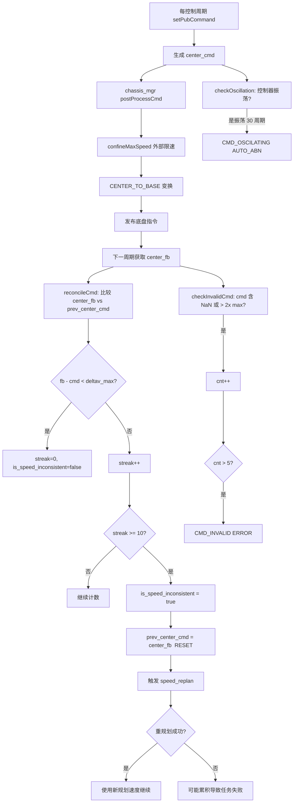

# 高频问题：速度跟踪偏差（2412）

> 文档用途：当 AI Agent 在任务结果或同期日志中发现 `[CMD] reconcile` / `[Trigger] inconsistent speed` / `CMD_OSCILATING` / `CMD_INVALID` 或底盘执行速度明显偏离下发指令时，用本文判断指令与反馈偏差的根因（控制器层 vs 底盘层 vs 建模层），并采集上游证据。

## 1 问题结论

| 字段 | 内容 |
|---|---|
| 问题模式 | `speed_tracking_deviation` |
| 用户可见提示 | `[CMD] RECONCILING prev_cmd WITH FEEDBACK`；HealthMonitor 上报 `cmd_oscillating` / `cmd_invalid` / `speed_inconsistent`（无独立异常位）→ 触发 speed_replan |
| JState 错误码 | `CMD_OSCILATING`（AUTO_ABN 级别）；`CMD_INVALID`（ERROR 级别）；无独立 `SPEED_INCONSISTENT` 位，仅作为触发信号 |
| 直接产生模块 | `nav-controller` `SpeedPostProcessor::reconcileCmd()` + `HealthChecker::checkInvalidCmd()` + `CentroidControllerInterface::checkOscillation()` |
| 直接触发条件 | 反馈速度与下发指令偏差 > `5 * delay_time * VAccMax` 连续 ≥10 周期；或指令自身 NaN/超 2x 上限；或控制器振荡 ≥30 周期 |
| 相关异常结果 | `isSpeedInconsistent` 触发 speed_replan（轨迹重规划）；`CMD_INVALID` 为 ERROR 级（可能中止）；`CMD_OSCILATING` 为 AUTO_ABN（自动处理） |
| 直接影响 | 轨迹频繁重规划导致走走停停、速度不平滑；严重时 CMD_INVALID 导致任务中止 |
| 恢复条件 | 重规划后速度偏差回归正常（≤10 周期连续正常）；控制器振荡恢复 |
| 验证基线 | `nav-manager` `RC/1.2412.x` @ nav-controller: speed_postprocessor + health_checker + centroid_controller_interface |
| 不适用条件 | 现场配置修改了 `speed_inconsistent_streak_threshold`、`oscillating_threshold`、`delay_time_` 或 `enable_speed_reconcile_=false` |

**核心判断**：下发的指令与反馈速度不一致，说明执行链路（控制器→底盘指令→电机→轮子→odom 反馈）存在偏差。需区分三种偏差来源。

三类偏差：

1. **速度跟踪偏差**（本文主题）：`reconcileCmd` 检测到 `|fb - cmd| > deltav_max` 连续 ≥10 周期，`delay_time_` 和 `VAccMax` 决定了容忍度；
2. **指令自身异常**：`checkInvalidCmd` 检测 cmd 含 NaN 或速度 > 2x 上限，累积 5 周期后报 `CMD_INVALID`；
3. **控制器振荡**：`checkOscillation` 检测控制器输出来回震荡 ≥`oscillating_threshold`（默认 30）周期，报 `CMD_OSCILATING`。

证据状态：

| 状态 | 含义 |
|---|---|
| `已确认` | 日志有 reconcile 偏差值和 deltav_max，或 cmd_invalid 具体超标值，或 oscillating 计数器 |
| `高可能` | 有 `RECONCILING` 日志但缺少完整周期数据 |
| `待确认` | 只有 speed_replan 触发或"走走停停"描述 |
| `已排除` | 偏差 < deltav_max，或重规划由 cover_rate/未完成规划等其他原因触发 |
| `insufficient_data` | 缺少反馈速度、下发指令、delay_time_、VAccMax 任一值 |

## 2 问题触发的功能流程

前置条件：nav-controller 跟踪态运行，运动反馈和指令均可用。



调用链：

```text
NavControllerImpl::setPubCommand()
  → chassis_mgr_->postProcessCmd(state_id, center_fb_, center_cmd)
  → speed_processor_->confineMaxSpeed(state_id, center_cmd)
  → motion_tf_->transformCmd(CENTER_TO_BASE, center_cmd, base_cmd)
  → 发布 base_cmd
  → speed_processor_->reconcileCmd(center_fb_, prev_center_cmd_)
     → deltav_max = 5 * delay_time_ * VAccMax()
     → |fb.vx - prev_cmd.vx| < deltav_max && |fb.vy - prev_cmd.vy| < deltav_max
     → 通过 → reset streak; 不通过 → streak++
     → streak >= threshold(10) → is_speed_inconsistent_ = true
     → prev_center_cmd_ = center_fb_  (防止偏差累积)

NavControllerImpl::shouldDynamicReplan()  [触发判断]
  → speed_processor_->isSpeedInconsistent()  → [Trigger] inconsistent speed

CentroidControllerInterface::ctrlAction()
  → ctrl_ret["is_oscillating"] → checkOscillation()
     → oscillating_counter_->update(is_oscillating)
     → isOverThreshold(30) → CMD_OSCILATING

HealthChecker::checkInvalidCmd()
  → has_nan || v_exceeded(2x max_v) || w_exceeded(2x max_w)
  → cnt > 5 → CMD_INVALID
```

直接判据：

- `deltav_max = 5 * delay_time_ * VAccMax()`：其中 `delay_time_` 由 `ConfigMaster::maxTimeDelay()` 提供，`VAccMax` 由 `SpeedButler` 提供；
- `delay_time_` 默认为系统时钟和通信延迟之和，值越大容忍度越高；
- `streak` 不满足时正常计数重置；
- `prev_center_cmd_ = center_fb_` 意味着偏差不累积——每周期只比较相邻两个周期；
- `isSpeedInconsistent()` 返回 `is_speed_limited_externally_ || is_speed_inconsistent_`，外部限速也被视为不一致信号；
- 控制器振荡由底层控制器（centroid_controller）自行检测并上报 `is_oscillating`。

## 3 结合日志选择排查方向

保留偏差发生前后至少 30 秒的 nav-controller 日志：

```bash
grep -E "reconcile.*fbvx|RECONCILING prev_cmd|\[Trigger\] inconsistent speed|INVALID CMD|oscillat|is_oscillating|CMD_OSCILATING|CMD_INVALID|speed_replan|deltav_max|center_fb|reconcileCmd" \
  /opt/jz/log/nav-controller.log
```

| 顺序 | 检查项 | 正常判据 | 异常判据 | 结论状态与下一步 |
|---:|---|---|---|---|
| 1 | 时间、版本、节点 | 日志可对齐 nav-controller 控制周期 | 无法对齐 | 输出 `insufficient_data`，补版本、时间 |
| 2 | 偏差类型 | 日志明确 reconcile / CMD_INVALID / oscillating | 只有"走走停停"描述 | 标记`待确认`，补控制周期日志 |
| 3 | reconcile 偏差值 | 日志输出 `fbvx:_, prev_vx:_, deltav_max:_, dv:_` | 无 reconcile 日志 | 可能 enable_speed_reconcile_=false，或偏差在容忍内 |
| 4 | 偏差幅度 | |fb-cmd| 略超 deltav_max（10-30%） | 大幅超（> 100%） | 大幅超通常为底盘物理问题或建模错误 |
| 5 | 持续时间 | streak 偶尔 ≥10，多数周期正常 | 几乎每个周期都超，streak 持续高位 | 持续偏高应优先排查底盘/建模 |
| 6 | CMD_INVALID | 指令正常 | 日志 `INVALID CMD, exceeded,v:X/Y, w:X/Y` | 检查规划器输出是否异常（NaN 或 > 2x 上限） |
| 7 | 控制器振荡 | 振荡队列值 < 30 | `is_oscillating` 连续出现 | 查控制器参数、定位稳定性或底盘响应特性 |
| 8 | delay_time_ 和 VAccMax | 参数范围合理（delay~0.05-0.2s） | delay 异常大（>1s）或 VAccMax 过小 | 建模/通信延迟配置不当 |
| 9 | 复测 | 同条件下不再触发 reconcile 或 oscillating | 仍频繁触发 | 核实底盘、定位或控制器参数 |

停止规则：

- 缺少 `deltav_max` 或 `delay_time_` 值时，无法判断容忍度是否合理；
- 仅 speed_replan 触发记录、无 reconcile 详情时，不得确认为速度跟踪偏差；
- CMD_INVALID 为 ERROR 级，应优先于 WARN 级偏差排查；
- 控制器振荡应先检查控制器配置和底盘响应，再排查上层原因。

## 4 可能原因与解决方案

| 优先级 | 原因与唯一特征 | 负责链路 | 临时处置 | 根因修复 | 修复验证 |
|---|---|---|---|---|---|
| P1 | 底盘执行能力不足（电机力矩/轮子打滑） | 底盘→motor_fb→center_fb | 降速运行，记录打滑时刻 | 检修电机/轮系/底盘 | 同速度段反馈跟踪偏差 < deltav_max |
| P1 | 速度规划过于激进（加速度接近物理极限） | 规划器→VAccMax→center_cmd | 降低任务速度等级 | 修正速度/加速度配置 | 指令值在底盘能力范围内 |
| P1 | delay_time_ 配置过小（< 实际通信延迟） | config_master→delay_time_→deltav_max | 临时增大延迟补偿 | 修正 delay_time_ 为真实值 | deltav_max 合理，不再误报 |
| P1 | 定位漂移导致反馈速度计算失真 | 定位→odom→center_fb | 暂停任务，记录定位数据 | 修复定位跳变 | odom 速度与真实一致 |
| P2 | 底盘通信丢包或超时 | ros_ds→motorVelFeedback | 记录丢包率 | 修复通信链路 | 反馈数据连续 |
| P2 | 控制器振荡（PID 参数不匹配） | centroid_controller→is_oscillating | 降速观察 | 调整 PID 参数 | 振荡计数器 < threshold |
| P2 | 下发的指令自身含 NaN（规划器 bug） | 规划器→ctrlAction→center_cmd | 记录规划器输入输出 | 排查规划器 NaN 来源 | 连续正常指令生成 |
| P2 | shear/ground 变化导致动态特性改变 | 底盘模型→实际性能 | 记录地面状态 | 更新底盘模型或 friction 参数 | 同条件下跟踪偏差可接受 |

前三类直接触发可由本代码确认；其余原因必须有同期底盘/定位证据。禁止擅自增大 `speed_inconsistent_streak_threshold` 或关闭 `enable_speed_reconcile_`，Agent 不写入参数。

## 5 修复验证与证据索引

闭环条件：

1. 已确认偏差类型（reconcile / CMD_INVALID / oscillating）并量化偏差；
2. `deltav_max`、`delay_time_`、`VAccMax` 已确认；
3. 反馈速度源（odom/motor feedback）和指令速度源已对齐时间戳；
4. 偏差频率和幅度已统计；
5. 同条件下复测无一致性触发；
6. 参数变更记录原值、新值。

Agent 最少证据：

```text
前后至少 30 秒 nav-controller 控制周期日志
reconcile 输出: fbvx, prev_vx, deltav_max, dv
delay_time_ / maxTimeDelay 值
VAccMax / speed_butler config
CMD_INVALID 细节: cmd.vx/vy/w, max_v, max_w
oscillating 计数器及 threshold
底盘 motor feedback 原始数据
任务 task_code、时间窗、state_id
同条件复测结果
```

Agent 输出：

```yaml
problem_pattern: speed_tracking_deviation
analysis_status: insufficient_data
applicable_version:
  nav_controller: ""
deviation_type: unknown  # reconcile/cmd_invalid/oscillating/mixed/unknown
deviation_detail:
  reconcile:
    streak_count: null
    streak_threshold: 10
    deltav_max: null
    delay_time: null
    vacc_max: null
    fb_vx_values: []
    cmd_vx_values: []
    fb_vy_values: []
    cmd_vy_values: []
  cmd_invalid:
    has_nan: false
    v_exceeded: false
    w_exceeded: false
    max_v: null
    max_w: null
  oscillating:
    counter: null
    threshold: 30
task_context:
  task_code: ""
  task_time: ""
  state_id: ""
frequency: {total_cycles: null, deviation_cycles: null, deviation_pct: null}
confirmed_facts: []
most_likely_cause: {cause: "", confidence: low, evidence: []}
excluded_causes: []
missing_evidence: []
next_action: []
temporary_action: ""
root_fix: ""
verification: {result: not_started, evidence: []}
```

输出约束：缺失 deltav_max 时不确认底盘/建模根因；仅 speed_replan 触发无 reconcile 细节时不直接归因跟踪偏差；混合型需逐项标记。

| 证据 | 2412 位置 |
|---|---|
| reconcileCmd | `nav_controller/src/task_manager/speed_postprocessor.cpp:156-179` |
| isSpeedInconsistent | `nav_controller/src/task_manager/speed_postprocessor.cpp:50-52` |
| isExternallyConfined | `nav_controller/src/task_manager/speed_postprocessor.cpp:47-49` |
| speed_inconsistent_streak_threshold | `nav_controller/src/task_manager/speed_postprocessor.cpp:74-79` |
| enable_speed_reconcile_ | `nav_controller/src/task_manager/speed_postprocessor.cpp:72` |
| shouldDynamicReplan speed_inconsistent | `nav_controller/src/nav_controller.cpp:638-641` |
| checkInvalidCmd | `nav_controller/src/task_manager/health_checker.cpp:81-97` |
| checkOscillation | `nav_controller/src/plan_ctrl_layer/centroid_controller_interface.cpp:252-258` |
| oscillating_threshold (30) | `nav_controller/src/plan_ctrl_layer/centroid_controller_interface.cpp:184` |
| updateFeedbackTable | `nav_controller/src/nav_controller.cpp:289` |
| odomVel → center_fb_ | `nav_controller/src/nav_controller.cpp:451` |
| motorVelFeedback | `nav_controller/src/nav_controller.cpp:455-458` |
| setPubCommand → reconcileCmd | `nav_controller/src/nav_controller.cpp:1043-1044` |
| center_fb_ 定义 | `nav_controller/include/nav_controller/private/nav_controller_impl.h:306` |
| CMD_OSCILATING 注册 | `nav_core/src/health_monitor.cpp:80` |
| CMD_INVALID 注册 | `nav_core/src/health_monitor.cpp:86` |

## 6 Agent 自动排查 Playbook

```yaml
playbook:
  meta:
    problem_pattern: "speed_tracking_deviation"
    baseline: "nav-manager RC/1.2412.x @ nav-controller"
    modules: ["nav-controller"]
    time_window_sec: 30
    read_only: true
  steps:
    - id: classify_deviation_type
      description: "区分速度偏差类型"
      checks:
        - type: grep_log
          module: "nav-controller"
          pattern: "reconcile.*fbvx|RECONCILING prev_cmd"
          on_match: {conclusion: "速度跟踪偏差 reconcile", priority: P1, goto: quantify_reconcile}
          on_no_match: {conclusion: "检查 CMD_INVALID 或振荡", goto: check_cmd_invalid}

    - id: check_cmd_invalid
      description: "检查指令自身异常"
      checks:
        - type: grep_log
          module: "nav-controller"
          pattern: "INVALID CMD.*exceeded|cmd_invalid"
          on_match: {conclusion: "指令异常", priority: P1, goto: diagnose_cmd_invalid}
          on_no_match: {conclusion: "检查控制器振荡", goto: check_oscillating}

    - id: check_oscillating
      description: "检查控制器振荡"
      checks:
        - type: grep_log
          module: "nav-controller"
          pattern: "is_oscillating|oscillat|CMD_OSCILATING"
          on_match: {conclusion: "控制器振荡", priority: P1, goto: diagnose_oscillating}
          on_no_match: {conclusion: "只有 speed_replan 触发无细节", goto: check_replan_trigger}

    - id: check_replan_trigger
      description: "确认 speed_replan 是否由跟踪偏差触发"
      checks:
        - type: grep_log
          module: "nav-controller"
          pattern: "\\[Trigger\\] inconsistent speed"
          on_match: {conclusion: "speed_replan 由 isSpeedInconsistent 触发", priority: P2, goto: fallback}
          on_no_match: {conclusion: "speed_replan 由其他原因触发（cover_rate/未完成规划）", goto: fallback}

    - id: quantify_reconcile
      description: "量化跟踪偏差"
      checks:
        - type: grep_log
          module: "nav-controller"
          pattern: "reconcile.*fbvx|deltav_max"
          on_match: {conclusion: "提取 fbvx, prev_vx, deltav_max, dv 值", priority: P1, goto: assess_severity}
          on_no_match: {conclusion: "有 reconcile 关键字但缺数值", goto: fallback}

    - id: assess_severity
      description: "评估偏差严重程度"
      checks:
        - type: grep_log
          module: "nav-controller"
          pattern: "reconcile.*fbvx"
          on_match: {conclusion: "统计 streak 频率和幅度", priority: P1, goto: check_delay_param}
          on_no_match: {conclusion: "无法评估", goto: fallback}

    - id: check_delay_param
      description: "检查 delay_time_ 和 VAccMax"
      checks:
        - type: grep_log
          module: "nav-controller"
          pattern: "delay_time|maxTimeDelay|VAccMax|speed_butler"
          on_match: {conclusion: "提取 delay_time_ 和 VAccMax 值", priority: P1, goto: diagnose_root_cause}
          on_no_match: {conclusion: "缺参数值", goto: fallback}

    - id: diagnose_cmd_invalid
      description: "诊断指令异常"
      checks:
        - type: grep_log
          module: "nav-controller"
          pattern: "INVALID CMD.*exceeded.*v:.*w:"
          on_match: {conclusion: "提取超限值，排查规划器或 speed_butler", priority: P1, goto: verify}
          on_no_match: {conclusion: "CMD_INVALID 无详情", goto: fallback}

    - id: diagnose_oscillating
      description: "诊断控制器振荡"
      checks:
        - type: grep_log
          module: "nav-controller"
          pattern: "checkOscillation|oscillating_counter|is_oscillating"
          on_match: {conclusion: "提取振荡频率，排查 PID 参数或底盘特性", priority: P1, goto: verify}
          on_no_match: {conclusion: "振荡无详情", goto: fallback}

    - id: diagnose_root_cause
      description: "排查偏差根因（底盘 vs 建模 vs 定位）"
      checks:
        - type: grep_log
          module: "nav-controller"
          pattern: "motorVelFeedback|odomVel|center_fb|loc_jump|localization"
          on_match: {conclusion: "有底盘/定位证据，继续采集", priority: P1, goto: verify}
          on_no_match: {conclusion: "缺外部证据，只能确认 reconcile 超限", goto: verify}

    - id: verify
      description: "复测检查"
      checks:
        - type: verify_fix
          grep_pattern: "reconcile.*fbvx|RECONCILING|INVALID CMD|is_oscillating|\\[Trigger\\] inconsistent speed"
          watch_duration_sec: 30
          on_match: {conclusion: "复测仍触发", priority: P1, goto: fallback}
          on_no_match: {conclusion: "未再命中；需同条件成功复测", goto: verify_success}

    - id: verify_success
      description: "确认正常跟踪"
      checks:
        - type: grep_log
          module: "nav-controller"
          pattern: "fillMoveTaskResult|task.*success|task_code"
          on_match: {conclusion: "任务成功且无跟踪偏差日志", priority: P1}
          on_no_match: {conclusion: "无成功复测证据", goto: fallback}

    - id: fallback
      description: "证据不足兜底"
      checks:
        - type: grep_log
          module: "nav-controller"
          pattern: "task_code|delay_time|VAccMax|center_fb|motorVelFeedback"
          on_match: {conclusion: "analysis_status=insufficient_data，列出缺失的数值或复测"}
          on_no_match: {conclusion: "补完整版本和问题前后 30 秒原始日志，analysis_status=insufficient_data"}
```
